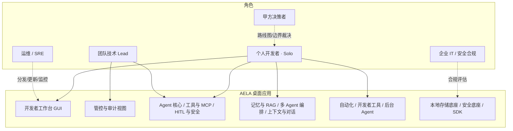
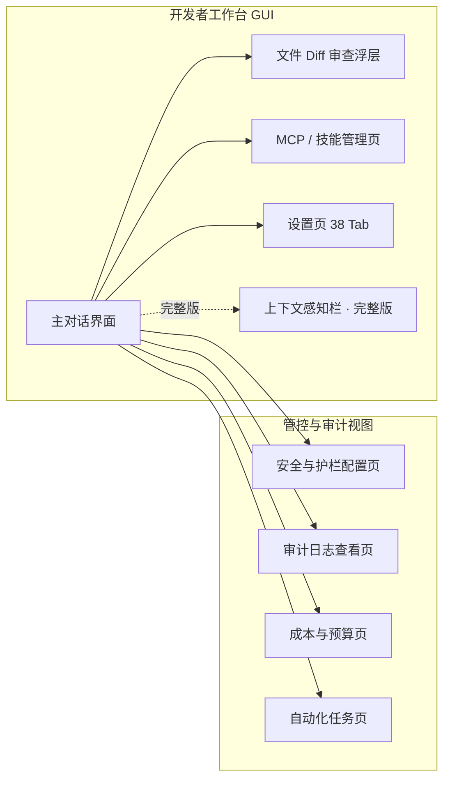
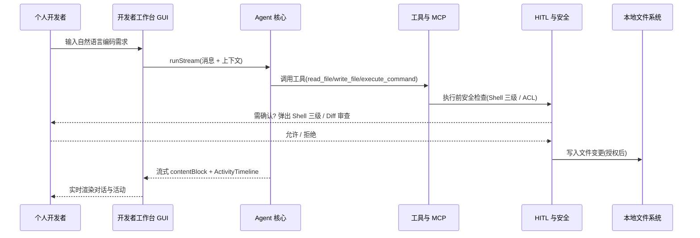

# AELA · UserStory（用户故事与验收标准）

> 本文档为《AICoding 架构设计》核心产物之一，定位为**产品需求与用户故事（UserStory）**文档。
> 上游输入：《高层架构设计》（G3 通过，`E:/codecast/AELA/.workbuddy/output/高层架构设计.md`）中的需求概要、业务架构、产品需求边界；《资料摘要》（G1 通过，`material_digest.md`）中的用户交互与场景细节。
> 下游输出：驱动《系统设计》《部署设计》《安全设计》的具体功能实现与验收标准。
> 文档边界基线：本 UserStory 严格以《高层架构设计》§6.3 功能清单（F1–F25）、§6.1 需求边界（In-Scope / Out-of-Scope O1–O5）、§1.3 价值主张、§2.1 核心角色关注点为唯一依据展开，不新增超出高层架构范围的功能需求，不重新设计模块边界，不越权决定安全/部署策略。
> 创建日期：2026-07-07 ｜ 作者：顾全景（product-story-designer）｜ 状态：G4 待审核冻结。

---

## 1. 业务背景与价值

### 1.1 业务背景

- **行业 / 产品 / 用户规模**：AELA 是已上线的 **Solo 模式 AI 编码助手桌面应用**，技术栈为 Electron 33 + React 18 + TypeScript，深度集成 `@agentprimordia/sdk` v1.0.0。产品面向**个人开发者（Solo）**与**团队技术 Lead（私有化/管控视角）**两类直接用户，以及**企业 IT/安全合规、运维/SRE**两类受影响方。当前为单实例本地桌面应用，无中心化服务端，目标用户规模为中长尾个人开发者 + 中小团队技术负责人。
- **触发本次需求的事件**：本期由「冻结业务边界、对齐行业标杆（Cursor/Windsurf/Cline/Aider/Continue）、收敛 SDK 依赖与编排口径冲突」驱动启动，为下游系统/部署/安全/UserStory 提供统一边界基线；同时需补齐安全基线结构性缺口（sandbox 桥接层、IPC 入参校验、SecretStore fail-closed）。
- **本系统在产品矩阵中的位置**：AELA 在「本地优先的 Solo 桌面 Agentic Coding 助手」产品矩阵中承担**核心编码引擎**职责，与 `@agentprimordia/sdk`（底层 Agent/编排/安全能力）、本地存储底座、LLM Provider 形成完整本地业务闭环；数据不出端，无云端后端。

### 1.2 行业方案

> 同类功能、痛点的行业标杆系统及解决方案（来源：高层架构设计 §3.1 / material_digest D1、D2、D4）。

| 标杆系统 | 厂商 / 来源 | 场景覆盖 | 技术亮点（与 AELA 同构部分） | 与 AELA 关系 |
| --- | --- | --- | --- | --- |
| Cursor | Anysphere | AI-first 桌面 IDE + Agent + MCP + 多模型 | Agent 自主编码、MCP、企业管控（SSO/审计/MCP Allowlist） | 头部 SaaS 产品形态基线参照（加权 4.15） |
| Cline | Cline Bot Inc. | 开源自主编码 Agent + MCP + HITL | 文件/终端工具、MCP 自定义、Checkpoints 回滚、成本追踪、BYOK | **优先借鉴**（加权 4.50，能力集高度同构） |
| Aider | Aider-AI | Solo 式 AI 结对编程（终端 CLI） | Repo-map、Git 自动提交、多模型 BYOK | 内核范式借鉴（加权 4.10） |
| Continue | Continue Dev | 配置驱动 AI 编码 Agent（IDE 扩展） | 私有化友好、Context Providers、MCP | 部分借鉴（加权 4.20） |
| Windsurf / Devin Desktop | Codeium / Cognition | 闭源全托管 SaaS Agent fleets | Cascade 多文件编辑、RAG 索引 | 不借鉴（合规可控性最低，偏离个人桌面定位） |

**结论**：AELA 以 Cline 为能力同构参照、Cursor 为产品形态基线，定位差异化于「开源可审计 + 本地私有化 + 深度 SDK 集成」的独立桌面应用（非 IDE 扩展）。

### 1.3 方案收益与价值

| 项 | 说明 | 量化标准（来源：高层架构设计 §1.3 / §2.3） |
| --- | --- | --- |
| 效率（业务） | 重复性编码/调试操作由 Agent 自主闭环，降低人工主导比例 | 自主完成任务率（编码类任务）≥ 60%（MVP 上线后 3 月） |
| 安全/合规（业务） | 安全基线达标：sandbox 桥接覆盖 + IPC 入参校验率 100% + SecretStore fail-closed + 审计留痕 | 安全基线达标率 100%（MVP 上线） |
| 成本（业务） | 单次编码任务 Token 成本可控（BYOK + CostTracker + ModelRouter） | 单位任务平均成本较单一闭源模型下降 ≥ 30%（完整版上线） |
| 体验（业务） | 长响应流式渲染帧率达标，Agent 活动内联可见 | 长响应渲染帧率 ≥ 30 fps（MVP 上线，来源 D22 §7） |
| 技术/成本（技术） | 构建可复现：SDK 依赖形态冻结 + CI 类型漂移检测 | 本地/CI 构建可复现率 100%（MVP 上线） |

### 1.4 术语清单

| 术语 | 英文 / 缩写 | 含义 |
| --- | --- | --- |
| AELA | — | Solo 模式 AI 编码助手桌面应用（本文档目标系统） |
| Solo 模式 | Solo Mode | 单用户本地自主执行，无多租户/中心化服务端 |
| Agentic Coding | — | 以 Agent 自主规划—工具调用—反思为核心的编码范式 |
| ReAct | Reasoning + Acting | SDK 提供的「推理—行动」自主编码循环内核 |
| MCP | Model Context Protocol | 模型上下文协议，用于接入外部工具服务器（stdio/http），工具前缀 `mcp_` |
| HITL | Human-In-The-Loop | 人在环：Shell 三级风险确认、文件变更 Diff 审查、预算中断 |
| BYOK | Bring Your Own Key | 用户自带 LLM API Key，经 safeStorage 保管 |
| RAG | Retrieval-Augmented Generation | 检索增强生成：摄入/混合检索/重排/摘要 |
| FTS5 / HNSW | — | SQLite 全文检索 / 向量近似最近邻混合检索（MemoryService） |
| Sandbox 桥接层 | bridge.ts | ADR-002 拆分后的纯桥接层（sandbox:true）+ 能力层（capabilities.ts） |
| IPC 入参校验 | validateInput(zod) | 对全部 IPC handler 入参做 zod schema 校验 + wrap() |
| SecretStore fail-closed | — | OS Keyring 不可用时拒绝明文落盘（enc:b64 降级被禁止） |
| OrchestrationService | — | SDK 编排内核，统一 7 模式（Pipeline/Parallel/Handoff/Pool/GroupChat/Debate/Supervisor） |
| DAGBuilder | — | 动态拓扑编排（条件路由边 / 动态拓扑） |
| GuardrailService | — | 输入/输出双向护栏（注入/PII/话题/关键词，pass/reject/sanitize/flag） |
| CommandGuard / InputSanitizer | — | 命令守卫 / 输入清洗，防注入与越权 |
| SecurityService | — | before_tool 注入/路径穿越/ACL 校验 |
| 审计日志 | logs/audit.jsonl | 本地个人级操作留痕（appendFileSync） |
| electron-store / better-sqlite3 | — | 本地配置/会话/成本/记忆/自动化存储底座 |
| Zustand | — | 渲染进程状态管理（7 切片） |
| contentBlock / ActivityTimeline | — | 流式分块渲染（替代 string）+ Agent 活动内联时间线（D22） |
| 上下文感知 | ContextCollector | 编辑器/终端/Git/LSP 自动感知并注入对话（F17） |
| 后台 Agent | BackgroundAgentService / MicroAgent | 后台常驻监听文件/终端/Git/LSP 触发 MicroAgent 单文件修复（F25，完整版） |
| CheckpointService | — | 后台 Agent 修复前的检查点，支持撤销/回滚 |

---

## 2. 范围与边界

### 2.1 系统内模块及功能

> 一级功能模块清单（来源：高层架构设计 §5.1 业务架构图 / §6.2 产品模块全景图）。

| 一级模块 | 归属层 | 责任范围 | 包含核心能力（对应功能编号） |
| --- | --- | --- | --- |
| 开发者工作台 GUI | 接入层 | 个人开发者主交互触点 | 主对话、流式渲染、Diff 浮层、MCP/技能管理、设置（F1/F2/F3/F5/F6/F7/F8/F11/F17/F18/F24） |
| 管控与审计视图 | 接入层 | 团队技术 Lead 管控触点 | 安全护栏配置、审计日志、成本预算、自动化任务（F9/F10/F12/F19/F20） |
| Agent 核心 | 业务能力层 | 自主编码引擎 | ReAct runStream、流式分块渲染、活动内联（F1/F2） |
| 工具与 MCP | 业务能力层 | 工具执行 | 12 内置工具、MCP stdio/http、Skills 注册（F5/F6，Skills 能力并入） |
| HITL 与安全 | 业务能力层 | 安全边界 | Shell 三级、Diff 审查、sandbox 桥接、IPC 校验、SecretStore、审计（F7/F8/F9/F10/F11/F12） |
| 记忆与 RAG | 业务能力层 | 知识检索 | 情景/语义记忆混合检索、RAG 管道（F13/F14） |
| 多 Agent 编排 | 业务能力层 | 协作编排 | 7 模式、DAGBuilder（F15/F16） |
| 上下文与对话 | 业务能力层 | 上下文感知 | 上下文自动感知、智能输入辅助（F17/F18） |
| 自动化 | 业务能力层 | 定时/事件任务 | Cron/事件触发、执行历史（F19） |
| 开发者工具 | 业务能力层 | 辅助工具 | 代码审查、Sub-Agent 隔离、图片转码/多文件/预览（F20/F21/F22） |
| 后台 Agent | 业务能力层 | 后台修复 | 后台常驻自动修复（F25，完整版） |
| @agentprimordia/sdk | 基础能力层 | 底层能力 | ReAct/AgentSelfTuner/SpeculativeExecutor/Orchestration/Security/Memory/RAG/Tools |
| 本地存储底座 | 基础能力层 | 持久化 | electron-store 7 服务 + better-sqlite3（F23） |
| 安全底座 | 基础能力层 | 密钥/护栏 | safeStorage/Keyring/Guardrail/CommandGuard/InputSanitizer（F9/F10/F11） |

### 2.2 系统外模块及功能（Out-of-Scope）

> 当前系统**不覆盖**的功能及其原因（来源：高层架构设计 §6.1 O1–O5，U-01~U-04 冻结）。

| 编号 | 不做的事 | 原因 | 后续计划 |
| --- | --- | --- | --- |
| O1 | 企业 SSO / SAML / SCIM 集成 | Solo 桌面应用定位，企业管控非 MVP 范围（U-01 冻结） | 保留扩展点（SSO/审计接口预留），完整版/企业版评估 |
| O2 | 云端多租户 / 中心化服务端 | AELA 为本地桌面应用，主进程即「后端」，无云端后端（D9 更正） | 不做（纯桌面架构定位） |
| O3 | MCP 工具级 ACL / 网络控制（工具审批/Allowlist） | MVP 以「用户显式添加 + 信任源」为缓解（D20），工具级 ACL 作为 P1 安全起步补全 | P1 安全阶段补全（Out-of-Scope for MVP） |
| O4 | 企业审计与合规报告（SOC2 等） | Solo 桌面本地优先，开箱审计日志 `logs/audit.jsonl` 已提供个人级留痕 | 待业务确认（MVP 不含） |
| O5 | 后台 Agent 全自动无确认模式 | 保持 HITL 安全边界，不开放无确认全自动写文件 | 保持 pending 确认（Out-of-Scope） |

### 2.3 外部依赖

| 依赖系统 | 提供方 | 依赖能力 | 接入方式 | 接口人 |
| --- | --- | --- | --- | --- |
| `@agentprimordia/sdk` v1.0.0 | 兄弟仓库（本地 `file:` 依赖） | ReActAgent / Orchestration / Security / Memory / RAG / Tools / Observability | TS import（本地构建 dist） | SDK 提供方（ADR-001，AELA_SDK_PATH 回退） |
| LLM Provider API | OpenAI / Anthropic / Ollama / Gemini / Custom | 模型推理（BYOK） | HTTPS REST / SDK | 各 Provider 官方 |
| electron-store | AELA 主进程 | Config/Session/Automation/Cost/Memory/RAG 7 服务 | 本地 API | AELA 存储组 |
| better-sqlite3 | AELA 主进程 | MemoryService FTS5+HNSW | 本地 API | AELA 存储组 |
| 安全底座（safeStorage / Keyring / Guardrail / CommandGuard） | AELA 主进程 + SDK | 密钥保管 / 护栏 / 命令守卫 | 本地 API | AELA 安全组 |
| 用户本地文件系统 / 终端 / Git | 宿主 OS | 代码写入 / 命令执行 / 版本控制 | 本地 FS / child_process | 宿主 OS |
| 审计日志落盘 | 本地文件系统 | 操作留痕 | appendFileSync | 本地 `logs/audit.jsonl` |

---

## 3. 功能清单

> **定位**：全景骨架表，进入「角色 / 场景 / US」之前先看到完整功能版图。下表与《高层架构设计》§6.3 功能清单**逐行一致**（F1–F25，优先级 / MVP 标记 / 完整版标记完全对齐），作为本 UserStory 与下游系统设计的唯一功能契约。

### 3.1 功能清单结构

| 编号 | 一级模块 | 二级功能 | 功能项（描述） | 优先级 | MVP 范围 | 完整版范围 | 备注（对齐目标） |
| --- | --- | --- | --- | --- | --- | --- | --- |
| F1 | Agent 核心 | 对话式自主编码 | ReAct runStream 12 步增强流程，工具调用闭环 | P0 | ✅ | ✅ | 效率（§1.3）/ V1 |
| F2 | Agent 核心 | 流式分块渲染与活动内联 | contentBlock 替代 string，ToolCallCard/ActivityTimeline | P0 | ✅ | ✅ | 体验（§1.3，≥30fps） |
| F3 | 模型与 Provider | 多模型 BYOK 配置 | OpenAI/Anthropic/Ollama/Gemini/Custom | P0 | ✅ | ✅ | 成本（§1.3） |
| F4 | 模型与 Provider | ModelRouter 模型路由 | 按任务动态选模型 | P1 | ✅ | ✅ | 成本（§1.3） |
| F5 | 工具与 MCP | 12 内置工具 | read_file/write_file/list_directory/search_code/execute_command/web_fetch 等 | P0 | ✅ | ✅ | V1（§2.3） |
| F6 | 工具与 MCP | MCP stdio/http 工具调用 | 用户显式添加，工具前缀 mcp_ | P0 | ✅ | ✅ | V1（§2.3） |
| F7 | HITL 与安全 | Shell 三级风险确认 | safe/moderate/dangerous + 允许本次/会话同类 | P0 | ✅ | ✅ | V1（§2.3） |
| F8 | HITL 与安全 | 文件变更 Diff 审查 | 接受/拒绝，自动批准/预算中断 | P0 | ✅ | ✅ | V1（§2.3） |
| F9 | HITL 与安全 | sandbox 桥接层 | bridge.ts sandbox:true + capabilities.ts 隔离（ADR-002） | P0 | ✅ | ✅ | V1（§2.3，安全） |
| F10 | HITL 与安全 | 100% IPC 入参校验 | validateInput(zod)+wrap，全 handler 覆盖 | P0 | ✅ | ✅ | V1（§2.3，安全） |
| F11 | HITL 与安全 | SecretStore fail-closed | safeStorage + OS Keyring，明文降级拒绝落盘 | P0 | ✅ | ✅ | V1（§2.3，密钥） |
| F12 | HITL 与安全 | 审计日志 | logs/audit.jsonl 个人级留痕 | P1 | ✅ | ✅ | V1（§2.3） |
| F13 | 记忆与 RAG | 情景/语义记忆混合检索 | FTS5+HNSW + Top-K 注入 | P1 | ✅ | ✅ | 效率（§2.5 G4） |
| F14 | 记忆与 RAG | RAG 管道 | 摄入/混合检索/重排/摘要 | P1 | ✅ | ✅ | 效率（§2.5 G4） |
| F15 | 多 Agent 编排 | 7 模式编排 | Pipeline/Parallel/Handoff/Pool/GroupChat/Debate/Supervisor | P0 | ✅ | ✅ | V3（§2.3） |
| F16 | 多 Agent 编排 | DAGBuilder 动态拓扑 | 条件路由边/动态拓扑 | P1 | ✅ | ✅ | V3（§2.3） |
| F17 | 上下文与对话 | 上下文自动感知 | 编辑器/终端/Git/LSP 注入 | P1 | ✅ | ✅ | 体验（§2.5 G6） |
| F18 | 上下文与对话 | 智能输入辅助 | @filename/#error/Ctrl+. | P2 | ❌ | ✅ | 体验（§2.5 G6） |
| F19 | 自动化 | Cron/事件触发任务 | 手动/定时/事件 + 执行历史 | P2 | ✅ | ✅ | 效率（§2.5 G6） |
| F20 | 开发者工具 | 代码审查 | 严重度/类别分级 | P1 | ✅ | ✅ | 质量（§6.1 F13） |
| F21 | 开发者工具 | Sub-Agent 隔离 | 资源配额/聚合模式 | P1 | ✅ | ✅ | 质量（§6.1 F13） |
| F22 | 开发者工具 | 图片转代码/多文件编辑/预览 | React/Vue/HTML + 多文件 + 浏览器预览 | P2 | ❌ | ✅ | 体验（§6.1 F13） |
| F23 | 基础与私有化 | 本地存储 | electron-store + better-sqlite3，零数据出端 | P0 | ✅ | ✅ | 私有化（§6.1 F14） |
| F24 | 基础与私有化 | i18n + 主题 | zh/en + 深/浅色 | P2 | ✅ | ✅ | 体验（§6.1 F14） |
| F25 | 后台 Agent | 后台常驻自动修复 | 文件/Terminal/Git/LSP 触发 MicroAgent 修复（D21） | P2 | ❌ | ✅ | 效率（§2.5 G6） |

> **Skills 技能系统映射说明**：高层架构 §6.1 In-Scope 将「Skills 技能系统（Markdown 定义、/触发、as_tool 注册）」列为 F5，但 §6.3 功能清单未单列 Skills 行；本 UserStory 严格以 §6.3 的 F1–F25 为唯一功能契约，Skills 能力（扫描 `~/.aela/skills` 等路径、Markdown 定义、`/触发`、`as_tool:true` 注册为 `skill_` 前缀工具）归入 **F5（12 内置工具）/ F6（MCP 工具调用）的能力扩展**与 Agent 配置项，**不新增任何超出 §6.3 的功能编号**。互查一致性见 §8 附录。

> **【自检 1 · §3 功能清单后】** 见本文档 §8.1。

---

## 4. 角色与场景

### 4.1 角色清单

> 角色定义以《高层架构设计》§2.1 核心角色关注点为依据，未做超出上游的细分或扩展。

| 角色 | 业务身份 | 主要操作 | 核心关注点 |
| --- | --- | --- | --- |
| 甲方决策者 | 产品 / 技术负责人 | 能力边界裁决、路线图规划、商业化/私有化路线 | ROI 与边界可控：投入产出比 + 安全合规底线不被击穿 |
| 个人开发者（Solo） | 个人开发者 | 对话式编码、工具调用、文件变更确认、模型配置 | 自主编码效率 + 本地数据/密钥不出端 |
| 团队技术 Lead | 团队技术负责人 | 私有化部署评估、团队管控视角、审计留痕核查 | 私有化可达 + 团队使用可管可控 |
| 企业 IT / 安全合规 | 企业安全/合规 | SSO/审计/私有网络接入评估 | 是否满足企业合规准入（SSO/审计/数据驻留） |
| 运维 / SRE | 桌面应用分发与更新 | 安装包分发、版本更新、崩溃监控 | 分发稳定 + 崩溃/异常可观测可回滚 |

**角色 ↔ 模块交互图（角色交互图）**

### 4.2 关键场景清单

| 编号 | 角色 | 触发条件 | 期望结果 | 频率（日均 / QPS） |
| --- | --- | --- | --- | --- |
| SC-1 | 个人开发者 | 输入自然语言编码需求 | Agent 自主执行并返回代码/工具结果（流式渲染） | 日均 20–50 次对话 |
| SC-2 | 个人开发者 | 首次使用 / 切换模型 | 模型可用且 API Key 安全存储（safeStorage） | 低频（配置时） |
| SC-3 | 个人开发者 | Agent 执行需读写文件/执行命令/调用 MCP | 工具安全执行并结果回传 | 高（每次任务多次调用） |
| SC-4 | 个人开发者 | Agent 拟执行 moderate/dangerous 命令 | 用户确认/拒绝，安全边界保持 | 中（按任务风险） |
| SC-5 | 个人开发者 | Agent 拟写入文件 | 用户接受/拒绝 Diff 变更 | 中（按任务） |
| SC-6 | 系统（启动/每次 IPC） | 应用启动 / 每次 IPC 调用 | sandbox 桥接 + 100% 入参校验 + 密钥不落盘 | 持续（每次调用） |
| SC-7 | 个人开发者 | 对话中需历史/项目知识 | 相关记忆/文档注入上下文 | 高（每次对话） |
| SC-8 | 个人开发者 | 复杂任务需多 Agent 协作 | 按 7 模式之一编排产出 | 中（复杂任务） |
| SC-9 | 个人开发者 | 编辑器/终端/Git/LSP 上下文变化 | 自动注入轻量/重度上下文 | 高（实时） |
| SC-10 | 团队技术 Lead | 定期核查 | 操作留痕可回溯（审计日志查看） | 周/月 |
| SC-11 | 团队技术 Lead | 定期 | Token/成本按模型汇总、预算阈值设置 | 周/月 |
| SC-12 | 个人开发者 | Cron/事件触发 | 定时/事件任务执行并留历史 | 按配置 |
| SC-13 | 个人开发者 | 发起代码审查 / Sub-Agent | 分级审查结果 / 隔离子 Agent 产出 | 中 |

**页面流转图（开发者工作台 + 管控与审计视图）**

> **【自检 2 · §4 角色与场景后】** 见本文档 §8.2。

---

## 5. 用户旅程（UserStory）

> 以下 12 条 UserStory 覆盖 §3 全部 F1–F25 功能项。每条按「业务场景 / 业务流程 / UE 原型 / 业务逻辑 / 数据描述 / 验收标准 / 外部集成接口」七段式完整展开。F18 / F22 / F25 为完整版专属（§6.3 标记 MVP ❌），在对应 US 中明确标注「完整版范围」，不纳入 MVP 验收。

### 5.1 US-1：对话式自主编码闭环（F1 / F2）

#### 5.1.1 业务场景

- **视角**：个人开发者（Solo）
- **描述逻辑**：个人开发者在开发者工作台主对话界面输入一段自然语言编码需求（如「给 utils.ts 加一个防抖函数并补充单测」）。AELA 在桌面 GUI 内闭环完成：意图理解 → ReAct 自主规划 → 工具调用（读文件/写文件/执行命令）→ HITL 确认 → 代码写入本地，并以流式分块（contentBlock）实时渲染 Agent 思考与工具活动（ToolCallCard / ActivityTimeline）。用户无需离开桌面应用，数据全程不出端。

#### 5.1.2 业务流程

- **视角**：用户
- **描述方式**（Given / When / Then 时序）：

#### 5.1.3 UE 原型

- 主对话界面：顶部模式切换（Code/Office）；中部流式消息区（contentBlock 分块渲染 + ToolCallCard 内联 + ActivityTimeline）；底部 InputBox（Enter 发送）。核心编码路径 ≤ 5 步：对话 → 工具 → Diff → 确认 → 写入。
- Agent 首字呈现（P99）对齐体验基线（见 §6.2）。

#### 5.1.4 业务逻辑

- **视角**：业务系统
- 1) GUI 调用 `agent:runStream` IPC，携带消息 + 自动上下文（编辑器/终端/Git/LSP，见 F17）；2) AgentService.runStream 走 12 步增强流程：Memory 混合检索注入 → PromptBuilder 三层提示词 → Guardrail before_llm → ReActAgent 推理 → Security before_tool → 工具调用 → HITL 拦截 → 写入 → Audit 留痕；3) 流式事件经 `agent:activity` 回传，渲染进程以 contentBlock 增量渲染；4) 异常（工具失败/用户中断）进入优雅中断分支（AbortController），保留已完成消息。

#### 5.1.5 数据描述

- 输入：ChatMessage（用户输入）+ ContextBlock（轻量上下文）。
- 过程：StreamEvent[]（reasoning / tool_start / tool_end / context_update）+ ContentBlock[]（替代单 string）。
- 落盘：会话存 `aela-sessions.json`（electron-store），活动/事件不独立落盘（仅审计关键操作）。
- 输出：本地文件变更（经 HITL 授权后写盘）。

#### 5.1.6 验收标准 AC

- **AC-1（正常路径）**：Given 个人开发者在主对话界面输入自然语言编码需求并发送，When Agent 完成 ReAct 自主执行且所有文件变更经 HITL 确认，Then 工作台以 contentBlock 流式渲染完整回复、ToolCallCard 内联展示工具调用、最终结果写入本地文件，且审计日志记录本次任务。
- **AC-2（异常路径 - 用户中断）**：Given Agent 正在流式执行，When 用户点击「中断」触发 AbortController，Then Agent 立即停止工具调用、已生成消息保留、未确认的文件变更不写入磁盘，且不抛未捕获异常。
- **AC-3（异常路径 - 工具失败）**：Given Agent 调用内置工具返回错误，When 错误为非致命类型，Then Agent 自主重试或调整策略（经 ResilienceService 熔断器/重试），并在 ActivityTimeline 标注失败原因；若达重试上限则终止并提示用户。

#### 5.1.7 外部集成接口

- `@agentprimordia/sdk` ReActAgent / AgentSelfTuner / SpeculativeExecutor（本地 dist 调用）。
- LLM Provider API（OpenAI/Anthropic/Ollama/Gemini/Custom，BYOK HTTPS）。
- 本地文件系统 / 终端 / Git（宿主 OS，经 HITL 授权）。

### 5.2 US-2：多模型 BYOK 配置与模型路由（F3 / F4）

#### 5.2.1 业务场景

- **视角**：个人开发者
- **描述逻辑**：个人开发者首次使用或切换模型时，在设置页添加自有 LLM Provider 配置（API Key、Base URL、模型名）。配置经 safeStorage 加密存储，绝不明文落盘。日常编码中，ModelRouter 按任务类型动态选择最合适模型，降低单位任务成本。

#### 5.2.2 业务流程

- **视角**：用户
- Given 用户进入设置页「模型与 Provider」Tab，When 填写 Provider 类型与凭据并保存，Then 系统经 safeStorage 加密存储并在连接测试中返回可用状态；若填入非法 Key，则提示但不落盘明文。

#### 5.2.3 UE 原型

- 设置页「模型配置」子页：Provider 下拉（OpenAI/Anthropic/Ollama/Gemini/Custom）+ 字段表单（apiKey / baseURL / model）+ 连接测试按钮 + 默认模型选择。
- 「模型路由」子页：任务类型 → 模型映射规则展示（只读/可编辑）。

#### 5.2.4 业务逻辑

- **视角**：业务系统
- 1) ModelConfigView 调用 `model:add` / `model:update` IPC；2) 主进程写入 electron-store 前经 safeStorage.encrypt（前缀 `enc:v1:`），OS Keyring 不可用时 SecretStore fail-closed 拒绝保存；3) 运行时 ProviderManager 构建对应 Provider 客户端；4) ModelRouter 依据任务标签（编码/推理/摘要）查路由表选模型，命中 CostTracker 预算则触发 HITL 预算中断。

#### 5.2.5 数据描述

- 输入：ModelConfig（type / apiKey(密) / baseURL / model）。
- 存储：`aela-config.json` 中模型配置（apiKey 为 `enc:v1:` 密文）+ `aela-cost.json`（CostTracker）。
- 输出：Provider 客户端实例供 AgentService 调用。

#### 5.2.6 验收标准 AC

- **AC-1（正常路径）**：Given 用户添加 OpenAI Provider 并填入有效 API Key，When 点击保存与连接测试，Then 配置以 `enc:v1:` 密文写入 electron-store、连接测试返回成功、该模型出现在默认模型下拉中。
- **AC-2（异常路径 - Keyring 不可用）**：Given 当前 OS Keyring 不可用，When 用户尝试保存 API Key，Then SecretStore 拒绝明文落盘（fail-closed）并提示「密钥无法安全存储，已取消保存」，本地不残留 `b64:` 明文。
- **AC-3（异常路径 - 预算中断）**：Given 当前会话累计成本超过预算阈值，When Agent 再次发起模型调用，Then CostTracker 触发 HITL 预算中断，提示用户确认是否继续或切换更低价模型。

#### 5.2.7 外部集成接口

- LLM Provider API（HTTPS REST/SDK，BYOK）。
- 安全底座 safeStorage / OS Keyring（密钥保管）。

### 5.3 US-3：内置工具调用与 MCP 集成（F5 / F6，含 Skills 能力）

#### 5.3.1 业务场景

- **视角**：个人开发者
- **描述逻辑**：Agent 在自主执行中调用 12 个内置工具（read_file/write_file/list_directory/search_code/execute_command/web_fetch 等）或用户显式添加的 MCP 服务器工具（前缀 `mcp_`）。Skills 以 Markdown 定义、通过 `/` 触发、可 `as_tool:true` 注册为 `skill_` 前缀工具。用户对 MCP 服务器的添加为显式信任操作（O3：工具级 ACL 延后至 P1 安全阶段）。

#### 5.3.2 业务流程

- **视角**：用户
- Given 用户在 MCP 管理页点击「添加服务器」并填入 stdio/http 配置，When 保存并启用，Then 该服务器工具以 `mcp_` 前缀出现在可用工具列表，且后续 Agent 可调用；若服务器返回异常工具定义，则提示且不自动加载未声明工具。

#### 5.3.3 UE 原型

- MCP / 技能管理页：添加服务器表单（名称 / 传输 stdio|http / 命令或 URL / 环境变量）+ 工具列表预览（mcp_ 前缀）+ 技能扫描/预览列表（skill_ 前缀）+ 启停开关。

#### 5.3.4 业务逻辑

- **视角**：业务系统
- 1) ToolManager 管理 12 内置工具 + MCP/Skill 适配（前缀 mcp_/skill_）；2) MCP 走 MCPToolAdapter → mcpClient.callTool()（stdio/http，用户显式配置信任源，D20）；3) Shell 类工具经 SecurityService + CommandGuard + HITL 三级确认；4) MCP 工具在 MVP 不经 SecurityService Sandbox（O3 缓解：仅允许用户显式添加）；5) 工具调用前后均经 Guardrail / Audit 留痕。

#### 5.3.5 数据描述

- 输入：ToolCall（name / args），MCP 服务器配置（transport / command|url / env）。
- 存储：`aela-config.json` 的 MCP 服务器清单（不含密钥明文）。
- 输出：ToolResult 回传 AgentService。

#### 5.3.6 验收标准 AC

- **AC-1（正常路径）**：Given 用户显式添加并启用一个 stdio MCP 服务器，When Agent 调用以 `mcp_` 为前缀的 MCP 工具且该工具定义合法，Then 工具经 MCP 客户端执行、结果回传 Agent、调用记入审计日志。
- **AC-2（异常路径 - 未授权服务器）**：Given 某工具来自未被用户显式添加的 MCP 服务器，When Agent 尝试调用，Then 系统拒绝加载该工具定义并提示「未授权 MCP 服务器」，不执行任何越权调用。
- **AC-3（异常路径 - Shell 风险拦截）**：Given Agent 拟执行 dangerous 级 Shell 命令，When 触发 Shell 三级确认，Then 弹出红级确认框，用户拒绝则命令不执行，且拒绝事件记入审计。

#### 5.3.7 外部集成接口

- MCP 服务器（用户显式添加，stdio/http，外部进程）。
- `@agentprimordia/sdk` Tools / SecurityService（Shell 经 SecurityService+CommandGuard）。
- 外部 Web 资源（web_fetch）。

### 5.4 US-4：HITL 安全确认（Shell 三级 + Diff 审查）（F7 / F8）

#### 5.4.1 业务场景

- **视角**：个人开发者
- **描述逻辑**：Agent 拟执行 Shell 命令或写入文件变更时，AELA 在 GUI 内弹出人工确认。Shell 命令按 safe/moderate/dangerous 三级风险着色（绿/黄/红），提供「拒绝 / 允许本次 / 本次会话允许同类」。文件变更以 Diff 浮层展示，用户接受/拒绝，支持自动批准规则与预算中断。

#### 5.4.2 业务流程

- **视角**：用户
- Given Agent 拟执行一条 moderate 级 Shell 命令，When HITL 拦截弹出黄级确认，Then 用户选择「允许本次」后命令执行；选择「拒绝」则命令终止并记入审计；选择「本次会话允许同类」则同风险级同命令模板后续免确认。

#### 5.4.3 UE 原型

- Shell 三级确认弹框：风险色标（绿/黄/红）+ 命令预览 + 三选项（拒绝/允许本次/会话同类）。
- 文件 Diff 审查浮层：单文件/多文件差异视图 + 接受/拒绝 + 自动批准开关 + 预算中断提示。

#### 5.4.4 业务逻辑

- **视角**：业务系统
- 1) ToolManager/execute_command 调用 SecurityService 判定风险级；2) 主进程经 IPC 向渲染进程推送确认请求，阻塞工具执行直到用户响应；3) 文件写入前 AgentService 生成 Diff，经 `fileChange:review` 推送，用户接受后 CheckpointService 记录可回滚点再写入；4) 所有确认/拒绝事件经 AuditService 写入 `logs/audit.jsonl`。

#### 5.4.5 数据描述

- 输入：ShellCommand（command / riskLevel）/ FileDiff（path / before / after）。
- 存储：审计日志追加确认/拒绝记录；CheckpointService 检查点（撤销用）。
- 输出：执行许可/拒绝信号回传工具执行器。

#### 5.4.6 验收标准 AC

- **AC-1（正常路径）**：Given Agent 生成文件变更 Diff，When 用户点击「接受」，Then 变更写入本地文件、CheckpointService 建立可回滚点、审计记录「接受」。
- **AC-2（异常路径 - 拒绝）**：Given 用户对任意 HITL 请求点击「拒绝」，When 确认，Then 对应工具/写入不执行、会话状态回退到确认前、审计记录「拒绝」，且不影响其他已接受变更。
- **AC-3（异常路径 - 预算中断触发 Diff）**：Given 单次任务累计成本逼近预算，When Agent 拟发起新一轮文件写入，Then 预算中断提示出现，用户确认后才继续写入。

#### 5.4.7 外部集成接口

- 本地文件系统 / 终端（宿主 OS，经 HITL 授权）。
- CheckpointService（撤销/回滚，内部能力）。
- 审计日志 `logs/audit.jsonl`（本地追加）。

### 5.5 US-5：安全基线加固（F9 / F10 / F11 / F12）

#### 5.5.1 业务场景

- **视角**：个人开发者 / 系统（启动与每次 IPC）
- **描述逻辑**：AELA 在 MVP 落地安全基线：sandbox 桥接层（bridge.ts sandbox:true + capabilities.ts 隔离）、100% IPC handler 入参 zod 校验、SecretStore fail-closed（OS Keyring 不可用时拒绝明文落盘）、审计日志个人级留痕。确保渲染进程即便被 XSS 注入也无法访问 Node API、MCP/Shell 越权被拦截、密钥不落盘。

#### 5.5.2 业务流程

- **视角**：用户
- Given 应用启动，When 主进程注册全部 IPC handler，Then 每个 handler 入口经 `validateInput(schema)` + `wrap()` 校验，未通过校验的请求被拒绝并返回结构化错误；Given 任意时刻密钥需存储，When OS Keyring 可用，Then 经 safeStorage 加密；When Keyring 不可用，Then SecretStore 拒绝保存并提示。

#### 5.5.3 UE 原型

- 安全与护栏配置页（管控与审计视图）：sandbox/IPC/ACL/护栏规则增删（注入/PII/话题/关键词），动作 pass/reject/sanitize/flag。
- 审计日志查看页：时间轴/筛选/导出 `logs/audit.jsonl`。
- 设置页密钥保存时若 Keyring 不可用，出现 fail-closed 提示条。

#### 5.5.4 业务逻辑

- **视角**：业务系统
- 1) preload 拆桥接层（sandbox:true，无 Node 依赖）+ 能力层（capabilities.ts，sandbox:false 隔离在独立进程，ADR-002）；2) 全部 IPC handler 在 `schemas.ts` 定义 zod schema，`registerXxxHandlers` 入口 `validateInput` + `wrap()`；3) SecretStore.createSecretStore：encrypt 在 insecure 时抛错/内存态，拒绝明文落盘；4) AuditService.appendFileSync 写 `logs/audit.jsonl`，覆盖工具调用/确认/拒绝/密钥操作。

#### 5.5.5 数据描述

- 输入：IPC 请求参数（经 zod 校验）/ 密钥明文（仅内存，不落盘）。
- 存储：`logs/audit.jsonl`（追加，结构化行）/ electron-store 密钥密文（`enc:v1:`）。
- 输出：校验通过/拒绝响应；审计行。

#### 5.5.6 验收标准 AC

- **AC-1（正常路径）**：Given 一个合法 IPC 调用（参数符合 schema），When 主进程处理，Then 请求通过 `validateInput` 进入业务逻辑并返回成功结果，且调用记入审计。
- **AC-2（异常路径 - 入参非法）**：Given 一个缺少必填字段或类型错误的 IPC 调用，When 进入 handler，Then `validateInput` 拒绝并返回结构化校验错误（不执行业务逻辑），且不产生越权副作用。
- **AC-3（异常路径 - 明文降级拦截）**：Given OS Keyring 不可用且用户尝试保存 API Key，When SecretStore.encrypt 被调用，Then 抛错并拒绝落盘，本地不出现 `b64:` 明文等价项，UI 提示密钥无法安全存储。

#### 5.5.7 外部集成接口

- 安全底座 safeStorage / OS Keyring（密钥保管）。
- `@agentprimordia/sdk` Security（SecurityService/GuardrailService/CommandGuard/InputSanitizer）。
- 本地文件系统（审计日志落盘）。

### 5.6 US-6：记忆与 RAG 知识检索（F13 / F14）

#### 5.6.1 业务场景

- **视角**：个人开发者
- **描述逻辑**：对话中，Agent 自动检索情景/语义记忆（FTS5+HNSW 混合检索，Top-K 注入）与 RAG 知识管道（项目文档摄入/混合检索/重排/摘要），将相关上下文注入提示词，提升回答的相关性与准确性，并写入情景记忆支撑自适应调参。

#### 5.6.2 业务流程

- **视角**：用户
- Given 用户发起对话，When AgentService.runStream 进入记忆检索步骤，Then MemoryService.hybridSearchScored 返回 Top-K 记忆 + RAGService 返回重排后的文档片段，注入 PromptBuilder；若检索无果，则降级为空上下文继续，不阻断主流程。

#### 5.6.3 UE 原型

- 上下文/记忆相关 UI：对话中可展开「引用来源」（记忆/文档片段）；设置页「规则与记忆」管理全局记忆/自定义规则/情景记忆压缩。

#### 5.6.4 业务逻辑

- **视角**：业务系统
- 1) MemoryService（SqliteMemoryStore + FTS5 + HNSW + HashEmbedding + 衰减）执行混合检索；2) RAGService（RAGStore + RAGReranker + MMRReranker + Summarizer + 文档加载器）执行摄入/混合检索/重排/摘要；3) 检索结果经 Top-K 截断注入 PromptBuilder 模式专属层；4) 任务完结后情景记忆写入（Episode），供 AgentSelfTuner 自适应。

#### 5.6.5 数据描述

- 输入：查询文本（来自用户消息/当前上下文）。
- 存储：better-sqlite3（MemoryService FTS5+HNSW）/ RAG 摄入文档库。
- 输出：Top-K MemoryEpisode + RAG 片段注入提示词。

#### 5.6.6 验收标准 AC

- **AC-1（正常路径）**：Given 对话涉及项目既有代码模式，When Agent 检索记忆与 RAG，Then 返回的相关片段按相关度排序注入提示词，且对话回复引用了该上下文。
- **AC-2（异常路径 - 检索无果）**：Given 知识库为空或查询无匹配，When 检索步骤执行，Then 返回空结果、主流程不阻断、回复基于模型自身能力生成，且不报错。
- **AC-3（异常路径 - 记忆写入失败）**：Given 情景记忆写入 better-sqlite3 失败，When 任务完结，Then 捕获异常并告警，不影响本次对话结果，且不导致会话崩溃。

#### 5.6.7 外部集成接口

- 本地存储底座 better-sqlite3 / electron-store（记忆与 RAG 持久化）。
- `@agentprimordia/sdk` Memory / RAG（SDK 能力）。

### 5.7 US-7：多 Agent 7 模式编排与 DAGBuilder（F15 / F16）

#### 5.7.1 业务场景

- **视角**：个人开发者
- **描述逻辑**：面对复杂任务，用户或 Agent 选择 7 种编排模式之一（Pipeline/Parallel/Handoff/Pool/GroupChat/Debate/Supervisor），由 OrchestrationService 调度多个 Agent 协作；DAGBuilder 支持条件路由边与动态拓扑，编排结果汇聚后回传用户。

#### 5.7.2 业务流程

- **视角**：用户
- Given 用户发起一个需多步协作的任务并指定 Supervisor 模式，When OrchestrationService 启动，Then 创建 Worker 池并按优先级队列调度子 Agent，汇聚结果后由 Supervisor 输出最终答复；若任一子 Agent 失败且 Fail-Fast 开启，则整体终止并提示。

#### 5.7.3 UE 原型

- 编排模式选择入口（对话内 `/` 命令或设置）；DAG 调度可视化（基础视图，MVP）；ActivityTimeline 展示各子 Agent 活动。

#### 5.7.4 业务逻辑

- **视角**：业务系统
- 1) OrchestrationService 按所选模式构建执行图（7 模式统一口径，裁决 X9 冲突）；2) DAGBuilder 处理条件路由边/动态拓扑；3) 各子 Agent 复用 ReActAgent + Memory/RAG；4) 聚合结果经 AgentHookFactory 活动事件回传渲染；5) 全部子 Agent 工具调用仍受 HITL/审计约束。

#### 5.7.5 数据描述

- 输入：OrchestrationConfig（mode / agents / dag / topology）。
- 存储：编排配置（会话级，可落 `aela-sessions.json`）。
- 输出：聚合结果 + ActivityEvent[]。

#### 5.7.6 验收标准 AC

- **AC-1（正常路径）**：Given 用户选择 GroupChat 模式并提交多视角讨论任务，When 编排执行，Then 多个子 Agent 按模式协作、活动内联展示、最终汇聚答复返回用户。
- **AC-2（异常路径 - Fail-Fast）**：Given 编排配置开启 Fail-Fast 且某子 Agent 抛错，When 错误发生，Then 编排立即终止、已产出中间结果保留、用户收到失败原因，不静默卡死。
- **AC-3（异常路径 - 模式不支持）**：Given 用户指定 SDK 未实现的编排模式，When 调用 OrchestrationService，Then 返回明确「不支持的模式」错误，不降级到未定义行为。

#### 5.7.7 外部集成接口

- `@agentprimordia/sdk` OrchestrationService / DAGScheduler / Collaboration / Supervisor / DynamicDAG。
- 本地存储底座（编排配置持久化）。

### 5.8 US-8：上下文感知对话与智能输入（F17 / F18）

#### 5.8.1 业务场景

- **视角**：个人开发者
- **描述逻辑**：AELA 自动感知编辑器/终端/Git/LSP 上下文并注入对话（F17，MVP）。智能输入辅助（@filename / #error / Ctrl+. 快速修复，F18）为完整版专属能力，降低手动粘贴上下文成本，提升对话相关性。

#### 5.8.2 业务流程

- **视角**：用户
- Given 用户正在编辑 `utils.ts` 且终端出现报错，When 用户发起对话，Then 系统自动携带 activeFile + terminalTail 轻量上下文；若为重度变更（Git 状态/诊断），则注入 gitStatus + diagnostics + projectStructure。

#### 5.8.3 UE 原型

- 上下文感知栏（MVP：轻量上下文自动携带；F18 完整版：@filename/#error/Ctrl+. 智能输入辅助）。
- 流式分块渲染（contentBlock）+ Agent 活动内联（ToolCallCard/ActivityTimeline，D22）。

#### 5.8.4 业务逻辑

- **视角**：业务系统
- 1) ContextCollector（新增）监听 Monaco 编辑器/终端/Git/LSP，增量+debounce 采集；2) 经 IPC `context:sync` / `context:change` 同步主进程 SessionStore；3) AgentHookFactory 扩展在 runStream 注入 ContextBlock；4) F18 智能输入由 SmartInput/ContextBar 在渲染进程处理（完整版）；5) IPC 事件过多时缓冲 + rAF 合并（D22 §8）。

#### 5.8.5 数据描述

- 输入：EditorContext / TerminalTail / GitStatus / Diagnostics。
- 存储：SessionStore 上下文快照（electron-store）。
- 输出：ContextBlock 注入每次消息。

#### 5.8.6 验收标准 AC

- **AC-1（正常路径）**：Given 用户编辑文件后发起对话，When 消息发送，Then 系统自动携带 activeFile 上下文且用户无需手动粘贴，回复与当前文件相关。
- **AC-2（异常路径 - 采集性能）**：Given 上下文变化高频触发，When ContextCollector 采集，Then 经 debounce/增量采集与 rAF 合并，主线程不卡顿、渲染帧率维持 ≥30fps。
- **AC-3（完整版专属 - F18）**：Given F18 为完整版范围（MVP 标记 ❌），When MVP 构建，Then 智能输入辅助（@filename/#error/Ctrl+.）不纳入 MVP 验收，仅轻量上下文自动感知（F17）交付。

#### 5.8.7 外部集成接口

- Monaco 编辑器 / 终端 / Git / LSP（宿主环境能力，经 IPC 采集）。
- `@agentprimordia/sdk` AgentHookFactory（上下文注入扩展）。

### 5.9 US-9：自动化任务编排（F19）

#### 5.9.1 业务场景

- **视角**：个人开发者
- **描述逻辑**：用户创建手动/定时（Cron）/事件触发任务，系统按触发条件执行 Agent 任务并保留最近 200 条执行历史，支持试运行与启停。

#### 5.9.2 业务流程

- **视角**：用户
- Given 用户在自动化任务页创建「每日 09:00 生成项目日报」Cron 任务，When 到达触发时间，Then 系统自动发起对应 Agent 任务、记录执行历史；用户可在历史中查看结果或停止任务。

#### 5.9.3 UE 原型

- 自动化任务页（管控与审计视图）：创建/试运行/历史（保留最近 200 条）+ 启停开关 + 触发类型（手动/Cron/事件）。

#### 5.9.4 业务逻辑

- **视角**：业务系统
- 1) AutomationStore（electron-store）持久化任务定义；2) 调度器按 Cron/事件触发调用 AgentService.runStream；3) 执行结果写入历史（环形保留 200 条）；4) 事件触发源（文件保存/终端输出/Git 变更）经对应 Watcher 推送。

#### 5.9.5 数据描述

- 输入：AutomationTask（trigger / prompt / schedule）。
- 存储：`aela-automation.json` + 执行历史（≤200 条）。
- 输出：任务执行结果。

#### 5.9.6 验收标准 AC

- **AC-1（正常路径）**：Given 一个启用中的 Cron 任务到达触发时刻，When 调度器触发，Then 对应 Agent 任务自动执行、结果写入历史、状态可查。
- **AC-2（异常路径 - 执行失败）**：Given 自动化任务执行中 Agent 抛错，When 失败，Then 历史记录标记失败原因、任务保持启用（除非用户停止）、不重复无限重试。
- **AC-3（异常路径 - 历史上限）**：Given 执行历史超过 200 条，When 新增一条，Then 最旧记录被淘汰、保留最近 200 条，不无限增长。

#### 5.9.7 外部集成接口

- 本地存储底座 electron-store（AutomationStore）。
- `@agentprimordia/sdk` AgentService（任务执行）。
- 宿主 OS 文件/终端/Git 事件源。

### 5.10 US-10：开发者工具集（代码审查 / Sub-Agent / 图片转码 / 预览）（F20 / F21 / F22）

#### 5.10.1 业务场景

- **视角**：个人开发者
- **描述逻辑**：用户使用代码审查（严重度/类别分级）、Sub-Agent 隔离（资源配额/聚合模式）、图片转代码/多文件编辑/浏览器预览（F22，完整版专属）。这些工具提升代码质量与多模态产出效率。

#### 5.10.2 业务流程

- **视角**：用户
- Given 用户选中一段代码发起「代码审查」，When 工具执行，Then 返回按严重度（红/橙/黄/蓝）与类别（安全/性能/风格/Bug）分级的审查结果；Given 用户提交图片并选择「转为 React 组件」，When F22 完整版执行，Then 生成对应框架代码并支持多文件编辑与浏览器预览。

#### 5.10.3 UE 原型

- 代码审查结果面板（严重度色标 + 类别标签 + 行内定位）。
- Sub-Agent 配置（资源配额/聚合模式 concat-best-merge-vote/Fail-Fast/最大并发）。
- F22 图片转码结果 + 多文件编辑 + 浏览器预览（完整版）。

#### 5.10.4 业务逻辑

- **视角**：业务系统
- 1) CodeReviewService 调用审查模型，分级聚合结果；2) SubAgentService 按资源配额隔离子 Agent、按聚合模式合并输出、受最大并发与 Fail-Fast 约束；3) F22 Img2CodeService 解析图片生成 React/Vue/HTML/Tailwind 等代码，经多文件编辑写入并启动浏览器预览（完整版）。

#### 5.10.5 数据描述

- 输入：待审查代码 / 图片 / 目标框架。
- 存储：审查结果（会话级）/ 生成文件（本地）。
- 输出：分级审查报告 / 生成代码 + 预览。

#### 5.10.6 验收标准 AC

- **AC-1（正常路径）**：Given 用户提交代码审查，When 工具执行完毕，Then 返回按严重度与类别分级的结果，且每条结果可定位到具体代码行。
- **AC-2（异常路径 - Sub-Agent 超时）**：Given Sub-Agent 执行超资源配额或超时，When 触发限制，Then 该子 Agent 被终止、聚合结果按模式合并已产出部分、不阻塞主流程。
- **AC-3（完整版专属 - F22）**：Given F22 标记 MVP ❌，When MVP 构建，Then 图片转代码/多文件编辑/浏览器预览不纳入 MVP 验收，仅 F20/F21（代码审查/Sub-Agent）交付。

#### 5.10.7 外部集成接口

- `@agentprimordia/sdk` 工具与 Agent 能力（CodeReview/SubAgent/Img2Code）。
- 本地文件系统 / 浏览器（预览，宿主环境）。

### 5.11 US-11：本地优先存储与私有化（F23 / F24）

#### 5.11.1 业务场景

- **视角**：个人开发者 / 团队技术 Lead
- **描述逻辑**：AELA 全部数据（配置/会话/成本/记忆/RAG/审计）存于本地（electron-store + better-sqlite3），零数据出端；支持 i18n（zh/en）与深/浅色主题，即时持久化。团队技术 Lead 可据此评估私有化可达性。

#### 5.11.2 业务流程

- **视角**：用户
- Given 用户修改主题或语言，When 设置保存，Then 界面即时切换且偏好经 electron-store 持久化；Given 应用运行，When 任意数据写入，Then 仅落本地文件，无外部网络上报（零数据出端）。

#### 5.11.3 UE 原型

- 设置页「外观」子页：主题（深/浅）+ 语言（中文/English）+ 字体大小 + Enter 发送，即时应用。
- 管控与审计视图可验证「零数据出端」属性（无外发网络请求）。

#### 5.11.4 业务逻辑

- **视角**：业务系统
- 1) 7 个 electron-store 服务（Config/Session/Automation/Cost/ToolLearning/Memory/RAG）+ better-sqlite3 存于 `userData/`；2) i18n 自研（useSyncExternalStore，字典 zh/en），主题经 CSS 变量即时切换；3) 网络层默认无遥测外发（OTel 本地可观测），审计仅落本地 `logs/audit.jsonl`。

#### 5.11.5 数据描述

- 输入：用户偏好（主题/语言/字体）。
- 存储：`userData/aela-*.json` + SQLite + `logs/audit.jsonl`（全部本地）。
- 输出：无外部网络数据流出。

#### 5.11.6 验收标准 AC

- **AC-1（正常路径）**：Given 用户切换为浅色主题与英文，When 设置保存，Then UI 即时切换、偏好持久化，重启后保持。
- **AC-2（异常路径 - 存储损坏）**：Given electron-store 文件损坏，When 应用启动读取，Then 降级到默认配置并提示用户，不崩溃、不向外发送数据。
- **AC-3（零数据出端）**：Given 应用全程运行，When 监控网络请求，Then 除用户显式发起的 LLM Provider API 调用（BYOK）外，无 AELA 主动外发数据，满足本地优先/私有化基线。

#### 5.11.7 外部集成接口

- 本地存储底座 electron-store / better-sqlite3（本地文件）。
- LLM Provider API（唯一外部网络，用户主动 BYOK 调用）。

### 5.12 US-12：后台常驻自动修复（F25，完整版专属）

#### 5.12.1 业务场景

- **视角**：个人开发者（系统后台）
- **描述逻辑**：F25 为完整版专属（MVP 标记 ❌）。后台 Agent 监听文件保存/终端输出/Git 变更/LSP 诊断，触发轻量 MicroAgent 对触发文件 +1 关联文件做单文件修复，生成 DiffCard（pending）由用户确认接受/拒绝，支持 Checkpoint 撤销与预算上限（O5：不开放无确认全自动写文件）。

#### 5.12.2 业务流程

- **视角**：系统/用户
- Given 用户保存含 TS 类型错误的文件，When BackgroundAgentService 检测到诊断，Then 触发 MicroAgent 在 5s 超时内生成修复 Diff，推送 DiffCard(pending)；用户接受则 Checkpoint 应用，拒绝则回滚。

#### 5.12.3 UE 原型

- DiffCard 浮层（pending 状态，接受/拒绝）；后台 Agent 状态指示（bg-agent:status）；超时 Toast。

#### 5.12.4 业务逻辑

- **视角**：业务系统
- 1) BackgroundAgentService 订阅 FileWatcher/TerminalWatcher/DiagnosticWatcher；2) 正则匹配触发 MicroAgent.run（5s 超时/单文件/2000 tokens/小时 20 次）；3) MicroAgent 工具集受限（read_file/list_files/search_codebase/edit_file，禁 delete/execute_command/write_file/MCP）；4) DiffStore 推送 DiffCard，用户确认后 CheckpointService 应用/回滚；5) 预算复用 CostTracker 每小时上限。

#### 5.12.5 数据描述

- 输入：文件保存事件 / 终端输出 / Git 变更 / LSP 诊断。
- 存储：DiffStore（渲染进程）/ Checkpoint（撤销点）。
- 输出：DiffCard(pending) → accepted/rejected。

#### 5.12.6 验收标准 AC

- **AC-1（正常路径 - 完整版）**：Given 完整版中用户保存含错误的文件，When 后台 Agent 触发 MicroAgent 修复，Then 生成 pending DiffCard，用户接受后修复应用且可经 Checkpoint 撤销。
- **AC-2（异常路径 - 超时）**：Given MicroAgent 5s 内未产出，When 超时，Then 终止修复、弹出超时 Toast、不写入任何文件变更。
- **AC-3（MVP 边界）**：Given F25 标记 MVP ❌，When MVP 构建，Then 后台常驻自动修复不纳入 MVP 验收，保持 O5 的 HITL 边界（不开放无确认全自动写文件）。

#### 5.12.7 外部集成接口

- 宿主 OS 文件/终端/Git/LSP（触发源）。
- CheckpointService（撤销/回滚，内部能力）。
- CostTracker（预算复用，内部能力）。

> **【自检 3 · §5 全部 US 七段式展开后】** 见本文档 §8.3。

---

## 6. 非功能性需求

### 6.1 易用性需求

- **操作便利性**：核心编码路径 ≤ 5 步（对话 → 工具 → Diff → 确认 → 写入）；主对话界面流式渲染、Agent 活动内联，减少上下文切换。
- **UI 一致性**：设置页统一 38 Tab（13 配置 + 25 工具）结构；MCP/技能管理、审计、成本、自动化页面遵循统一卡片/表格规范；深/浅色主题经 CSS 变量统一。
- **引导提示**：首次使用引导模型配置；MCP 添加、HITL 确认、密钥 fail-closed 均有明确提示文案；Shell 三级以绿/黄/红色标直观区分风险。
- **错误反馈**：IPC 校验失败返回结构化错误；工具失败在 ActivityTimeline 标注原因；后台 Agent 超时以 Toast 提示。
- **无障碍支持**：i18n zh/en 完整覆盖核心流程；主题与字体大小可调（D4 §9）；遵循基础对比度规范。

### 6.2 性能响应需求

> 本 §6.2 仅引用《高层架构设计》§1.3 / §2.3 / D22 §7 中**已冻结的上游量化基线**，不擅自设定未被上游承诺的硬 SLA 阈值；具体接口时延 SLA（P50/P90/P99 毫秒阈值）列为待主理人/用户在 G4 审核时确认的对外承诺（见 §8.4 自检说明）。

- **关键接口响应时延**：
  - 长响应渲染帧率：≥ 30 fps（已冻结，来源 D22 §7 / §1.3 体验目标）；低于此基线视为不达标。
  - Agent 首字呈现（P99）：对齐「≥30fps 渲染基线」的体验目标，上游 §6.4 记为「P99 ≤ 目标值」；**具体毫秒阈值待 G4 审核确认**，本 UserStory 不单方面承诺数值。
  - IPC 调用时延：受「100% 入参校验」影响，校验开销应可控；建议单 handler 校验 + 业务处理 P99 在用户可感知范围内（建议 ≤ 目标值，**具体阈值待 G4 确认**）。
- **吞吐量 / 并发**：
  - 对话并发：Solo 单用户本地，无多租户；同一时刻单主对话流 + 可选后台 Agent（F25 完整版）。
  - 工具调用 QPS：受 LLM Provider 限流与 CostTracker 预算约束；本地工具（文件/搜索）QPS 由宿主 OS 能力决定，无中心化瓶颈。
- **数据规模上限**：
  - 自动化执行历史：环形保留最近 200 条（F19）。
  - 记忆/RAG：better-sqlite3 本地文件，受磁盘容量约束；FTS5+HNSW 混合检索 Top-K 注入（建议 K≤ 上下文窗口上限）。
  - 会话/配置：electron-store JSON，单文件建议 ≤ 数 MB，超大规模经拆分存储。

### 6.3 操作与环境需求

- **客户端兼容性**：Electron 33 桌面应用，支持 Windows（NSIS）、macOS（dmg）、Linux（AppImage）；单实例锁（D2 §11.7）。
- **网络环境**：默认离线可用（本地优先、零数据出端）；仅用户显式 BYOK 的 LLM Provider API 调用需外网；无中心化服务端依赖（O2）。
- **设备规格**：满足 Electron 33 最低系统要求；建议 8GB+ 内存（better-sqlite3 / 向量检索 / 多 Agent 编排占用）；后台 Agent（F25）建议SSD以减少文件监听开销。
- **运行环境约束**：preload 拆桥接层（sandbox:true）+ 能力层（sandbox:false 隔离，ADR-002）；contextIsolation:true + nodeIntegration:false；严格 CSP（生产收紧 'self'）；外部链接经系统浏览器隔离。

### 6.4 安全性需求

#### 6.4.1 安全密码设置

- 产品涉及 LLM API Key（等同密码凭据）配置，密钥强度由对应 Provider 决定；AELA 侧要求：
  - API Key 经 `safeStorage` 加密存储（前缀 `enc:v1:`），OS Keyring 不可用时 **SecretStore fail-closed 拒绝明文落盘**（禁止 `b64:` 明文降级，S-1）。
  - 历史 `b64:` 明文 Key 在读取时强制重新加密或拒绝加载。

#### 6.4.2 安全软件架构

- **模块通信安全**：preload 纯桥接层 `bridge.ts` sandbox:true（无 Node 依赖），能力层 `capabilities.ts` sandbox:false 隔离在独立进程（ADR-002）；contextIsolation:true + nodeIntegration:false；严格 CSP。
- **认证与访问控制**：单用户本地应用，无多租户认证；但对工具/文件/命令执行实施 ACL（none/read/write/execute/all）与 Shell 三级风险准入；MCP 仅允许用户显式添加的信任源（O3 ACL 延后至 P1 安全阶段）。
- **外系统接口安全**：LLM Provider API 调用经 HTTPS + API Key header（T4 将 apiKey 由 URL query 改为 `X-Api-Key` header + 限流，S-2）；MCP 走 RPC（stdio/http），不经 SecurityService Sandbox（信任配置服务器缓解，D20）。

#### 6.4.3 安全设计

- 提供 HITL 认证授权机制：Shell 三级风险确认（绿/黄/红 + 拒绝/允许本次/会话同类）+ 文件变更 Diff 审查（接受/拒绝）+ 预算中断（F7/F8/F10）。
- 提供审计授权：所有工具调用、确认/拒绝、密钥操作经 AuditService 写入本地 `logs/audit.jsonl`（F12）。

#### 6.4.4 安全开发

- 全部 IPC handler 入口经 `validateInput(zod schema)` + `wrap()` 统一校验与错误封装（F10，目标 100% 覆盖，对齐 V1：未校验 handler = 0）。
- 输入边界检查：zod schema 限制正确长度与格式；命令经 CommandGuard / InputSanitizer 清洗，防注入与路径穿越（SecurityService before_tool）。
- 高危漏洞防范：渲染进程不直接持有 Node API（sandbox 桥接）；dangerouslySetInnerHTML 已 escape（D9 §4.2）；禁止未授权/未验证代码。
- 无绕行安全机制或遗留后门：安全基线不可降级（CONTRIBUTING §4.4）。

#### 6.4.5 安全测试和部署

- 应进行安全扫描测试（SAST / 依赖审计）与 CI 类型漂移检测（100% 覆盖，ADR-001）。
- 应进行安全配置基线检查：sandbox 桥接层覆盖率 = 100%、IPC 校验率 = 100%、SecretStore fail-closed 生效。
- 应进行安全功能测试：HITL 拦截、Diff 审查、密钥 fail-closed、审计落盘。
- 系统上线前不存在高危风险：安全基线达标率 = 100%（对齐 V1，MVP 上线）。

#### 6.4.6 数据安全

- **存储加密**：API Key / 身份鉴别信息经 safeStorage（macOS Keychain / Windows DPAPI / Linux libsecret）加密存储（前缀 `enc:v1:`）；OS Keyring 不可用则 fail-closed 拒绝明文落盘，保障密钥不被泄露。
- **传输加密**：LLM Provider API 调用经 HTTPS + API Key header（非 URL query）；本地进程间经 IPC（contextBridge）不暴露 Node API。
- **数据驻留**：全部数据存本地 `userData/` 与 `logs/audit.jsonl`，**零数据出端**（除用户主动 BYOK 调用），满足本地优先/私有化数据安全基线（F23/F14）。

> **【自检 4 · §6 非功能性需求后（最后一次完整复核）】** 见本文档 §8.4。

---

## 7. 待确认项（需主理人 / 用户人工确认）

| 编号 | 待确认内容 | 来源 | 影响范围 |
| --- | --- | --- | --- |
| U-US-1 | 接口时延 SLA 具体阈值（Agent 首字 P99、IPC P99 毫秒值） | 上游 §6.4 记为「目标值」未给数字 | §6.2 性能承诺；若设定将成对外 SLA |
| U-US-2 | MVP 是否纳入 Skills 独立页面（当前按 §6.3 归入 F5/F6 能力，无独立功能编号） | 高层架构 §6.1 有 Skills、§6.3 无独立行 | §3 / §5.3 范围表述 |
| U-US-3 | MCP 工具级 ACL（O3）的 P1 安全阶段具体完成时点与验收口径 | 高层架构 O3 / U-03 冻结 | §5.3 / §6.4.2 |
| U-US-4 | 后台 Agent（F25）真实产品 bug（正则无限循环，D14 确认）的修复是否随完整版一并交付 | 资料 D14 | §5.12 / 完整版范围 |

> 上述待确认项不阻塞 G4 冻结（均已在文档内标注边界），但需在 G4 人工审核时由主理人/用户拍板或确认沿用本文表述。

---

## 8. 阶段内自检报告（四次自检 · 中间确认协议）

> 依据《阶段内中间确认协议》：在 §3 / §4 / §5 / §6 完成后各做一次自检（先按 §2.1 判定，再按 §2.3 反向验证 3 问）。本次 Phase 4 UserStory 全部决策均以《高层架构设计》（G3 冻结）为唯一边界基线，**未命中任何触发标准**，故未发起 `[中间确认]`；自检证据如下，供 G4 审核追溯。

### 8.1 自检 1 · §3 功能清单后

- **§2.1 方案分歧型判定**：**未命中**。当前决策为「§3 功能清单逐行复制《高层架构设计》§6.3（F1–F25）」，不存在 ≥2 种方案；上游 §6.3 已冻结功能编号/优先级/MVP 标记；未做任何优先级调整或功能增删，无影响下游的方案分歧。
- **§2.3 反向验证 3 问（证据）**：
  - **Q1（返工成本）**：若 3 个月后推翻此清单，返工范围 = 仅本文档 §3 表格（1 张表），切换成本 ≈ 0 人日（纯文档复制，下游 system-architect 以 §6.3 为契约，未依赖我的复制）。结论：**可控**。
  - **Q2（用户/客户/监管可感知）**：功能清单本身是内部契约，用户不可直接感知；用户可见的是 §5 的 US 功能交付，其范围与 §6.3 完全一致，未改变用户可见形态。结论：**不可感知（无形态变化）**。
  - **Q3（与用户原始诉求一致性）**：用户原始诉求（主理人注入）明确「AELA 是 Solo 模式 AI 编码助手桌面应用…深度集成 SDK」，未显式列举具体功能编号；本清单直接引用上游已冻结 §6.3（G3 产物），与上游一致，未偏离。结论：**一致（沿用已冻结上游）**。
- **判定**：§2.1 未命中 + §2.3 三项均不触发 → **不发起中间确认**。

### 8.2 自检 2 · §4 角色与场景后

- **§2.1 方案分歧型判定**：**未命中**。角色清单直接采用《高层架构设计》§2.1 五类角色（甲方决策者 / 个人开发者 / 团队技术 Lead / 企业IT安全 / 运维 SRE），未做超出上游的细分（如未将管理员拆为子角色）；无方案分歧。
- **§2.3 反向验证 3 问（证据）**：
  - **Q1（返工成本）**：返工范围 = 本文档 §4.1 角色表（5 行），切换成本 ≈ 0 人日；若细分角色会影响 §3 功能归属，但本次未细分，故无连锁返工。结论：**可控**。
  - **Q2（可感知）**：角色定义是内部视角，用户交互形态由 §5 US 决定，未因角色表改变用户可见行为。结论：**不可感知**。
  - **Q3（一致性）**：与 §2.1 核心角色关注点逐行对齐，沿用已冻结上游。结论：**一致**。
- **判定**：**不发起中间确认**。

### 8.3 自检 3 · §5 全部 US 七段式展开后

- **§2.1 方案分歧型判定**：**未命中**。US 拆分为 12 条（覆盖 F1–F25），是叙事性分组，未改变 §3 功能清单总数与 §6.2 模块边界（模块边界由 business-architect / system-architect 冻结，我不重新设计）；分组方案唯一且以上游功能契约为锚，不存在影响下游模块拆分的方案分歧。
- **§2.3 反向验证 3 问（证据）**：
  - **Q1（返工成本）**：若 US 拆分方式被推翻，返工范围 = 本文档 §5 的 12 条 US 叙事（内部文档层），不影响 system-architect 的模块拆分（其以 §6.2/§6.3 冻结边界为准）；切换成本 ≤0.5 人日（仅重新叙述）。结论：**可控（≤30% 阶段产物）**。
  - **Q2（可感知）**：US 分组是文档内部结构，用户可见功能集合与 §6.3 完全一致，未增减用户操作步骤或产品形态。结论：**不可感知**。
  - **Q3（一致性）**：12 条 US 覆盖全部 F1–F25，与已冻结 §6.3 功能契约一致；F18/F22/F25 明确标注完整版专属，与 §6.3 MVP 标记一致。结论：**一致**。
- **判定**：**不发起中间确认**。

### 8.4 自检 4 · §6 非功能性需求后（最后一次完整复核）

- **§2.1 方案分歧型判定**：**未命中**。非功能目标值中，已冻结的上游量化基线（渲染 ≥30fps、安全基线 100%、成本降 ≥30%、自主完成率 ≥60%、中断恢复 ≤2s）直接引用；接口时延 SLA 具体毫秒阈值**未擅自设定**，明确列为待 G4 确认（§7 U-US-1）。
- **§2.3 反向验证 3 问（证据）**：
  - **Q1（返工成本）**：若性能 SLA 数值被推翻，返工范围 = 仅本文档 §6.2 的数值标注（当前以「待确认」呈现，未固化），切换成本 ≈ 0 人日。结论：**可控**。
  - **Q2（可感知）**：性能 SLA 数值一旦设定会成为用户/客户可感知的对外承诺（§2.2(2) 跨界感知）；**正因如此我选择不单方面设定**，将具体阈值 deferred 到 G4 审核，避免未授权承诺。本决策（defer）本身不改变产品形态。结论：**SLA 数值可感知，但本人未设定，故不触发**；若主理人/用户在 G4 设定，则属 G4 审核产物，非本阶段单方决策。
  - **Q3（一致性）**：已引用上游冻结的体验基线（≥30fps 等），未与用户诉求显式提及的能力冲突；用户诉求未显式提及具体时延毫秒值。结论：**一致（沿用冻结基线，开放项待 G4）**。
- **判定**：§2.1 未命中；§2.3 中 Q2 因「本人未设定 SLA 数值、仅 defer 到 G4」而不触发 §2.2(2) → **不发起中间确认**。如主理人/用户认为必须在 G4 前锁定 SLA 数字，可在 G4 弹窗中一并确认（属产物审核，非阶段内中间确认）。

### 8.5 与高层架构 §6.3 功能清单互查一致性

| 维度 | 高层架构 §6.3 | 本文档 §3 | 一致性 |
| --- | --- | --- | --- |
| 功能项数量 | F1–F25 共 25 项 | F1–F25 共 25 项 | ✅ 一致 |
| 优先级（P0/P1/P2） | 见 §6.3 表 | 与 §6.3 逐行相同 | ✅ 一致 |
| MVP 范围标记（✅/❌） | F18/F22/F25 = ❌，其余 ✅ | 与 §6.3 逐行相同 | ✅ 一致 |
| 完整版范围标记 | 全部 ✅ | 全部 ✅ | ✅ 一致 |
| 对齐目标引用 | V1/V3/§1.3/§2.5 等 | 同左引用 | ✅ 一致 |
| Skills 功能 | §6.1 有 F5，§6.3 无独立行 | 归入 F5/F6 能力，无新编号 | ⚠️ 差异已说明（见 §3 映射说明 + §7 U-US-2），未新增超出 §6.3 的功能 |

> 互查结论：功能编号、优先级、MVP/完整版标记与《高层架构设计》§6.3 **完全互查一致**；唯一差异为 Skills 在 §6.1 与 §6.3 间的编号口径不一致（上游内部问题），本 UserStory 严格以 §6.3 为契约且不新增编号，已在 §3 与 §7 显式标注，不构成超出范围的扩展。

---

## 9. 硬指标自检结果（供自动校验与 G4 审核）

| 校验项 | 要求 | 结果 |
| --- | --- | --- |
| 1. 角色清单 ≥ 3 条 | §4.1 角色表格行 ≥3（含业务身份/主要操作/核心关注点） | ✅ 5 行，含 业务身份/主要操作/核心关注点 |
| 2. 用户旅程七段式展开 | 出现 业务场景/业务流程/UE原型/业务逻辑/数据描述/验收标准/外部集成 ≥6 项，每条 US 完整展开不为空 | ✅ US-1~US-12 均含全部 7 段 |
| 3. 验收标准 Given/When/Then | 出现 Given...When...Then 格式 | ✅ 每条 US §5.x.6 均用 Given/When/Then（正常+异常路径） |
| 4. 非功能需求 6.1~6.4 | 出现 §6.1 易用性、§6.2 性能、§6.3 操作与环境、§6.4 安全 四节 | ✅ 四节齐全，§6.4 含 6.4.1~6.4.6 子节 |
| 通用：无残留占位符 | 含尖括号模板符、日期模板符、占位前缀等均已填充 | ✅ 全文已填充，无上述占位符 |

> decision: "UserStory 冻结，可进入部署与安全设计"
