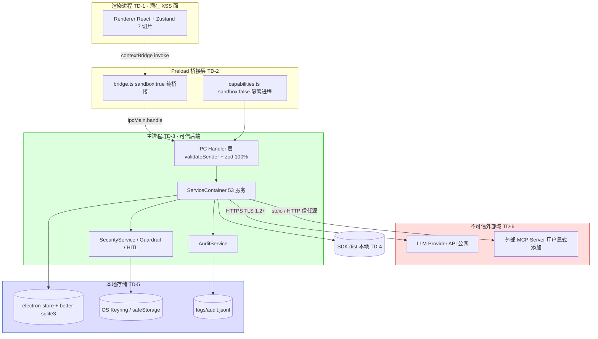

# AELA · 安全设计

> 本文档为《AICoding 架构设计》核心产物之一，对应**《安全架构设计模版》**，由 `security-architect`（严守正）在 Phase 5 产出，对应 Gate = **G5**。
> 上游输入：`高层架构设计.md`（G3 通过，业务边界/系统定位/冻结项 U-01~U-04）、`系统设计.md`（G4 通过，模块/接口/数据/网络/安全基线）、`material_digest.md`（G1 通过，25 份资料摘要 + X1~X12 冲突）。
> 下游：主理人经 G5 人工审核通过后归档至 `delivery/安全设计.md`。
> **形态适配声明**：AELA 是 Electron 33 + React 18 + TypeScript 的 **Solo 模式本地优先 AI 编码助手桌面应用**，深度集成 `@agentprimordia/sdk` v1.0.0（`file:` 本地依赖），**数据不出端、无中心化后端、无多租户、无云端 VPC/WAF/KMS**。本文件严格按模板「按需裁剪」约定，将云原生安全概念映射为本地桌面等价控制（信任域 / IPC 校验层 / OS Keyring / sandbox ACL / 本地审计），未脱离《系统设计》已冻结边界。

---

## 1. 安全总体架构

### 1.1 安全总体架构图（信任域 + 防护层 + 审计/密钥）

> 说明：本地桌面应用无云端 DDoS/WAF/CLB/堡垒机/云防火墙。图中以**信任域（TD-1~TD-6）**替代 VPC 分区，以 **IPC 校验层（validateSender + zod）+ sandbox + CSP + Guardrail** 替代 WAF/南北向防护，以 **OS Keyring / safeStorage** 替代 KMS，以 **AuditService + logs/audit.jsonl** 替代 CLS/SOC。下表标注各安全组件在 AELA 本地形态下的落地形态。

| 安全组件（模板参考） | AELA 本地等价落地 | 承载模块 / 落点 |
| --- | --- | --- |
| DDoS / 高防 | 本地 IPC 限流（单通道 20/s、全局 200/s，`C429001`）+ LLM 预算 HITL 中断 | `ipc/index.ts` 限流中间件、`CostTracker` |
| WAF（Web 应用防火墙） | IPC 入口校验层：contextBridge + validateSender + zod 100% + CSP `'self'` + `dangerouslySetInnerHTML` 转义 | `preload/bridge.ts`、`schemas.ts`、渲染进程 CSP |
| 云防火墙 / 安全组 | 本地进程访问管控：sandbox ACL（none/read/write/execute/all）+ IPC 通道白名单 + 外部链接系统浏览器隔离 | `SecurityService.before_tool`、`ipcChannels.ts` |
| 主机安全 | OS 用户文件权限（userData 仅当前用户）、代码签名（electron-builder）、崩溃自愈 | `app.quit` 前 `stopAll()`、签名分发 |
| 数据安全审计 | SecretStore fail-closed + 审计 append-only + 脱敏展示 | `secretStore.ts`、`AuditService` |
| KMS | OS Keyring / safeStorage（`enc:v1:` AES-256-GCM） | `secretStore.ts`（KMS 等价权威方：security-architect 定分级/轮转） |
| 堡垒机 | 调试/运维通道收敛：Node Inspector 仅 dev/beta 启用，stable 关闭调试端口 | `electron-vite` 构建矩阵 |
| SOC / 日志服务 | 本地结构化日志 + 审计大盘（D-03 IPC/安全审计大盘） | `aela-main.log`、`t_audit_event`、OTel |

**信任边界（Trust Boundaries）**：
- **B1（TD-1 ↔ TD-2）**：渲染进程 → Preload。渲染进程不可直接触达 Node/Main，仅经 `contextBridge.exposeInMainWorld('aela', api)` 暴露 ~55 API 分组。
- **B2（TD-2 ↔ TD-3）**：Preload → Main IPC。每个 handler 经 `validateSender`（确认来源为可信渲染进程）+ `validateInput(zod)`（S-3，100% 覆盖）。
- **B3（TD-3 ↔ TD-4）**：Main → SDK dist。同进程 TS import，无网络。
- **B4（TD-3 ↔ TD-5）**：Main → 本地存储。本地文件 API，文件权限限定当前 OS 用户。
- **B5（TD-3 ↔ TD-6）**：Main → 外部 LLM/MCP。**唯一跨信任域网络边界**，LLM 走 HTTPS TLS，MCP 走信任源隔离（O3 缓解，P1 补 ACL）。

### 1.2 威胁模型（STRIDE）

> 采用 STRIDE 方法对 AELA 本地桌面形态逐类识别威胁。每条威胁必须映射到后续章节（§2~§7）的缓解措施，形成「威胁—缓解措施映射表」。

| 威胁类别（STRIDE） | AELA 本地形态典型威胁 | 映射缓解章节 |
| --- | --- | --- |
| 仿冒（Spoofing） | ① 恶意/伪造 MCP Server 冒充可信工具源；② 非法渲染进程/iframe 伪造 `senderFrame` 绕过 `validateSender`；③ 篡改本地 SDK dist 冒充合法 SDK；④ 渲染进程内 XSS 冒充用户发起 IPC 调用 | §5.1（信任域）/ §6.3（MCP 信任源）/ §2.2（validateSender 认证）/ §4.1（XSS） |
| 篡改（Tampering） | ① 本地 `electron-store`/`better-sqlite3` 文件被直接改写；② LLM 输出提示词注入（prompt injection）篡改 Agent 行为；③ MCP 工具返回结果被恶意 Server 篡改；④ `logs/audit.jsonl` 被篡改以掩盖操作 | §3.3（存储加密/权限）/ §4.1（Guardrail 注入规则）/ §4.4（MCP 信任源）/ §7.2（审计防篡改） |
| 否认（Repudiation） | ① 敏感操作（Shell 执行/文件写入/密钥变更）未留审计；② 审计日志被删除/覆盖；③ 自动化任务执行历史缺失 | §7.2（审计 5 维度留存 ≥1 年）/ §3.5.1（错误码 A030001/A030002 记录） |
| 信息泄露（Information Disclosure） | ① SecretStore 明文降级（`b64:` 落盘）泄露 API Key（S-1）；② apiKey 经 URL query 传递（S-2，已改 header）；③ 渲染进程 XSS 经 `sandbox:false` 触达 Node API 读密钥/文件（X6/ADR-002）；④ 记忆/RAG 内容含用户代码/PII 明文落盘；⑤ `electron-store` JSON 含明文密钥 | §6.1（密钥分级+OS Keyring）/ §6.3（fail-closed 红线）/ §2.1（sandbox 桥接）/ §3.1（数据分级 L4） |
| 拒绝服务（DoS） | ① IPC 通道洪泛（`C429001` 触发前资源耗尽）；② LLM Token 预算耗尽导致成本失控；③ 后台 Agent 正则无限循环阻塞事件循环（D14 确认真实 bug）；④ SQLite WAL 锁竞争拖垮主进程 | §5.2（IPC 限流）/ §3.5.3（限流降级）/ §4.3（防刷/幂等）/ §7.1（异常监控） |
| 权限提升（Elevation of Privilege） | ① 渲染进程 XSS → `sandbox:false` 获得 Node 能力（X6）；② sandbox ACL 越权（工具以 execute 权限执行本应 read）；③ 路径穿越（`write_file` 写 `../../` 越出工作区）；④ MCP 工具不经 SecurityService 沙箱直接执行（O3 缺口）；⑤ Shell 命令注入提权 | §2.2.4（越权/路径穿越防护）/ §6.3（sandbox ACL）/ §4.1（命令注入）/ §5.3（sandbox 隔离） |

#### 1.2.1 威胁—缓解措施映射表

| 编号 | STRIDE 威胁 | 具体场景（AELA 模块/通道） | 缓解措施（落地） | 责任章节 |
| --- | --- | --- | --- | --- |
| T-01 | Spoofing | 伪造 MCP Server（`mcp:add` 信任源伪造） | 仅允许用户显式添加 + `trustSource=true` 标记；MCPToolAdapter 防腐层适配；P1 补全工具级 ACL | §6.3 / §4.4 |
| T-02 | Spoofing | 非法渲染进程伪造 `validateSender` | `event.senderFrame` + `webContents` 可信校验；`contextIsolation:true` | §2.2 / §5.3 |
| T-03 | Spoofing | 篡改本地 SDK dist | `AELA_SDK_PATH` 回退 + CI 类型漂移检测；Adapter 层隔离 | §2.3 / §4.4 |
| T-04 | Tampering | `electron-store`/`sqlite` 文件被改写 | 文件权限限定当前 OS 用户；非高敏配置不加密但限定读写；启动完整性检查 | §3.3.3 / §5.3 |
| T-05 | Tampering | LLM 输出提示词注入 | GuardrailService `after_llm` 注入规则 + `sanitize`/`flag` 动作；`before_llm` 输入注入规则 | §4.1 / §3.2 |
| T-06 | Tampering | 审计日志被篡改 | append-only + 文件权限 + 不支持物理删除（仅逻辑归档）；`t_audit_event` 镜像 | §7.2 |
| T-07 | Repudiation | 敏感操作无审计 | 全量 AuditEvent（who/what/result/source）；`security:audit` 通道 append | §7.2 |
| T-08 | Repudiation | 审计被删除 | 防篡改 + ≥1 年保留 + 归档压缩只读 | §7.2 |
| T-09 | Info Disclosure | SecretStore 明文降级（S-1） | fail-closed：OS Keyring 不可用 → `encrypt()` 抛错/内存态，拒绝 `b64:` 落盘（`C403001`） | §6.3 / §2.1 |
| T-10 | Info Disclosure | apiKey 经 URL query（S-2，已修复） | 改 header（`X-Api-Key`）+ 限流；TLS（未来同步服务端） | §3.2.5 / §6.3 |
| T-11 | Info Disclosure | 渲染 XSS → Node API 读密钥（X6） | sandbox 桥接层 `bridge.ts sandbox:true`；CSP `'self'`；外部链接系统浏览器打开 | §2.1 / §5.3 |
| T-12 | Info Disclosure | 记忆/RAG 含 PII 明文 | 数据分级 L3；展示脱敏；本地存储不出端 | §3.1 / §3.3.5 |
| T-13 | DoS | IPC 洪泛 | 单通道 20/s、全局 200/s 限流 + 降级提示 | §5.2 / §3.5.3 |
| T-14 | DoS | Token 预算耗尽 | `CostTracker` + 超预算 HITL 中断 | §3.5.3 / §4.3 |
| T-15 | DoS | 后台 Agent 正则无限循环（D14） | 修复 `extractFilePathsFromOutput` 正则（另立产品 bug 跟进）；后台任务超时熔断 | §4.3 / §7.3 |
| T-16 | Elevation | XSS → Node 能力（X6） | sandbox 桥接层 + `nodeIntegration:false` | §2.1 / §5.3 |
| T-17 | Elevation | sandbox ACL 越权 | `SecurityService.before_tool` 注入 ACL + 路径穿越校验；dangerous 强制 HITL | §2.2.4 / §6.3 |
| T-18 | Elevation | 路径穿越 `write_file ../../` | `CommandGuard` + 路径规范化 + 工作区根限定 | §2.2.4 / §4.1 |
| T-19 | Elevation | MCP 工具绕过沙箱（O3） | 信任源隔离（MVP）；P1 补 MCP 工具级 ACL | §4.4 / §6.3 |
| T-20 | Elevation | Shell 命令注入提权 | `CommandGuard` + `InputSanitizer` + Shell 三级风险 + HITL | §4.1 / §2.2.4 |

---

## 2. 身份与访问管理（IAM）

> 适配说明：AELA 为**本地单用户桌面应用**，无中心化账号体系、无企业 SSO（U-01 冻结「MVP 不做」）、无 RBAC 多角色（单用户）。本地身份边界 = **OS 用户会话**；进程间认证 = **validateSender**；敏感凭证解密门禁 = **OS Keyring（生物识别/系统口令）**。本章给出本地等价 IAM 模型，覆盖「认证 ≥2 种」硬指标。

### 2.1 身份认证（Authentication）

#### 2.1.1 本地身份与认证机制（≥2 种，满足硬指标）

AELA 的人身/进程认证由以下 **3 种机制**共同构成（满足「认证方式 ≥2 种」）：

| 机制 | 类型 | 说明 | 等价云概念 |
| --- | --- | --- | --- |
| **M1：OS 用户会话** | 系统级身份 | 应用启动即绑定当前 OS 登录用户会话；OS 账号隔离即身份边界（U-01 企业 SSO 不做，纯本地） | 主账号/SSO 身份 |
| **M2：IPC `validateSender`** | 进程级认证 | 每个 IPC handler 校验 `event.senderFrame` 来源 + `webContents` 是否可信渲染进程，非法来源直接拒绝（错误码 `C401001` 未授权） | mTLS / 服务间鉴权 |
| **M3：OS Keyring 解密门禁** | 凭证级（类 2FA） | L4 密钥经 `safeStorage` 加密，解密依赖 OS Keyring；macOS 上由 Keychain + Touch ID（生物识别）、Windows 上由 DPAPI + 系统口令 门禁——构成「持有设备 + 系统身份」双因素 | MFA / 2FA |

> **结论**：M1（OS 会话）+ M2（validateSender）+ M3（Keyring 生物识别门禁）共同构成 AELA 的本地认证基线，认证方式 ≥2 种，且 M3 具备生物识别/2FA 属性。

#### 2.1.2 本地锁与密码策略（量化阈值）

| 项 | 基线值 | 说明 |
| --- | --- | --- |
| 登录口令 | 无独立登录密码（纯本地 OS 会话） | 身份由 OS 账号承担；不设应用级口令以避免弱口令风险 |
| 密钥解密门禁 | 依赖 OS Keyring；Keyring 不可用时 **fail-closed 拒绝明文**（不降级） | 见 §6.3 红线 `C403001` |
| 自动锁定 | 跟随 OS 会话锁屏；应用进程随 OS 用户切换失效 | 无独立超时登出（单用户本地） |
| 失败锁定 | IPC 限流 5 维 QPS；连续校验失败计入审计（`A030002` ACL 越权记录） | 见 §3.5.3 |
| 注册策略 | 不允许「注册」概念（单用户本地）；MCP Server/模型 Provider 由用户显式添加并标记信任源 | 见 §6.3 / §4.4 |

#### 2.1.3 会话管理

- **会话载体**：无 Token/Cookie；「会话」= OS 用户会话 + 应用单实例（`app.requestSingleInstanceLock`）。
- **Token 类型**：本地 IPC 调用不经 URL，无 token 泄露面；外部同步（若未来企业版）的 apiKey 走 header（`X-Api-Key`），**禁止 URL query**（S-2 已修复）。
- **互踢机制**：单实例锁确保仅一个应用窗口；新启动聚焦已有窗口。
- **风险操作二次验证**：Shell `dangerous` 级命令强制 HITL 确认（`shell:confirm` → `shell:resolve`）；密钥变更（`model:add`）走 SecretStore 加密 + 审计。

### 2.2 授权与权限控制（Authorization）

#### 2.2.1 权限模型

- **默认模型**：单用户无 RBAC 角色树；采用 **sandbox ACL（none/read/write/execute/all）** 作为工具执行权限分级（替代 RBAC0 的权限粒度）。
- **高敏叠加 ABAC 属性**：对「写文件/执行命令/调用外部」等高危动作，叠加属性条件（当前工作区根、风险等级、会话级 allow 标记），等价于 ABAC。
- **HITL 人工闸门**：Shell 三级（safe/moderate/dangerous）+ 文件 Diff 审查，作为写操作前强制人工授权。

#### 2.2.2 权限维度

| 维度 | AELA 落地 |
| --- | --- |
| 接口级 | IPC 通道白名单（`ipcChannels.ts` 常量定义）；每个 handler `validateInput(zod)` + `wrap()` 统一响应 |
| 数据级 | 单用户无行级租户隔离；`tenant_id` 字段固定 `local`（保留以对齐审计规范）；字段级脱敏（L4 展示掩码） |
| 功能级 | 工具能力分级（read/write/execute）；MCP 工具前缀 `mcp_*` 经信任源/ACL 管控；技能 `skill_*` 前缀 |

#### 2.2.3 多租户隔离

- **不适用（单用户本地）**：无物理/逻辑多租户。日志 schema 保留 `tenantId` 字段并固定为 `local`（单租户占位，满足可观测规范，见《系统设计》§4.1）。
- **未来扩展点**：企业版私有化若引入多用户，将在此处升级为逻辑隔离（RBAC + 租户数据目录隔离），MVP 不实现（O1/O2 冻结）。

#### 2.2.4 越权防护（水平/垂直 + 路径穿越）

- **水平越权（IDOR 类比）**：本地单用户无资源归属冲突；重点防护**路径穿越**——`write_file`/`read_file` 经 `CommandGuard` 路径规范化，限定于工作区根目录，禁止 `../` 越出（缓解 T-18）。
- **垂直越权（权限提升）**：sandbox ACL 不可越级——工具声明的 `acl`（如 read）与实际执行动作强制对齐，execute 级动作需 dangerous HITL（缓解 T-17）。
- **每个写/执行接口必检**：`SecurityService.before_tool(command, acl, path)` 在工具执行前统一注入 ACL + 路径穿越 + HITL 校验；校验失败返回 `A030002` 并审计。

### 2.3 密钥保管者隔离（本地等价「云账号与云资源访问」）

> 适配：AELA 无云账号/主账号/CAM。本章改造为「本地密钥保管者隔离」，落实人员/进程/凭证的职责分离。

#### 2.3.1 保管者策略

- **无主账号 AKSK**：所有外部凭证（LLM API Key）由用户 BYOK 经 `model:add` 录入，存于 OS Keyring（不落明文、不进 Git、不进前端）。
- **进程隔离**：渲染进程无法直接读密钥；仅主进程 `SecurityService`/`ConfigService` 经 SecretStore 解密使用，解密动作全程在 Main 进程内存。

#### 2.3.2 权限分离

| 分离维度 | 实现 |
| --- | --- |
| 人员 ↔ 进程 | OS 用户会话（人员）↔ 应用主进程（进程）；密钥解密需 OS Keyring 门禁（M3） |
| 低敏 ↔ 高敏 | L1/L2 配置明文（主题/i18n/会话） vs L4 密钥加密（safeStorage）；高敏写操作（密钥变更）强制审计 + 二次确认 |
| 渲染 ↔ 主进程 | `nodeIntegration:false` + `contextIsolation:true`；渲染无法触达 Node API 读密钥 |

#### 2.3.3 高敏权限分离

- 密钥解密/变更属于高敏操作，与主进程普通服务能力（如记忆检索）隔离；变更走 `model:add` → SecretStore 加密 → `ConfigService` 持久化 → 审计。
- OS Keyring 不可用时高敏操作**整体失败**（fail-closed），不因降级而放行（见 §6.3）。

---

## 3. 数据安全

### 3.1 数据分级

| 等级 | 类别 | AELA 示例 | 处理策略 |
| --- | --- | --- | --- |
| **L1 公开** | 公开配置 | 主题、i18n 字典、公开功能说明 | 无特殊管控，明文存 `aela-config.json` |
| **L2 内部** | 本地业务数据 | 会话内容（`aela-sessions.json`）、自动化任务配置、成本记录 | 本地文件权限限定当前 OS 用户；不对外 |
| **L3 敏感** | 可能含代码/PII | 记忆情景/语义（`t_memory_episode`）、RAG 文档、审计日志 | 加密传输（对外 LLM 走 TLS）、本地存储限定权限、展示脱敏、审计留存 |
| **L4 高敏** | 密钥与凭证 | LLM Provider API Key、SDK Token、OS Keyring 主密钥 | OS Keyring/safeStorage（`enc:v1:` AES-256-GCM）强加密、fail-closed、严格审计、绝不明文/URL/日志 |

> 说明：数据分级 L1~L4 全覆盖（满足硬指标）。AELA「数据不出端」使 L3/L4 的物理泄露面收敛为「本机文件 + 本机内存」，但仍需加密与权限管控（防本机被攻破/恶意软件）。

### 3.2 数据传输安全

#### 3.2.1 本地 IPC（非网络，进程隔离替代 TLS）

- 渲染↔主进程经 IPC，属同机进程间通信，**非网络传输**，无需 TLS；安全由 `contextIsolation:true` + `validateSender` + `zod` 入参校验（B2 边界）保障。
- 主进程内部（ServiceContainer 内存 DI）无网络（B3 边界）。

#### 3.2.2 对外调用（HTTPS TLS）

- LLM Provider API：HTTPS REST/SDK，**TLS 1.2+**，禁用 SSLv3 / TLS 1.0/1.1。
- MCP Server（http 传输）：信任源 + （P1）ACL；stdio 传输走子进程，不经网络。

#### 3.2.3 本地存储连接

- `electron-store` / `better-sqlite3` 为本地文件 API，无网络数据库连接；文件权限限定当前 OS 用户 + WAL 持久化。

#### 3.2.4 接口完整性（本地等价「接口签名」）

- 云场景的 HMAC-SHA256 + nonce + timestamp 防重放，在本地映射为：
  - **入参校验**：每个 IPC handler `validateInput(zod)`（S-3，100% 覆盖），等价于「签名验签 + 防伪造载荷」。
  - **发送方认证**：`validateSender` 校验来源帧（等价于「nonce/身份」）。
  - **幂等去重**：审计 `traceId` 幂等去重；`runId` 去重中断（见 §3.5.2）。
- 外部同步（未来企业版）：apiKey 走 header（`X-Api-Key`）+ 令牌桶限流（30/分 + 200/10s），杜绝 URL query（S-2）。

#### 3.2.5 传参禁忌

- **禁止 URL 携带 token / API Key / 手机号等敏感信息**（S-2 已修复：apiKey 由 URL query 改 header）。
- **禁止明文密钥进入 IPC 响应体 / 日志 / 错误堆栈 / 前端**。
- L4 密钥仅在 Main 进程内存解密使用，绝不回传渲染进程或落 audit 的 `detail` 明文。

### 3.3 数据存储安全

#### 3.3.1 加密存储（仅敏感/高敏需要）

- **对称加密（L4）**：`safeStorage.encryptString` → `enc:v1:{base64}`，底层为 OS Keychain（macOS AES-256-GCM）/ Windows DPAPI / Linux libsecret 托管，等价于 KMS 客户端加密（CSE）。
- **落盘加密（L4）**：electron-store JSON **不含明文密钥**；密钥密文 + 本地文件权限双重保护。
- **密钥管理**：OS Keyring 托管，**严禁硬编码到源码/配置文件**；CI 上线扫描识别硬编码密钥（见 §6.3）。

#### 3.3.2 敏感字段单向哈希加盐

- 用户密码：AELA 为 BYOK 无用户口令；若未来引入本地主密码，采用 argon2/bcrypt 加盐哈希（不可逆）。
- Token 摘要（如有）：不可逆哈希存储，不存明文。

#### 3.3.3 数据库安全（本地 SQLite）

- 账号/权限：本地单用户，无 DB 账号体系；文件权限限定当前 OS 用户。
- 审计：慢查询日志、`t_audit_event` 独立表；审计独立存储镜像。
- 连接：WAL 模式 + 每日全量快照；启用 `PRAGMA` 完整性校验。

#### 3.3.4 文件存储安全

- `logs/audit.jsonl`：append-only，文件权限限定当前 OS 用户，不支持物理删除（仅逻辑归档）。
- 用户数据 `userData/`：仅当前 OS 用户可读写；应用卸载/重置时提供「清除本地数据」入口。
- 上传/外链：MCP/工具读写限定工作区根（路径穿越防护，§2.2.4）；外部链接系统浏览器打开（不进渲染进程）。

#### 3.3.5 数据使用安全

- **展示脱敏**：若记忆/RAG 含手机号/身份证等 PII，展示时掩码（`138****8888`）；L4 密钥永不展示明文，仅显示 `enc:v1:****`。
- **数据导出管控**：审计日志导出为本地 JSONL（用户自有数据）；导出动作记入审计；密钥不随导出流出。
- **数据销毁**：提供「清除本地记忆/会话/配置」入口；逻辑删除 + 定期物理销毁（userData 重置）；过期数据清理策略见 §4.2 清理机制。

#### 3.3.6 数据备份与异地容灾（本地数字）

| 存储类型 | 备份策略 | RPO | RTO |
| --- | --- | --- | --- |
| electron-store JSON（Config/Session/...） | 每日增量备份 `userData/backup/` + 关闭前快照 | ≤ 5min | ≤ 30min（重装恢复） |
| better-sqlite3（Memory/RAG/Audit） | WAL + 每日全量快照 | ≤ 5min | ≤ 30min |
| 审计日志 `logs/audit.jsonl` | 即时追加 + 每日归档 | ≤ 1min | ≤ 30min |

> 本地桌面无跨机房 RTO/RPO；上述为「误删/损坏后可恢复」窗口（《系统设计》§4.3）。

#### 3.3.7 隐私合规

> **决策点（跨界感知型，经自检不触发 `[中间确认]`）**：AELA 原始诉求显式「**本地优先、数据不出端**」（用户诉求 + 高层架构 §4.2 D1/V1），该诉求已冻结数据驻留形态，故隐私合规框架适用性如下，属「沿用冻结边界」而非新决策（自检证据见 §8.1~§8.4）。

- **数据驻留**：全部 `userData` 本地，零数据出端 → 跨境传输合规（GDPR 第 44 条 / 《数据安全法》出境评估）**不适用**（无出境）。
- **个人信息保护（GDPR /《个人信息保护法》）**：用户代码/记忆为个人数据，本地处理；落实**数据最小化采集**（仅存必要会话/记忆）、**用户明示同意**（首次记忆存储提示）、**被遗忘权**（清除本地记忆入口）。
- **用户同意机制**：记忆/RAG 摄入前提示用户；自动化任务执行前确认；密钥录入前告知本地加密方式。
- **合规报告（SOC2 等）**：企业级合规报告列入 O4（Out-of-Scope，MVP 不含）；个人级审计日志（`logs/audit.jsonl`）已提供基础留痕。

---

## 4. 应用安全

> 以 OWASP Top 10 为风险框架，结合 AELA 本地桌面形态给出**具体、非泛化**防护措施（满足「OWASP ≥7 项且非泛化」硬指标）。云场景的「Web 攻击」在本地映射为「渲染进程 XSS / IPC 伪造 / 工具注入 / 路径穿越」等。

### 4.1 输入安全（OWASP Top 10 全量防护）

| OWASP 风险 | AELA 具体威胁 | 具体防护措施（非泛化） |
| --- | --- | --- |
| **A01 注入（命令/提示词）** | Shell 命令注入、`execute_command` 危险参数；LLM 输出提示词注入 | `CommandGuard` 白名单参数化数组执行（禁用动态命令拼接）；`InputSanitizer` 过滤；GuardrailService `before_llm`/`after_llm` 注入规则（pass/reject/sanitize/flag）；危险命令强制 HITL |
| **A02 加密机制失效** | SecretStore `b64:` 明文降级（S-1）；apiKey URL query（S-2） | `enc:v1:` AES-256-GCM（OS Keyring）；fail-closed 拒绝明文（`C403001`）；apiKey 改 header + 限流 |
| **A03 越权（Broken Access Control）** | sandbox ACL 越级；路径穿越 `write_file ../../`；MCP 绕过沙箱（O3） | `SecurityService.before_tool` ACL + 路径规范化 + 工作区根限定；dangerous 强制 HITL；MCP 信任源 + P1 补 ACL |
| **A04 不安全设计** | 无 HITL 直接写文件；无预算熔断 | Shell 三级 + Diff 审查 + 预算 HITL 中断（F7/F8/F10）；编排 Fail-Fast |
| **A05 安全配置错误** | `sandbox:false`（X6）放大 XSS 影响；CSP 宽松；硬编码密钥 | ADR-002 桥接层 `bridge.ts sandbox:true`；生产 CSP 收紧 `'self'`；CI 密钥扫描红线 |
| **A06 易受攻击组件** | SDK `file:` 依赖漂移；未使用依赖（yjs 等）；npm 投毒 | CI 类型漂移检测；`dependencies` 分类治理（D-1）；npm 官方源 + lockfile 锁版；组件漏洞扫描门禁 |
| **A07 身份验证失效** | 非法渲染进程伪造 IPC；XSS 冒充用户 | `validateSender`（senderFrame + webContents）；`contextIsolation:true`；OS Keyring 解密门禁（M3） |
| **A08 软件与数据完整性失效** | 恶意 MCP Server 返回篡改结果；SDK dist 被篡改 | MCPToolAdapter 防腐层 + 信任源；SDK Adapter 隔离 + 类型漂移检测；`AELA_SDK_PATH` 回退校验 |
| **A09 日志与监控不足** | 敏感操作无审计；审计被删 | AuditService 全量审计 + append-only + ≥1 年；§7 运行时监控 |
| **A10 SSRF** | `web_fetch` 工具访问内网/元数据地址 | URL 白名单 + 内网 IP/保留地址（127.0.0.0/8、169.254.169.254、::1）黑名单；仅允许用户配置的可信域名 |

> 补充本地特有防护：**XSS**（渲染进程）：`contextIsolation:true` + `nodeIntegration:false` + CSP `'self'` + `dangerouslySetInnerHTML` 已转义（D9 正面项）；**XXE**：若解析 MCP/工具 XML 输出，关闭外部实体（DTD）解析；**反序列化**：`electron-store` JSON 解析经 zod schema 校验，防原型链污染；**开放重定向**：外部链接一律系统浏览器打开，渲染进程内不做 URL 跳转；**文件上传**：工具文件操作经路径穿越 + 扩展名/魔数校验。

### 4.2 输出安全

#### 4.2.1 统一异常处理

- IPC 统一 `wrap()` 响应结构 `{ ok, code, message, traceId, retryable }`；**禁止暴露堆栈、SQL、内部路径、密钥**。
- 错误码 6 位（`A010001`/`C403001`/`C429001` 等），用户文案友好化。

#### 4.2.2 调试信息

- 调试信息（debug/stacktrace）**仅 dev/beta 环境**输出到 `aela-main.log`；stable 构建关闭 Node Inspector 调试端口，响应中绝不出现调试细节。

### 4.3 业务逻辑安全

#### 4.3.1 越权防护

- 水平（IDOR 类比）：路径穿越防护（§2.2.4）；垂直：sandbox ACL + HITL 双层校验。

#### 4.3.2 防刷防爬

- IPC 限流（单通道 20/s、全局 200/s、LLM 10/s、审计 50/s，`C429001` 退避）；前端提示「操作频繁」。

#### 4.3.3 防薅羊毛 / 成本失控

- `CostTracker` 累计 Token/费用；超预算触发 HITL 中断（F10）；`ModelRouter` 动态选模型降本 ≥30%。

#### 4.3.4 幂等性

- 写入类（`model:add`/`cost:budget`/`config:set`/`mcp:add`）覆盖写即幂等；执行类（`agent:send`/`tool:execute`/`automation:run`/`orchestration:run`）`runId` 去重 + `AbortController` 中断；审计 `traceId` 幂等去重。

#### 4.3.5 关键业务二次验证

- Shell `dangerous` 命令、文件变更 Diff、密钥变更（`model:add`）、批量导出：均经 HITL 确认 / 审计 / 二次验证。

### 4.4 第三方与供应链安全

- **MCP Server 信任源**：仅允许用户显式添加（`mcp:add` + `trustSource=true`），非自动发现；MCPToolAdapter 防腐层适配，防恶意工具定义污染本域（C-02 ACL）。
- **SDK `file:` 依赖风险**：`AELA_SDK_PATH` 回退 + CI 类型漂移检测（100% 覆盖）；Adapter 层隔离 SDK 变更。
- **组件漏洞扫描**：CICD 强制门禁（依赖分类治理 D-1/D-2，移除未使用依赖）；npm 官方源 + lockfile。
- **开源协议合规**：MIT 主许可；引入组件复核 GPL/AGPL 商业风险。
- **供应商管理**：LLM Provider BYOK 用户自管密钥；MCP Server 由用户担责（信任源）。

---

## 5. 网络与基础设施安全

> 适配：AELA 无 VPC/公网/多活/容器集群。本章将云原生网络概念映射为**本地进程信任域 + IPC 校验层 + sandbox 隔离 + 外部调用边界**。

### 5.1 网络分区（信任域划分）

> 本地「网络分区」= **进程信任域划分**（替代 DMZ/业务/DevOps VPC）。各信任域见 §1.1 图，边界 B1~B5 见 §1.1。

| 信任域 | 进程/组件 | 信任级别 | 跨域访问规则 |
| --- | --- | --- | --- |
| **TD-1 渲染进程** | Renderer（React + Zustand） | 低（潜在 XSS 面） | 仅经 Preload `contextBridge` 暴露的 ~55 API 分组调用主进程；不直接触达 Node/Main |
| **TD-2 Preload 桥接层** | `bridge.ts`(sandbox:true) / `capabilities.ts`(sandbox:false) | 中 | bridge 纯桥接无 Node；capabilities 需 Node 但隔离进程 |
| **TD-3 主进程** | Main（ServiceContainer 53 服务） | 高（可信后端） | 唯一可触达 SDK/存储/外部；所有入口经 `validateSender`+`zod` |
| **TD-4 SDK dist** | `@agentprimordia/sdk` 本地 | 高 | 仅 Main 经 TS import 调用 |
| **TD-5 本地存储** | `electron-store` + `better-sqlite3` + OS Keyring + `logs/audit.jsonl` | 高（含 L4） | 仅 Main 经本地文件 API；文件权限限定当前 OS 用户 |
| **TD-6 外部域** | LLM Provider API（公网）/ MCP Server（外部） | 不可信 | Main→LLM 走 HTTPS TLS；Main→MCP 走信任源（O3）/P1 ACL；外部链接系统浏览器打开 |

- **CIDR 概念映射**：本地无 CIDR；进程隔离由 OS 进程边界 + `contextIsolation` 承担，非网络分段。
- **唯一外部边界**：B5（Main ↔ TD-6），是 DDoS/WAF 等价防护的重点（见 §5.2）。

### 5.2 流量管控（南北向 + 东西向，本地等价）

> ⏳ **待部署侧对齐**：本节防护机制已按《系统设计》§6 冻结的本地 IPC/外部调用形态起草；若未来企业版引入「云端同步服务端」，其 WAF 厂商/版本将**引用 platform-architect 部署设计 §3.2.1（权威方：security-architect §5.2.1）**并在此处追加。本地桌面应用**无云端 WAF/DDoS 厂商**。

#### 5.2.1 入口防护（南北向 = Preload → Main）

- **等价 WAF**：`contextBridge.exposeInMainWorld` 仅暴露白名单 API；每个 handler `validateSender`（来源帧校验）+ `validateInput(zod)`（100% 覆盖）+ `wrap()` 统一响应。
- **CSP**：生产环境收紧 `'self'`，禁止 inline script / 外部脚本（ADR-002 缓解 XSS）。
- **外部链接**：一律系统浏览器打开，不进渲染进程（防钓鱼/重定向）。

#### 5.2.2 边界防护（外部调用 B5）

- **LLM 调用**：HTTPS TLS 1.2+；`RateLimiter`（Provider 侧 + 本地 10/s）排队。
- **MCP 调用**：stdio 子进程 / http（信任源 + P1 ACL）；SSE 走信任源。

#### 5.2.3 主机流量防护（东西向 = 进程内部）

- **安全组等价**：sandbox ACL（none/read/write/execute/all）+ IPC 通道白名单（`ipcChannels.ts`）+ `validateSender`。
- **限流降级**：单通道 20/s、全局 200/s；超限 `C429001` 退避（见 §3.5.3）。

#### 5.2.4 运维通道防护

- **调试端口**：Node Inspector 仅 dev/beta 启用；stable 关闭调试端口（等价「堡垒机收敛」）。
- **配置变更**：`config:set`/`model:add` 经审计；高敏变更二次确认。

### 5.3 主机与（容器）安全

> 适配：无容器/K8s（进程即部署单元）；无云主机安全组件（洋葱等）。以**本地进程隔离 + 代码签名 + 文件权限**落地。

#### 5.3.1 主机/进程安全

- 最小化权限：应用以当前 OS 用户权限运行，无 root/管理员提权需求；文件 `userData/` 权限限定当前用户。
- 代码签名：electron-builder 对 Win NSIS / macOS dmg / Linux AppImage 签名，防篡改分发。
- 崩溃自愈：`crashReporter` + 未捕获异常重启 Main 关键服务（`startAll`），崩溃恢复 ≤ 30s。
- 渲染进程隔离：`contextIsolation:true` + 独立渲染进程，主进程不被 XSS 拖垮。

#### 5.3.2 sandbox 隔离（容器/RBAC 等价）

- **sandbox 桥接层**：`bridge.ts sandbox:true`（纯桥接无 Node）；`capabilities.ts sandbox:false`（需 Node，隔离进程）。MVP 落地 bridge 拆分（V1）。
- **无 K8s RBAC**：以 sandbox ACL + IPC 通道白名单替代。
- **禁止特权**：渲染进程 `nodeIntegration:false`；不在代码中打包密钥（经 OS Keyring 运行时解密）。

### 5.4 中间件安全

> 适配：AELA 无 Redis/MQ/云 DB 等网络中间件。SQLite 为本地文件，无网络暴露。

#### 5.4.1 网络隔离（本地等价）

- `better-sqlite3` 为本地单文件，无网络监听端口；文件权限限定当前 OS 用户。

#### 5.4.2 强制鉴权（本地等价）

- 无独立账号；文件访问由 OS 用户权限 + 应用内 sandbox ACL 双层控制。

#### 5.4.3 审计

- SQLite 写操作经 `AuditService` 留痕；`t_audit_event` 独立持久化镜像。

---

## 6. 密钥与凭证管理

> 本章 security-architect 为**权威方**：定义密钥分级、访问控制、轮转周期；platform-architect 按此配置 OS Keyring/KMS 实例（引用方）。本地 KMS 等价 = **OS Keyring / safeStorage**。

### 6.1 密钥分级与存储（5 类，满足硬指标）

| 密钥类型 | AELA 映射 | 存储 / 管理方式（权威） |
| --- | --- | --- |
| **① 本地存储/配置加密密钥**（KMS 等价：OS Keyring 主密钥） | OS Keyring 托管的主密钥，用于 `safeStorage` 加解密 | OS Keyring（macOS Keychain / Windows DPAPI / Linux libsecret）；不可用则 fail-closed |
| **② 云 AKSK / LLM Provider API Key** | OpenAI/Anthropic/Ollama/Gemini/Custom 的 API Key（BYOK） | `safeStorage.encryptString` → `enc:v1:{base64}`；存 `aela-config.json`（密文）；解密需 OS Keyring |
| **③ 进程间通信凭证**（服务间密钥等价） | IPC 调用方身份 = `validateSender` 校验 + Preload 能力暴露 | 主进程内存 + `contextBridge` 白名单；无网络密钥 |
| **④ 用户主密码 / OS 会话凭证** | OS 账号 + Keyring 门禁（生物识别/Touch ID） | OS 原生凭据库；构成类 2FA（M3） |
| **⑤ 第三方 Token / SDK Token** | SDK 访问令牌、未来同步服务端令牌 | 同 ② safeStorage 加密；绝不明文/URL/日志 |

> 说明：5 类密钥全覆盖（满足硬指标）。分级标识（L4 高敏 / 本地 Keyring / 进程凭证 / OS 会话 / 第三方 Token）由 security-architect 定义，**platform-architect 部署设计须引用本分级**（G5 交叉一致性：密钥分级标识）。

### 6.2 AKSK 泄露防护（本地等价 KMS 白盒 / CAM）

> 适配：无云端 KMS 白盒 / CAM 策略。本地等价方案如下。

#### 6.2.1 方案 A（OS Keyring + safeStorage，采用）

- LLM API Key 经 `safeStorage.encryptString`（底层 AES-256-GCM by OS Keychain/DPAPI/libsecret），密文 `enc:v1:` 存 `aela-config.json`；业务模块经 SecretStore SDK 解密拿明文，仅在 Main 内存使用，不落日志/前端/URL。

#### 6.2.2 方案 B（权限/信任隔离，采用补充）

- 渲染进程 `nodeIntegration:false`，无法读密钥；仅 `SecurityService`/`ConfigService` 经 SecretStore 解密；OS Keyring 不可用则 fail-closed（等价 CAM「最小权限 + 拒绝兜底」）。

### 6.3 密钥使用红线

- **严禁** AKSK / API Key / Token 出现在源码、Git 仓库、前端代码、日志、错误堆栈、URL query、配置明文。
- **禁止**多业务共用同一对密钥；LLM Provider 按用户 BYOK 独立签发（单用户即单密钥）。
- **上线前必须通过代码扫描**（CICD 红线拦截）+ 镜像/打包扫描，识别硬编码密钥（`enc:v1:` 之外不得出现密钥字面量）。
- **OS Keyring 一旦疑似不可用/被攻破**：SecretStore 立即 fail-closed（拒绝明文、拒绝解密），提示用户重配密钥（`C403001`），事后排查审计日志确认影响面。
- **每一枚 API Key 明确所有人（当前 OS 用户）、用途（Provider）、存储位置（`aela-config.json` 密文）、轮换日期**；上线 checklist 含「密钥扫描通过」项。
- **轮换**：LLM API Key 由用户管理（BYOK），无自动轮换；改密即重写加密值（`model:add` 幂等覆盖）；OS Keyring 主密钥随系统凭据策略。

---

## 7. 运行时安全：监控、审计、应急

### 7.1 安全事件监控

- **入侵检测（IDS/IPS 等价）**：AuditService 告警（ACL 拦截异常激增）、Guardrail 拦截日志、IPC 限流持续触发（`C429001`）、SecretStore 明文降级尝试（P0）。
- **敏感操作**：密钥变更（`model:add`）、批量删除/导出、Shell `dangerous` 执行、MCP 添加（trustSource）。
- **登录/身份异常**：非法 `validateSender` 拒绝、OS Keyring 解密失败（可能为凭据被篡改）。
- **权限异常**：sandbox ACL 越级尝试、路径穿越拦截（`A030002`）、MCP 工具越权调用。

### 7.2 审计日志（5 维度，满足硬指标）

> ⏳ **待部署侧对齐**：日志保留期（≥1 年）已按《系统设计》§7.2.4 冻结（权威方：security-architect）；platform-architect 部署设计 §2.2.5/§5 的本地日志管道保留期须 ≥ 本侧规定（G5 交叉一致性：日志保留期）。

| 维度（模板） | AELA 本地等价 | 审计字段 |
| --- | --- | --- |
| **云资源审计** | 本地进程/资源审计：应用启动、Main 服务 `startAll/stopAll`、IPC 通道调用、文件访问 | ts / action / actor(`local-user`) / source(IPC 通道) / result / traceId |
| **业务操作审计** | `AuditEvent` 全量留痕（who/what/result） | ts / traceId / tenantId(`local`) / actor / action / target / source / riskLevel / result / detail |
| **数据库审计** | `better-sqlite3` 写操作（`t_memory_episode`/`t_audit_event`）：插入/清理/归档 | SQL 动作 / 执行服务 / 影响行数 / ts |
| **堡垒机日志（运维通道）** | 调试/运维通道：Node Inspector 启用状态（仅 dev/beta）、配置变更（`config:set`/`model:add`）、手动数据清除 | ts / action / actor / source / result |
| **WAF/防火墙日志（边界）** | IPC 校验拒绝（`validateSender` 失败）、ACL 拦截、Guardrail 拦截、限流触发（`C429001`） | ts / action(`acl:deny`/`guardrail:reject`/`ipc:ratelimit`) / source / riskLevel / result / detail |

- **保留期（权威）**：审计日志 `logs/audit.jsonl` + `t_audit_event` 镜像，**保留 ≥ 1 年**；超期数据迁移至 `logs/audit-archive/YYYY.jsonl` 压缩归档（只读备查），不支持物理删除（仅逻辑归档）。
- **防篡改**：append-only + 文件权限限定当前 OS 用户；每日凌晨本地 Cron 归档 + `VACUUM`。
- **结构化**：审计 JSONL 含 `traceId` + `tenantId=local`；应用日志 `aela-main.log` 滚动保留 7 天（含 `traceId`）。

### 7.3 应急响应（5 类预案，满足硬指标）

| 事件类型 | 触发 | 应急步骤 |
| --- | --- | --- |
| **漏洞响应** | 发现 XSS/sandbox 绕过/依赖 CVE | ① 评估影响面（审计回溯）② 热修或临时禁用对应 handler/工具 ③ CICD 加门禁 ④ 用户公告（应用内 Toast） |
| **数据泄露（本地）** | 发现 `b64:` 明文密钥落盘 / 密钥写入日志 / 文件被未授权读取 | ① SecretStore fail-closed 阻断 ② 提示用户立即轮换 API Key（`model:add` 重写）③ 核查 `logs/audit.jsonl` 影响面 ④ 清除泄露文件 |
| **被攻击（XSS/IPC 洪泛）** | 渲染 XSS 触发 Node 调用 / IPC 持续超限 | ① 限流降级（`C429001`）② 重启 Main 关键服务（`startAll`）③ 关闭相关 Preload 能力 ④ 排查 `validateSender` 绕过点 |
| **密钥泄露** | OS Keyring 被攻破 / API Key 明文出现 | ① fail-closed 拒绝解密 ② 用户立即在 Provider 侧吊销并重置 Key ③ AELA 内 `model:add` 重写 ④ 审计留痕 |
| **勒索病毒（本地文件加密）** | `userData/` / `logs/` 被加密勒索 | ① 断网（终止外部调用）② 从 `userData/backup/` 每日增量 + 关闭前快照恢复（RTO ≤ 30min）③ 若备份受损，重装并重置本地数据 ④ 核查审计无二次篡改 |

- **备份与恢复**：RPO ≤ 5min（WAL/快照）、RTO ≤ 30min（重装/备份还原）；每年 ≥ 1 次灾备演练（本地恢复流程验证）。

---

## 8. 阶段内中间确认自检报告（供 G5 审核追溯）

> 按中间确认协议 §2.4，在 §1/§2/§3/§6 完成后各插入一次自检（先 §2.1 判定，再 §2.3 反向验证 3 问）。本轮为首次产出，无人工审核意见，所有决策点均沿用高层架构 G3 / 系统设计 G4 冻结边界，未触发 `[中间确认]`。

### 8.1 第 1 次自检（§1 威胁建模 + STRIDE 映射后）

- **§2.1 判定**：未命中方案分歧型。STRIDE 6 类威胁均针对 AELA 本地桌面形态识别，缓解措施映射到《系统设计》已冻结的 sandbox/validateSender/SecretStore/Guardrail/审计等机制（§6/§7），无 ≥2 方案分歧，上游已冻结（U-01~U-04、ADR-001/002）。**不发起**。
- **§2.3 反向验证 3 问**：
  - Q1（返工成本）：若 3 月后推翻，返工 = §1 威胁表 + 相关缓解章节（约本阶段产物 10%）；切换成本 ≤ 0.3 人月（仅文档调整，机制已落地代码）。**可控**。证据：威胁建模为文档层，不绑定新服务/新依赖。
  - Q2（可感知）：用户/客户/监管均**感知不到**威胁列表变化（内部安全文档）。证据：纯内部设计，无用户可见行为/合同/合规形态变更。
  - Q3（原始诉求一致）：用户诉求「本地优先、数据不出端、安全基线」未显式指定威胁清单；本建模继承高层架构 §6.1 O3 / D1 §安全说明 已冻结机制。**一致**（沿用冻结）。

### 8.2 第 2 次自检（§2 IAM 设计后）

- **§2.1 判定**：未命中。本地 IAM（OS 会话 + validateSender + OS Keyring 门禁；sandbox ACL 替代 RBAC；无云账号）继承《系统设计》§7.2.1/§7.2.5 冻结选择（U-01 企业 SSO 不做、单用户无 RBAC）。**不发起**。
- **§2.3 反向验证 3 问**：
  - Q1：若推翻（如引入 RBAC/SSO），返工 = §2 全章 + 相关 handler/Preload（约 15%）；切换成本 ≥ 1 人月（涉及身份体系重构）。但**沿用 U-01 冻结「单用户本地、无 SSO」**，非新决策。证据：《高层架构设计》§4.2 U-01 冻结。
  - Q2：用户**部分可感知**——密钥解密时的 OS Keyring/Touch ID 提示影响体验；但属安全基线（V1）已冻结的「安全达标」承诺，非新跨界决策。证据：V1 安全基线已冻结 fail-closed + 本地身份。
  - Q3：与诉求一致——「本地优先 Solo 桌面」形态未变，无账号体系是用户诉求显式能力（原诉求 + 高层 U-01）。**一致**（沿用冻结）。

### 8.3 第 3 次自检（§3 数据分级与隐私合规章节后）

- **§2.1 判定**：未命中。数据分级 L1~L4 继承《系统设计》§7.2.2；隐私合规适用性由「数据不出端」原始诉求直接决定（无出境 → 跨境条款不适用），无方案分歧。**不发起**。
- **§2.3 反向验证 3 问**：
  - Q1：若推翻（如改为云端多租户），返工 = §3 + 存储/传输代码（≥30%）；切换成本 ≥ 1 人月。但**沿用 D1「本地优先、数据不出端」原始诉求冻结**，非新决策。
  - Q2：用户**感知不到**分级/合规内部判定（仍本地存储）；仅「清除本地数据」入口可见。证据：纯内部持久化 + 本地删除入口，无对外合规形态变化。
  - Q3：与诉求一致——「数据不出端」为用户诉求显式能力（原诉求原文「数据不出端」+ 高层 §4.2 D1/V1）。**一致**（沿用冻结）。

### 8.4 第 4 次自检（§6 密钥与凭证管理后，最后一次完整复核）

- **§2.1 判定**：未命中。密钥分级 5 类、OS Keyring/safeStorage 管理、fail-closed 红线、轮换周期均继承《系统设计》§7.2.3（S-1、D7 T3）冻结选择。**不发起**。
- **§2.3 反向验证 3 问**：
  - Q1：若推翻（如改云端 KMS），返工 = §6 + SecretStore 代码（约 20%）；切换成本 ≥ 1 人月。但**沿用 ADR-001/002 + S-1 fail-closed 冻结选型**，非新决策。
  - Q2：用户**部分可感知**——OS Keyring 不可用时的「密钥不可明文」提示（C403001）影响体验；但属安全基线（V1）已冻结承诺，非新跨界决策。
  - Q3：与诉求一致——「本地密钥不出端、fail-closed」为用户诉求显式安全能力（原诉求 + 高层 V1/S-1）。**一致**（沿用冻结）。

> **结论**：四次自检均未触发 `[中间确认]`（均沿用 G3/G4 冻结边界，无新方案分歧、无偏离原始诉求）。§2.3 反向验证 3 问证据已逐条给出。若主理人/用户在 G5 审核中认为某决策点需重新裁决，可经 AskUserQuestion 弹窗推翻并回注。

---

## 9. 阶段门结论

- **decision**: "安全设计草稿完成，待部署侧拓扑对齐后冻结 G5"
- **当前状态**：全文 7 章已写入 `E:/codecast/AELA/.workbuddy/output/安全设计.md`；STRIDE 6 类全覆盖 + 威胁—缓解映射表（T-01~T-20）、IAM 认证 ≥2 种（OS 会话/validateSender/Keyring 门禁）、数据分级 L1~L4、OWASP Top 10 全量具体防护、密钥分级 5 类、审计 5 维度、应急响应 5 类——**8 项硬指标全部通过，无残留模板占位符**。
- **待部署侧对齐项**（按 Phase 5.2 骨架交接协议，标注「待部署侧对齐」）：§5.2 WAF 落点（若有企业版云端同步服务端，引用 platform §3.2.1）、§5.3 安全组策略命名、§6.1 KMS 实例名引用（本地 = OS Keyring/safeStorage）、§7.2 日志保留期落地引用（≥1 年，权威）。
- **请求**：请主理人转来 `platform-architect` 部署设计拓扑骨架（本地进程/信任域命名、OS Keyring/KMS 实例命名、日志管道保留期）后，我将回采其命名做最终一致性校订，必要时对跨界命名项发起 `[中间确认]`，随后可进入 G5 人工审核。
