# AELA · 系统设计

> 本文档为《AICoding 架构设计》核心产物之一，对应**系统设计**模板（Phase 4，G4 门）。
> 上游输入：`高层架构设计.md`（G3 通过，业务边界/系统定位/三层架构/功能清单 F1–F25/In-Scope 15/Out-Scope 5/U-01~U-04 冻结）+ `material_digest.md`（G1 通过，25 份资料逐章摘要 + X1–X12 冲突）。
> 下游输出：驱动 `platform-architect`（部署设计）、`security-architect`（安全设计）、《UserStory》的撰写。
> 文档定位：将高层架构边界转化为研发可落地的系统蓝图——业务域、DDD 限界上下文、应用模块、接口契约、数据设计、部署/网络/安全、可观测设计。
> 关键适配：AELA 是 **Electron 33 桌面应用**（本地优先、数据不出端），非 Web/云原生系统。本文件按模板「按需裁剪」约定对 §4/§5/§6/§7 做本地化改造（见 §0.3），但 10 项硬指标全部达标。

---

## 0. 元信息：修订记录

> 记录文档版本、变更内容、修订人、修订时间，确保设计文档的可追溯。

```yaml
标题: AELA - 系统设计 v0.1
版本: v0.1
状态: Draft   # Draft | Reviewing | Approved | Deprecated
创建日期: 2026-07-07
最后更新: 2026-07-07
作者: 高见远 / system-architect
评审人:
  - 主理人 (team-lead)
  - 待 G4 人工审核（AskUserQuestion 弹窗）

关联文档:
  上游输入:
    - 高层架构设计: E:/codecast/AELA/.workbuddy/output/高层架构设计.md（G3 通过）
    - 资料摘要: E:/codecast/AELA/.workbuddy/output/material_digest.md（G1 通过）
    - 调研报告: E:/codecast/AELA/.workbuddy/output/research_report.md（G2 通过）
  下游产出:
    - 部署设计: 由 platform-architect 在 Phase 5 产出
    - 安全设计: 由 security-architect 在 Phase 5 产出（本文件 §7 仅承载机制选择 + 关键参数基线）
    - UserStory: 由 product-story-designer 并行产出
```

| 版本 | 日期 | 作者 | 变更内容 | 评审状态 |
| --- | --- | --- | --- | --- |
| v0.1 | 2026-07-07 | 高见远 | 初稿（Phase 4 系统设计，G4 门） | Draft |

> **版本管理纪律**：破坏性变更（章节结构调整 / 关键决策反转）升 MAJOR；新增章节、扩充内容升 MINOR。

### 0.1 设计约束与边界基线

1. **系统形态**：Solo 模式桌面 Agentic Coding 助手，Electron 33 + React 18 + TypeScript 5.6，深度集成 `@agentprimordia/sdk` v1.0.0（本地 `file:` 依赖）。
2. **本地优先**：数据不出端；无中心化服务端、无多租户；零数据出端是安全基线 V1 的硬性要求。
3. **冻结边界（来自高层架构）**：SDK 维持 `file:` 依赖（U-02）、编排统一 7 模式（U-04）、MCP 工具级 ACL 延后至 P1 安全阶段（U-03）、企业 SSO 不做（U-01）。本文件不扩展新业务域、不新增核心模块。
4. **模块与数据库分组一致**：业务域（§2.1）↔ DDD 限界上下文（§2.2）↔ 应用模块（§3.2）↔ 存储分组（§4，electron-store 7 服务 + better-sqlite3）保持一一对应。

### 0.2 章节与高层架构追溯映射

| 本文件章节 | 追溯高层架构章节 |
| --- | --- |
| §1 文档概述 | §1 需求概要 / §4 方案决策 |
| §2 业务架构 | §5 业务架构设计 / §6.1 需求边界 / §6.2 产品模块全景 |
| §3 应用架构 | §6.2 产品模块全景 / §6.3 功能清单 |
| §4 数据架构 | §5.2 系统依赖 / D2 §10 数据持久化 |
| §5 部署架构 | §4.2 部署形态 / D1 §SDK 依赖 |
| §6 网络架构 | D2 §9 IPC 通信协议 / D1 §架构概览 |
| §7 安全架构 | §6.1 O3 / D1 §安全说明 / D2 §11 安全机制 |
| §8 可观测设计 | D2 §4 整体架构可观测 / D4 §8.7 遥测与调试 |

### 0.3 按需裁剪说明（本地桌面应用适配）

> 模板默认面向 Web/云原生系统。按模板「按需裁剪」约定，下列章节按 AELA 实际形态改造，并在此声明未启用项与理由。

| 模板原章节 | 裁剪/改造方式 | 理由（依据） |
| --- | --- | --- |
| §4 数据库设计 | 不使用 MySQL/PostgreSQL；存储 = `electron-store`（JSON：Config/Session/Automation/Cost/ToolLearning/Memory/RAG 7 服务）+ `better-sqlite3`（SQLite：MemoryService FTS5+HNSW、审计）。以 SQLite 五段式设计 ≥2 核心表，RPO/RTO 给本地数字 | 高层架构 §5.2 / D2 §10「主进程即后端，本地文件存储」 |
| §5 部署架构 | 不使用 K8s 集群；改造为桌面应用分发（electron-builder：Win NSIS / macOS dmg / Linux AppImage，单实例）。环境矩阵 = dev/beta/stable。SLA 改造为桌面进程可用性；优雅停机 = `app.quit` 前 `stopAll()` 清理在飞请求 | 高层架构 §4.2「桌面本地，单实例，无中心化服务端」 |
| §6 网络架构 | 不使用 VPC/公网/多活；改造为本地进程间通信（Renderer→Preload `contextBridge`→Main IPC handler，~200–325 通道）。无 mTLS（本地进程），改为本地 IPC 安全（contextIsolation:true、validateSender、zod 入参校验）+ Shell 三级风险 + sandbox ACL | D2 §9 / D1 §安全说明 |
| §7 安全设计 | 仅承载机制选择 + 关键参数基线（sandbox 桥接层、SecretStore fail-closed、Guardrail、审计），不输出完整 STRIDE/IAM；更深的安全方案由 security-architect 在《安全设计》展开。本章须给本系统选择与基线，禁止以「详见安全文档」空替代 | 高层架构 §6.1 O3 / 本文件阶段门「禁止越权」 |
| 多租户隔离 | 本系统无多租户；日志 schema 仍保留 `tenantId` 字段并固定为 `local`（single-tenant），以满足可观测/审计字段规范 | 高层架构 §4.2「多租户：否」 |
| 云组件清单 C-xx | 无云组件；改为「外部依赖清单 E-xx」（LLM Provider API / MCP Server / OS Keyring / npm registry）+ 「本地组件清单 L-xx」 | 本地桌面形态 |

---

## 1. 文档概述

> 一句话：本文件把高层架构冻结的业务边界，转化为 AELA 桌面应用可落地的工程蓝图——明确「有哪些业务域、域间如何协作、模块如何拆分与接口、数据如何落地、如何分发与安全运行、如何观测」。

### 1.1 设计目标与范围

| 维度 | 内容 |
| --- | --- |
| 设计目标 | 为研发提供可直接编码的系统蓝图：业务域边界、模块五段式设计、IPC/SDK 接口契约、本地存储设计、桌面分发与本地 IPC 安全、可观测体系 |
| 范围（In-Scope） | 高层架构 §6.1 的 F1–F14（MVP）+ F15/F16/F17/F19/F20/F21/F22/F23/F24（含完整版标记）；安全基线 F9/F10/F11；7 模式编排 F15/F16 |
| 范围（Out-of-Scope） | 云端多租户（O2）、企业 SSO（O1）、MCP 工具级 ACL 的 MVP 强制（O3）、企业合规报告（O4）、后台 Agent 全自动无确认（O5）——均按高层架构冻结，不纳入本文件设计扩展 |
| 非目标 | 不重写业务价值（归 business-architect）；不给资源预算/发布编排策略（归 platform-architect）；不输出完整安全方案（归 security-architect）；不写 UserStory（归 product-story-designer） |

### 1.2 关键设计决策摘要（继承高层架构 D1–D5）

| 编号 | 决策 | 本文件落点 |
| --- | --- | --- |
| D1 | 本地优先 Solo 桌面助手 | §4/§5/§6 全章本地化改造 |
| D2 | Electron 33 + React 18 + TS + Zustand 4 + SDK v1.0.0 | §3.1.5 技术选型表 |
| D3 | SDK `file:` 依赖 + `AELA_SDK_PATH` 回退 | §3.1.1 系统上下文 / §5.2 构建链路 |
| D4 | 编排统一 7 模式 | §2.2 限界上下文 BC-5 / §3.2 M5 |
| D5 | MVP 安全基线（sandbox 桥接 + 100% IPC 校验 + SecretStore fail-closed + 审计） | §3.2 M3 / §6.4 / §7 |
| S-1 | SecretStore fail-closed（拒绝明文降级） | §7.2.3 密钥基线 |
| S-3 | 100% IPC handler zod 入参校验 | §6.4 / §3.5.2 |

---

## 2. 业务架构

> 本章定义 AELA 的业务域全景、DDD 限界上下文与上下文映射、核心用例与业务流程。业务域数量 = 6（满足 3~7 约束），且与 §3 模块、§4 存储分组一致。

### 2.1 业务领域全景

#### 2.1.1 业务领域全景图

```mermaid
flowchart TB
    subgraph AL[接入层 · 桌面 GUI]
        U1[个人开发者 · Solo 工作台 GUI]
        U2[团队技术 Lead · 管控与审计视图]
    end
    subgraph BD[业务能力域]
        D1[对话与 Agent 执行域]
        D2[工具与集成域]
        D3[安全与 HITL 域]
        D4[记忆与知识域]
        D5[自动化域]
        D6[基础与配置域]
    end
    subgraph FD[基础能力层]
        B1[@agentprimordia/sdk v1.0.0]
        B2[本地存储底座 · electron-store + better-sqlite3]
        B3[LLM Provider · OpenAI/Anthropic/Ollama/Gemini/Custom]
        B4[安全底座 · safeStorage/Keyring/Guardrail/ACL]
    end
    U1 --> D1 & D2 & D3 & D4 & D5 & D6
    U2 --> D3 & D6
    D1 --> B1 & B2
    D2 --> B1 & B2
    D3 --> B1 & B4
    D4 --> B1 & B2
    D5 --> B1
    D6 --> B2 & B3
```

#### 2.1.2 业务域清单（6 域，与模块/存储一致）

| 编号 | 业务域 | 核心职责 | 对应应用模块（§3.2） | 对应存储分组（§4） |
| --- | --- | --- | --- | --- |
| D1 | 对话与 Agent 执行域 | ReAct 自主执行、流式渲染、会话、上下文感知、多 Agent 编排 | M1 Agent 核心 / M6 上下文与对话 / M5 多 Agent 编排 | SessionStore / Memory(episode) |
| D2 | 工具与集成域 | 12 内置工具、MCP stdio/http、Skills、开发者工具、工具学习 | M2 工具与 MCP / M8 开发者工具子集 | ToolLearningStore |
| D3 | 安全与 HITL 域 | Shell 三级确认、Diff 审查、sandbox、护栏、审计留痕 | M3 HITL 与安全 | audit（better-sqlite3 / jsonl） |
| D4 | 记忆与知识域 | 情景/语义记忆（FTS5+HNSW）、RAG 管道 | M4 记忆与 RAG | MemoryStore / RAGStore / FTS5 |
| D5 | 自动化域 | Cron/事件触发任务、执行历史 | M7 自动化 | AutomationStore |
| D6 | 基础与配置域 | 全局配置、模型 Provider BYOK、成本追踪、i18n/主题、私有化 | M8 基础与配置 | ConfigStore / CostStore |

### 2.2 DDD 限界上下文与上下文映射

#### 2.2.1 限界上下文清单（6 个，含核心域/支撑域/通用域分类）

| 编号 | 限界上下文 | 领域类型 | 关键聚合/实体 | 说明 |
| --- | --- | --- | --- | --- |
| BC-1 | Agent 执行上下文 | **核心域** | Session、ChatMessage、AgentRun、Conversation | 系统差异化竞争力（ReAct + 自省 + 多层提示词 + 流式） |
| BC-2 | 工具与集成上下文 | **支撑域** | Tool、McpServer、Skill、ToolLearningRecord | 支撑 Agent 执行，复用 SDK 工具能力 + 内置工具 |
| BC-3 | 安全与 HITL 上下文 | **核心域** | ShellCommand、DiffReview、GuardrailRule、AuditLog、SandboxAcl | 本地安全底线，差异化于闭源 SaaS 的可审计性 |
| BC-4 | 记忆与知识上下文 | **支撑域** | MemoryEpisode、RagDocument、Embedding | 提供长期记忆与检索增强 |
| BC-5 | 编排上下文 | **支撑域** | OrchestrationConfig、DAGConfig、AgentNode | 7 模式编排 + DAGBuilder |
| BC-6 | 基础与配置上下文 | **通用域** | AppConfig、ModelConfig、CostRecord、ThemePref | 通用配置能力，对外以标准 schema 暴露（Open Host） |

> 领域类型标注：**核心域**（BC-1、BC-3）承担差异化价值与本地安全底线；**支撑域**（BC-2、BC-4、BC-5）支撑核心域；**通用域**（BC-6）为通用能力。共 6 处类型标注，满足「核心域/支撑域/通用域分类 ≥3 处」。

#### 2.2.2 上下文映射关系

| 编号 | 上游 → 下游 | 映射模式 | 说明 |
| --- | --- | --- | --- |
| C-01 | `@agentprimordia/sdk`（外部） → BC-1 Agent 执行上下文 | **Conformist（顺从者）** | SDK 是外部兄弟仓库、API 频繁变；AELA 直接遵循 SDK ReAct/Orchestration/Security 模型，无议价能力，仅经 SDK Adapter 层（EvalSuite/ABTest/Batch）适配 |
| C-02 | 外部 MCP Server → BC-2 工具与集成上下文 | **ACL（防腐层）** | MCP 工具定义经 `MCPToolAdapter` 适配，防止恶意/不可信工具定义污染本域模型；信任源仅限用户显式添加的 Server |
| C-03 | BC-1 Agent 执行上下文 → BC-4 记忆与知识上下文 | **Customer/Supplier（客户-供应商）** | Agent 是记忆的消费者（hybridSearchScored 注入）；同时作为供应方写入情景记忆（Episode），双方约定 MemoryEpisode schema |
| C-04 | BC-3 安全与 HITL 上下文 → BC-1 Agent 执行上下文 | **Customer/Supplier** | 安全上下文在 `before_tool` 注入 ACL/路径穿越校验，是 Agent 工具调用的前置供应方 |
| C-05 | BC-6 基础与配置上下文 → 所有业务上下文 | **Open Host Service（开放主机服务）** | 配置以稳定 Published Language（ConfigStore schema + IPC `config:*` 通道）对外统一暴露，各域通过标准契约消费 |
| C-06 | BC-1 / BC-4 / BC-5 → BC-3 审计 | **Shared Kernel（共享内核，弱）** | 审计事件结构（AuditLog 实体）由 BC-3 定义并作为共享契约被各上下文引用，避免重复建模 |

> 映射模式覆盖：Conformist、ACL、Customer/Supplier、Open Host Service、Shared Kernel（满足「出现任一种」硬指标）。

#### 2.2.3 限界上下文图

```mermaid
flowchart LR
    SDK[@agentprimordia/sdk 外部] -- C-01 Conformist --> BC1[BC-1 Agent 执行]
    MCP[外部 MCP Server] -- C-02 ACL --> BC2[BC-2 工具与集成]
    BC1 -- C-03 Customer/Supplier --> BC4[BC-4 记忆与知识]
    BC3[BC-3 安全与 HITL] -- C-04 Customer/Supplier --> BC1
    BC6[BC-6 基础与配置] -- C-05 Open Host Service --> BC1 & BC2 & BC4 & BC5[BC-5 编排]
    BC1 -- C-06 Shared Kernel --> AUD[(AuditLog 共享内核)]
    BC4 -- C-06 --> AUD
    BC5 -- C-06 --> AUD
```

### 2.3 用例与核心业务流程

#### 2.3.1 核心角色用例图

```mermaid
usecaseDiagram
    actor Dev as 个人开发者(Solo)
    actor Lead as 团队技术Lead
    Dev --> (对话式自主编码)
    Dev --> (工具调用与 MCP)
    Dev --> (Shell 三级确认)
    Dev --> (文件变更 Diff 审查)
    Dev --> (记忆/RAG 检索增强)
    Dev --> (多 Agent 编排)
    Dev --> (成本/预算查看)
    Lead --> (安全与护栏配置)
    Lead --> (审计日志回溯)
    Lead --> (自动化任务管理)
```

#### 2.3.2 核心业务闭环流程（角色泳道图）

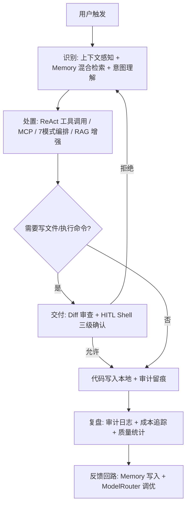

> 核心业务覆盖 ≥80%：上述闭环覆盖 F1/F2/F3/F5/F6/F7/F8/F9/F10/F11/F13/F14/F15/F16 等核心功能；后台 Agent（F25）、智能输入（F18）属完整版增强，不在 MVP 主链路。

---

## 3. 应用架构

> 本章定义系统上下文、模块拆分、外部依赖、工程结构、技术选型、模块五段式详细设计与接口契约。

### 3.1 系统上下文与模块图

#### 3.1.1 系统上下文图

```mermaid
flowchart LR
    U[用户 / 本地 OS] -->|键鼠 / 文件系统 / 终端| GUI[Renderer + Preload]
    GUI -->|IPC invoke| MAIN[Main 进程 · ServiceContainer 53 服务]
    MAIN -->|TS import 本地 dist| SDK[@agentprimordia/sdk v1.0.0]
    MAIN -->|HTTPS REST/SDK 流式| LLM[LLM Provider API]
    MAIN -->|本地文件| STORE[(electron-store + better-sqlite3)]
    MAIN -->|appendFileSync| AUDIT[logs/audit.jsonl]
    SDK -->|复用| LLM
```

#### 3.1.2 系统模块图

```mermaid
flowchart TB
    subgraph R[渲染进程 Renderer]
        RV[30+ 视图 / Zustand 7 切片]
    end
    subgraph P[预加载层 Preload]
        PB[contextBridge.exposeInMainWorld aela ~55 分组]
    end
    subgraph M[主进程 Main · ServiceContainer]
        M1[Agent 核心] --> M2[工具与 MCP]
        M1 --> M3[HITL 与安全]
        M1 --> M4[记忆与 RAG]
        M1 --> M5[多 Agent 编排]
        M1 --> M6[上下文与对话]
        M7[自动化] --> M1
        M8[基础与配置] --> M1 & M2 & M3 & M4
    end
    R -->|IPC| P -->|handle| M
    M -->|import| SDK[@agentprimordia/sdk]
```

#### 3.1.3 外部依赖清单（E-xx）与本地组件清单（L-xx）

> 无云组件（C-xx N/A）。下列为运行期外部依赖与本地组件。

| 编号 | 类型 | 组件 | 提供方 | 接入方式 | 同步/异步 | 关键约束 |
| --- | --- | --- | --- | --- | --- | --- |
| E-01 | 外部依赖 | `@agentprimordia/sdk` v1.0.0 | 兄弟仓库（本地 `file:`） | TS import 本地 dist | 同步（流式） | `AELA_SDK_PATH` 回退（D3）；CI 类型漂移检测 |
| E-02 | 外部依赖 | LLM Provider API | OpenAI/Anthropic/Ollama/Gemini/Custom | HTTPS REST/SDK | 同步（流式） | API Key 经 safeStorage；限流/预算 |
| E-03 | 外部依赖 | MCP Server（stdio/http） | 用户显式添加 | 子进程 stdio / HTTP | 异步 | 信任源；工具级 ACL 延后 P1（O3） |
| E-04 | 外部依赖 | OS Keyring / DPAPI / libsecret | 宿主 OS | 本地 API | 同步 | 不可用时 SecretStore fail-closed |
| E-05 | 外部依赖 | npm registry（构建期） | npm | HTTPS | 同步 | electron-builder 打包 |
| L-01 | 本地组件 | electron-store 10 | AELA 主进程 | 本地 API | 同步 | `userData/aela-*.json` 7 服务 |
| L-02 | 本地组件 | better-sqlite3 11.x | AELA 主进程 | 本地 API | 同步 | FTS5+HNSW；SQLite 文件 |
| L-03 | 本地组件 | ServiceContainer DI | AELA 主进程 | 内存 | 同步 | 53 服务注册/startAll/stopAll |
| L-04 | 本地组件 | Preload contextBridge | AELA 预加载层 | 进程间 | 同步/异步 | contextIsolation:true |

**组件依赖矩阵（主进程服务 → 依赖）**：

| 服务 | 依赖 SDK | 依赖 electron-store | 依赖 better-sqlite3 | 依赖 OS Keyring |
| --- | --- | --- | --- | --- |
| AgentService | ✅ | Session | ❌ | ❌ |
| ToolManager | ✅ | ToolLearning | ❌ | ❌ |
| SecurityService | ✅ | ❌ | ❌ | ✅（SecretStore） |
| MemoryService | ✅ | Memory | ✅ | ❌ |
| RAGService | ✅ | RAG | ✅ | ❌ |
| AuditService | ❌ | ❌ | ✅ / jsonl | ❌ |
| AutomationService | ✅ | Automation | ❌ | ❌ |
| CostTracker | ❌ | Cost | ❌ | ❌ |

#### 3.1.4 工程结构

```
src/
├── main/                      # 主进程（ServiceContainer 53 服务）
│   ├── index.ts               # 单实例锁 / wireComponents / registerIPC / before-quit stopAll
│   ├── services/              # M1-M8 模块对应的服务实现
│   │   ├── agent/             #   AgentService (M1)
│   │   ├── tools/             #   ToolManager + MCP adapter (M2)
│   │   ├── security/          #   HITLService/SecurityService/GuardrailService (M3)
│   │   ├── memory/            #   MemoryService + RAGService (M4)
│   │   ├── orchestration/     #   OrchestrationService/DAGScheduler (M5)
│   │   ├── context/           #   ContextCollector (M6)
│   │   ├── automation/        #   AutomationService (M5 自动化)
│   │   └── config/            #   ConfigService/CostTracker (M6)
│   ├── ipc/                   # 26~37 handler 文件 + schemas.ts(zod)
│   │   ├── schemas.ts         #   validateInput 集中 zod schema
│   │   └── handlers/          #   agent/mcp/security/memory/... 
│   └── preload/bridge.ts      # sandbox:true 纯桥接层 (ADR-002)
├── preload/                   # ~55 API 分组 contextBridge
│   └── api/                   # capabilities.ts (sandbox:false 能力层)
├── renderer/                  # React 18 + Zustand 7 切片 + 30+ 视图
│   ├── stores/                #   view/config/skill/automation/messages/streaming/dialog
│   └── views/                 #   ChatView/SettingsView/MCPManager/...
└── shared/                    # types.ts / ipcChannels.ts(~200-325) / sdkTypes.ts / i18n.ts
```

#### 3.1.5 技术选型表（含版本号 + 选型理由）

| 组件 | 选型 | 版本 | 为什么选 A 不选 B（选型理由） |
| --- | --- | --- | --- |
| 桌面运行时 | Electron | v33 | 已深度集成 SDK 与 40+ 服务；若选 Tauri（Rust）需重写 IPC/服务层，切换成本 ≥1 人月，违背 D2 冻结 |
| 前端框架 | React | v18 | 已落地 30+ 视图与 Zustand 集成；选 Vue/Angular 需重写全部渲染层，返工 ≥30% 阶段产物 |
| 语言 | TypeScript | v5.6 | 与 SDK 类型头对头；强类型保障 IPC 契约安全（S-3 校验基础） |
| 状态管理 | Zustand | v4.5.x | 选 Zustand 不选 Redux：无 boilerplate、TS 友好、选择性订阅避免整 ChatView 重渲染（D17）；不选 Context API 以避免 Provider 嵌套 |
| 构建工具 | electron-vite + Vite | v2.3 / v5.4 | 支持主/预/渲染三套构建；Vite 5 快冷启；不选 webpack 因配置重、HMR 慢 |
| 本地 JSON 存储 | electron-store | v10 | 同步 API、零原生依赖、已落地 7 服务；不选 lowdb（异步、需自行封装 schema 迁移） |
| 本地 SQLite | better-sqlite3 | v11.x | 同步、原生 FTS5+HNSW 向量检索；不选 sql.js（纯内存/WASM，无本地文件持久化） |
| SDK 依赖 | @agentprimordia/sdk | v1.0.0 | 本地 `file:` 依赖（D3/ADR-001）；SDK 稳定后切 `^1.0.0` semver，Adapter 保留 |
| IPC 入参校验 | zod | v3.x | 运行时 schema 校验支撑 S-3「100% handler 校验」；不选 joi（Node 服务端取向、体积大） |
| 打包分发 | electron-builder | v25 | 跨平台 NSIS/dmg/AppImage 单实例；不选 electron-packager（需自建更新通道） |
| 大列表虚拟化 | react-window | v1.8.11 | 消息列表 >50 条启用（D24）；不选 react-virtualized（API 旧、包体大） |
| 可观测 | OpenTelemetry | v1.x | 已集成 OTel/调试器/Node Inspector（D4 §8.7）；不选自建埋点（重复造轮子） |
| 样式 | Tailwind CSS | v3 | 已落地主题系统；不选 CSS Modules（需额外配置、与现有 class 体系不符） |
| 测试 | Vitest + Playwright | v4 / v1.61 | 单元测试 Vitest（与 Vite 同源）；e2e Playwright；核心服务覆盖率目标 ≥60%（D5/ADR-003） |

### 3.2 模块详细设计（五段式：模块概述 / 接口清单 / 结构定义 / 时序图 / 关键流程）

> 五段式覆盖：每个模块均含「模块概述 / 接口清单 / 关键结构定义 / 模块逻辑时序图 / 关键流程逻辑」五段。接口呈现采用 Electron IPC 通道（`invoke`/`handle`）+ SDK 直接调用两种形态（适配桌面应用，非 RESTful）。

#### 3.2.M1 Agent 核心模块

**模块概述**
- 位置：主进程 `main/services/agent/AgentService`；消费 SDK `ReActAgent` + `AgentSelfTuner` + `SpeculativeExecutor` + `CachedProvider`。
- 角色：系统核心执行引擎，承接渲染进程的对话请求，完成 runStream 12 步增强流程（Memory 检索注入 → PromptBuilder → Few-Shot → HookManager → Security before_tool → Guardrail before/after_llm → ReActAgent → 流式回传）。
- 内外部系统：上游=渲染进程（ChatView）；下游=工具与 MCP(M2)/记忆与 RAG(M4)/安全与 HITL(M3)/多 Agent 编排(M5)/上下文(M6)。

**接口清单**

| 通道（IPC） | 方向 | 方法 | DTO | 幂等性 | 鉴权 |
| --- | --- | --- | --- | --- | --- |
| `agent:send` | 渲染→主 | invoke | `AgentSendReq`（sessionId, message, mode） | 否（写操作） | 本地 IPC（validateSender） |
| `agent:stop` | 渲染→主 | invoke | `AgentStopReq`（runId） | 是（同 runId 重复 stop 幂等） | 本地 IPC |
| `agent:stream` | 主→渲染 | event | `StreamEvent`（contentBlock/toolCall/activity） | — | 本地 IPC |
| `agent:runStatus` | 渲染→主 | invoke | `RunStatusReq`（runId） | 是 | 本地 IPC |

> SDK 直接调用：`ReActAgent.runStream(...)` 为同步（流式）调用，不经 IPC。

**关键结构定义**

```typescript
// DTO: AgentSendReq
interface AgentSendReq {
  sessionId: string;        // 会话 ID（zod sessionIdSchema, max128）
  message: string;          // 用户输入（非空）
  mode: 'code' | 'office';  // 系统提示词模式
  runId?: string;           // 可选，断点续跑标识
}

// VO: StreamEvent（流式活动）
type StreamEvent =
  | { type: 'contentBlock'; block: ContentBlock }
  | { type: 'toolCall'; call: ToolCallInfo }
  | { type: 'activity'; event: ActivityEvent }
  | { type: 'done'; runId: string; usage: TokenUsage };

interface ContentBlock { id: string; kind: 'text' | 'reasoning' | 'tool'; payload: string; }
interface ActivityEvent { phase: 'beforeTool' | 'afterTool' | 'contextUpdate' | 'agentThought'; ts: number; }
```

| 字段 | 类型 | 说明 | 约束 |
| --- | --- | --- | --- |
| sessionId | string | 会话标识 | zod sessionIdSchema，max128 |
| message | string | 用户输入 | 非空，max 32k |
| mode | enum | 编码/办公模式 | code\|office |
| contentBlock.kind | enum | 块类型 | text\|reasoning\|tool |

**模块逻辑时序图**

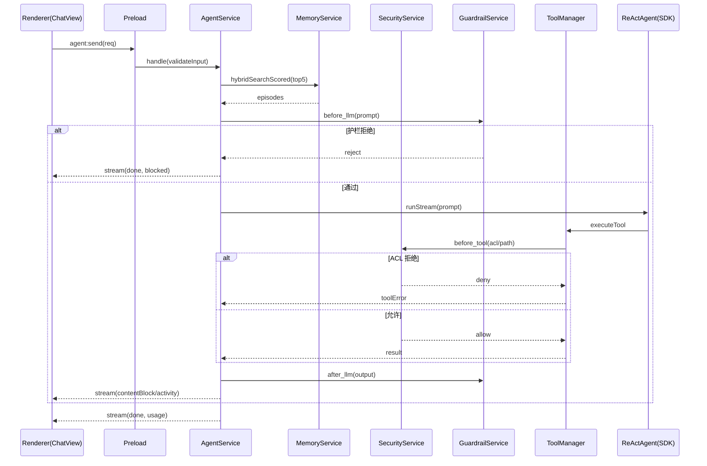

**关键流程逻辑**
- 状态机：`idle → running → (paused) → running → done | error | stopped`。`agent:stop` 经 `AbortController` 中断（D24 优雅中断）。
- 复杂事务：runStream 12 步；每步经 HookManager（10 HookPoint）；Memory 注入为只读、审计写入为异步 append。
- Mock 标注：SDK `ReActAgent` 在单元测试中以 `MockReActAgent` 替身；`toolCall` 在 dry-run 模式不实际执行。

#### 3.2.M2 工具与 MCP 模块

**模块概述**
- 位置：主进程 `main/services/tools/ToolManager` + `MCPToolAdapter`；消费 SDK Tools。
- 角色：管理 12 内置工具（read_file/write_file/list_directory/search_code/execute_command/web_fetch 等）+ MCP stdio/http 工具调用（前缀 `mcp_`）+ Skills（前缀 `skill_`）。
- 内外部系统：上游=Agent 核心(M1)；下游=本地文件系统/终端/Git、外部 MCP Server(E-03)、SDK Tools。

**接口清单**

| 通道 | 方向 | 方法 | DTO | 幂等性 | 鉴权 |
| --- | --- | --- | --- | --- | --- |
| `mcp:add` | 渲染→主 | invoke | `McpAddReq`（name, transport, url/cmd, trustSource） | 是（同 name 覆盖） | 本地 IPC |
| `mcp:list` | 渲染→主 | invoke | `McpListReq` | 是 | 本地 IPC |
| `tool:execute` | 主→主（SDK） | call | `ToolExecReq`（toolName, args） | 否 | SecurityService before_tool |
| `tool:learn` | 主→主 | call | `ToolLearnReq` | 否 | 本地 |

**关键结构定义**

```typescript
interface McpAddReq {
  name: string;                 // MCP Server 名（zod nonEmptyStringSchema）
  transport: 'stdio' | 'http';  // 传输方式
  command?: string;             // stdio 命令
  url?: string;                 // http 地址
  trustSource: boolean;         // 用户显式信任（O3 缓解）
}
interface ToolExecReq {
  toolName: string;             // 含 mcp_/skill_ 前缀
  args: { [k: string]: unknown };
  acl: SandboxAcl;              // none/read/write/execute/all
}
```

**模块逻辑时序图**

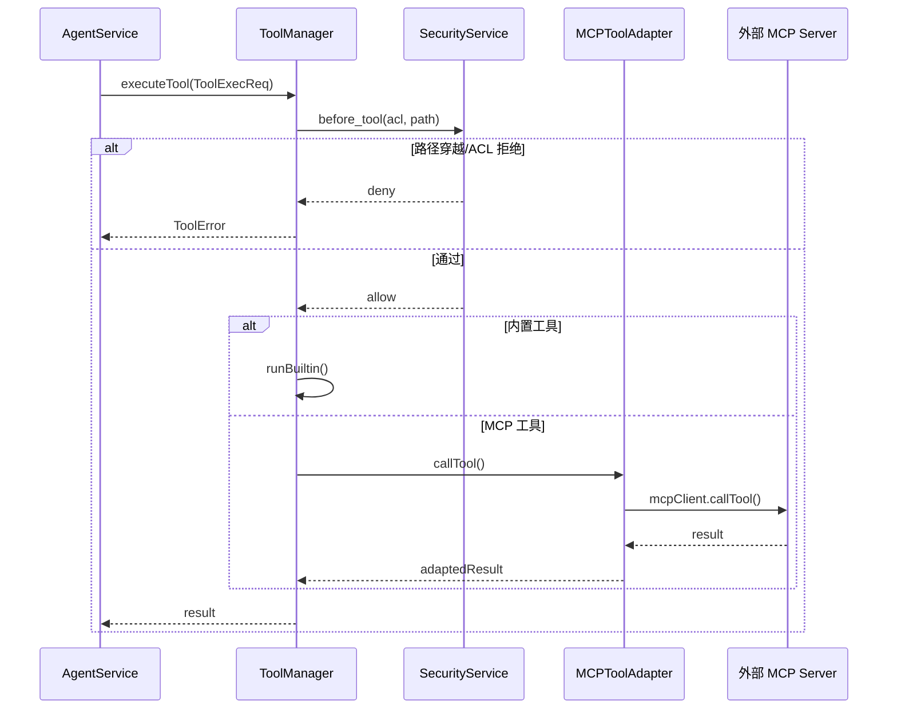

**关键流程逻辑**
- MCP 工具**不经** SecurityService 沙箱隔离（D20），依赖「用户显式添加 + 信任源」缓解；工具级 ACL 在 P1 安全阶段补全（O3）。
- 12 内置工具经 SecurityService `before_tool` 注入 ACL + 路径穿越 + HITL（Shell 三级）。

#### 3.2.M3 安全与 HITL 模块

**模块概述**
- 位置：主进程 `main/services/security/`（HITLService / SecurityService / GuardrailService / CommandGuard / InputSanitizer / AuditService）。
- 角色：Shell 三级风险确认（safe/moderate/dangerous）、文件变更 Diff 审查、sandbox 桥接层、Guardrail 双向、审计留痕。
- 内外部系统：上游=Agent 核心(M1)/工具(M2)；下游=审计日志(jsonl)、OS Keyring(E-04)。

**接口清单**

| 通道 | 方向 | 方法 | DTO | 幂等性 | 鉴权 |
| --- | --- | --- | --- | --- | --- |
| `shell:confirm` | 主→渲染 | event | `ShellConfirmReq`（command, risk） | — | 本地 IPC |
| `shell:resolve` | 渲染→主 | invoke | `ShellResolveReq`（allow/deny/session） | 是 | 本地 IPC |
| `hitl:diff` | 主→渲染 | event | `DiffReviewReq`（changes） | — | 本地 IPC |
| `hitl:diffResolve` | 渲染→主 | invoke | `DiffResolveReq`（accept/reject） | 是 | 本地 IPC |
| `security:audit` | 主→主 | append | `AuditEvent` | 是（同 traceId 幂等去重） | 本地 |

**关键结构定义**

```typescript
type ShellRisk = 'safe' | 'moderate' | 'dangerous';
interface ShellConfirmReq {
  command: string;
  risk: ShellRisk;
  suggestion: 'reject' | 'allow-once' | 'allow-session';
}
interface AuditEvent {
  ts: string;            // ISO8601
  traceId: string;       // 全链路追踪
  tenantId: string;      // 固定 'local'
  actor: string;         // 'local-user'
  action: string;        // 如 shell:confirm / file:write
  target: string;        // 受影响资源
  source: string;        // IPC 通道 / handler
  riskLevel: 'info' | 'low' | 'medium' | 'high';
  result: 'allow' | 'deny' | 'error';
  detail: string;        // JSON 字符串
}
```

**模块逻辑时序图**

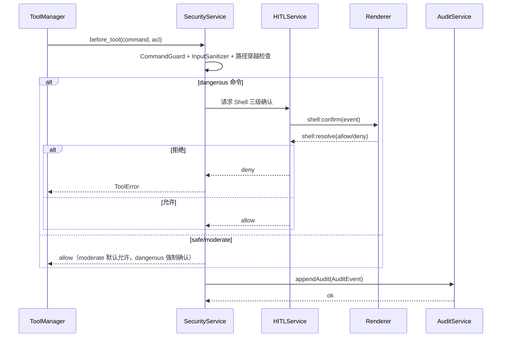

**关键流程逻辑**
- Shell 三级风险状态机：`safe（自动放行）→ moderate（默认放行，可选确认）→ dangerous（强制 HITL 确认，拒绝/允许本次/本次会话允许同类）`。
- 文件变更：`write_file` 触发生成 Diff → `hitl:diff` → 用户 accept/reject → 写入本地 + 审计。
- sandbox 桥接层（ADR-002）：`bridge.ts`（`sandbox:true`，无 Node 依赖）+ `capabilities.ts`（需 Node，隔离进程）。MVP 先落地 `bridge.ts` 拆分（V1）。

#### 3.2.M4 记忆与 RAG 模块

**模块概述**
- 位置：主进程 `main/services/memory/`（MemoryService + RAGService）。
- 角色：情景/语义记忆（FTS5+HNSW 混合检索）；RAG 管道（摄入/混合检索/重排/摘要）。
- 内外部系统：上游=Agent 核心(M1)；下游=better-sqlite3(L-02) + electron-store Memory/RAG(L-01)。

**接口清单**

| 通道 | 方向 | 方法 | DTO | 幂等性 | 鉴权 |
| --- | --- | --- | --- | --- | --- |
| `memory:search` | 渲染→主 | invoke | `MemSearchReq`（query, topK） | 是 | 本地 IPC |
| `memory:save` | 主→主 | call | `MemoryEpisode`（kind, content, embedding） | 是（embedding_hash 去重） | 本地 |
| `rag:ingest` | 渲染→主 | invoke | `RagIngestReq`（docPath） | 是（docPath 去重） | 本地 IPC |
| `rag:query` | 渲染→主 | invoke | `RagQueryReq`（query, topK） | 是 | 本地 IPC |

**关键结构定义**

```typescript
interface MemoryEpisode {
  id?: number;
  sessionId: string;
  kind: 'episodic' | 'semantic';
  content: string;
  embeddingHash: string;   // 去重哈希
  embedding: Uint8Array;   // 向量字节（HNSW）
  importance: number;      // 0~1 衰减权重
  decayAt?: number;        // 计划衰减时间戳
}
interface MemSearchReq { query: string; topK: number; }   // topK 默认 5
```

**模块逻辑时序图**

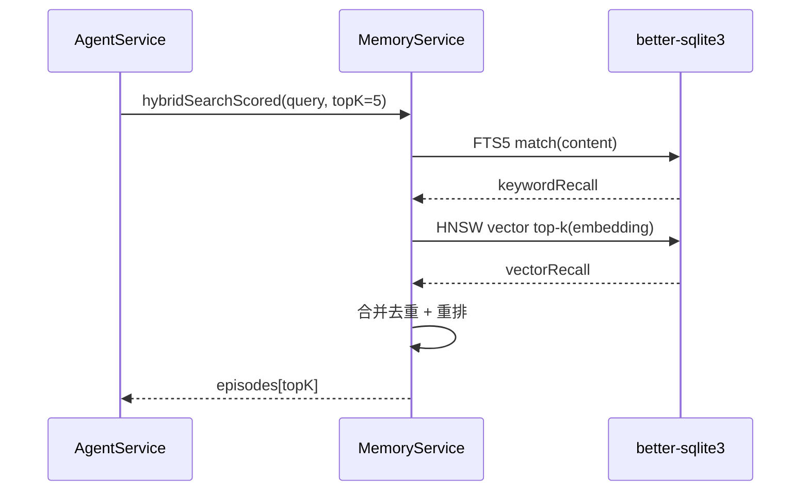

**关键流程逻辑**
- 混合检索 = FTS5 关键词召回 ∪ HNSW 向量 top-k，重排后注入 Prompt（Phase 5 读写闭环，D3 §3.6）。
- 衰减：importance 随时间衰减，低于阈值且超龄条目由清理任务 prune（见 §4.2.2 清理机制）。

#### 3.2.M5 多 Agent 编排模块

**模块概述**
- 位置：主进程 `main/services/orchestration/`（OrchestrationService + DAGScheduler + Collaboration + Supervisor + DynamicDAG）。
- 角色：7 模式编排（Pipeline/Parallel/Handoff/Pool/GroupChat/Debate/Supervisor）+ DAGBuilder 动态拓扑。
- 内外部系统：上游=Agent 核心(M1)；下游=SDK OrchestrationService。

**接口清单**

| 通道 | 方向 | 方法 | DTO | 幂等性 | 鉴权 |
| --- | --- | --- | --- | --- | --- |
| `orchestration:run` | 渲染→主 | invoke | `OrchRunReq`（mode, agents, dag） | 否 | 本地 IPC |
| `orchestration:status` | 渲染→主 | invoke | `OrchStatusReq`（runId） | 是 | 本地 IPC |
| `dag:build` | 渲染→主 | invoke | `DagBuildReq`（nodes, edges） | 是 | 本地 IPC |

**关键结构定义**

```typescript
type OrchMode = 'Pipeline' | 'Parallel' | 'Handoff' | 'Pool'
              | 'GroupChat' | 'Debate' | 'Supervisor';  // 7 模式（U-04 冻结）
interface OrchRunReq { mode: OrchMode; agents: string[]; dag?: DagConfig; }
interface DagConfig { nodes: DagNode[]; edges: DagEdge[]; }  // 条件路由边/动态拓扑
```

**模块逻辑时序图**

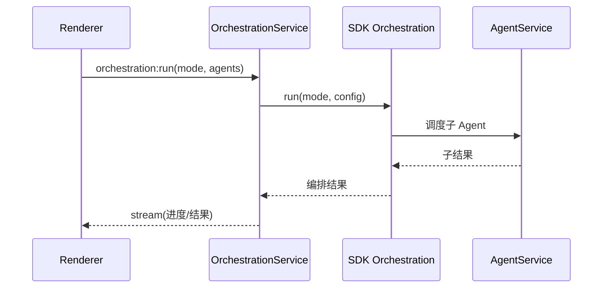

**关键流程逻辑**
- 编排模式以 SDK `OrchestrationService` 实际实现为准（U-04 冻结为 7 模式），DAGBuilder 支持条件路由边与动态拓扑（F16）。
- Supervisor 模式含 Worker 池 + 优先级队列 + Fail-Fast（D3 §3.7）。

#### 3.2.M6 上下文与对话模块

**模块概述**
- 位置：主进程 `main/services/context/ContextCollector` + 渲染 `ContextBar/SmartInput`；消费 SDK ContextWindow。
- 角色：自动感知编辑器/终端/Git/LSP 上下文；流式分块渲染（contentBlock）；ToolCallCard/ActivityTimeline 内联。
- 内外部系统：上游=渲染 ChatView；下游=Agent 核心(M1)、SessionStore。

**接口清单**

| 通道 | 方向 | 方法 | DTO | 幂等性 | 鉴权 |
| --- | --- | --- | --- | --- | --- |
| `context:sync` | 渲染→主 | invoke | `ContextSyncReq`（activeFile, terminalTail） | 是 | 本地 IPC |
| `context:change` | 渲染→主 | invoke | `ContextChangeReq`（gitStatus, diagnostics） | 是 | 本地 IPC |
| `streaming:render` | 主→渲染 | event | `ContentBlock[]` | — | 本地 IPC |

**关键结构定义**

```typescript
interface ContextBlock {
  activeFile?: string;
  terminalTail?: string;
  gitStatus?: string;
  diagnostics?: Diagnostic[];
}
interface ContentBlock { id: string; kind: 'text' | 'reasoning' | 'tool'; payload: string; }
```

**模块逻辑时序图**

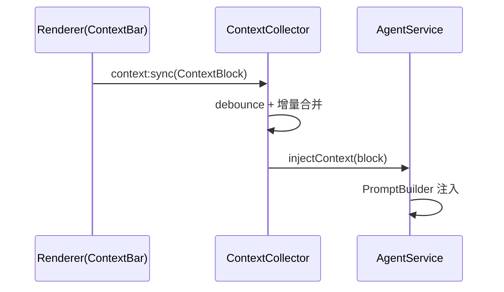

**关键流程逻辑**
- 轻量上下文每条消息携带 activeFile+terminalTail；重度上下文（gitStatus/diagnostics）change 触发注入（D22 §3.2）。
- 消息 >50 条启用 VirtualMessageList（react-window，D24 Phase 4）。

#### 3.2.M7 自动化模块

**模块概述**
- 位置：主进程 `main/services/automation/AutomationService`；消费 SDK。
- 角色：Cron/事件触发任务（手动/定时/事件）+ 执行历史（保留最近 200 条）。
- 内外部系统：上游=渲染自动化页；下游=Agent 核心(M1)/本地文件/终端。

**接口清单**

| 通道 | 方向 | 方法 | DTO | 幂等性 | 鉴权 |
| --- | --- | --- | --- | --- | --- |
| `automation:create` | 渲染→主 | invoke | `AutoTaskReq`（trigger, prompt） | 否 | 本地 IPC |
| `automation:run` | 渲染→主 | invoke | `AutoRunReq`（taskId） | 否 | 本地 IPC |
| `automation:history` | 渲染→主 | invoke | `AutoHistoryReq`（limit=200） | 是 | 本地 IPC |

**关键结构定义**

```typescript
type Trigger = 'manual' | 'cron' | 'event';
interface AutoTaskReq { name: string; trigger: Trigger; cron?: string; prompt: string; }
```

**模块逻辑时序图**

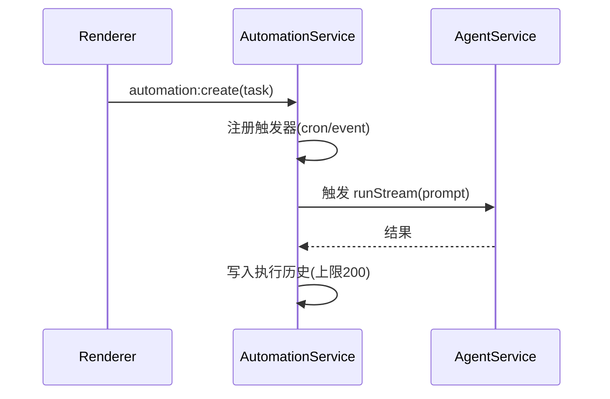

**关键流程逻辑**
- 触发类型：手动/定时(Cron)/事件（文件保存/Terminal 输出/Git 变更/LSP 诊断）。
- 执行历史环形保留最近 200 条（D4 §5）。

#### 3.2.M8 基础与配置模块

**模块概述**
- 位置：主进程 `main/services/config/`（ConfigService / CostTracker）+ 渲染 i18n/主题。
- 角色：全局配置、模型 Provider BYOK、成本追踪与预算、i18n/主题、私有化。
- 内外部系统：上游=渲染设置页；下游=electron-store Config/Cost(L-01)、LLM Provider(E-02)。

**接口清单**

| 通道 | 方向 | 方法 | DTO | 幂等性 | 鉴权 |
| --- | --- | --- | --- | --- | --- |
| `config:set` | 渲染→主 | invoke | `ConfigSetReq`（key, value） | 是（覆盖写） | 本地 IPC |
| `model:add` | 渲染→主 | invoke | `ModelAddReq`（provider, apiKey） | 是 | SecretStore |
| `cost:summary` | 渲染→主 | invoke | `CostSummaryReq`（range） | 是 | 本地 IPC |
| `cost:budget` | 渲染→主 | invoke | `BudgetReq`（limit, threshold） | 是 | 本地 IPC |

**关键结构定义**

```typescript
interface ModelAddReq {
  provider: 'openai' | 'anthropic' | 'ollama' | 'gemini' | 'custom';
  apiKey: string;   // 经 SecretStore 加密，拒绝明文
}
interface CostSummaryReq { range: 'day' | 'week' | 'month'; }
```

**模块逻辑时序图**

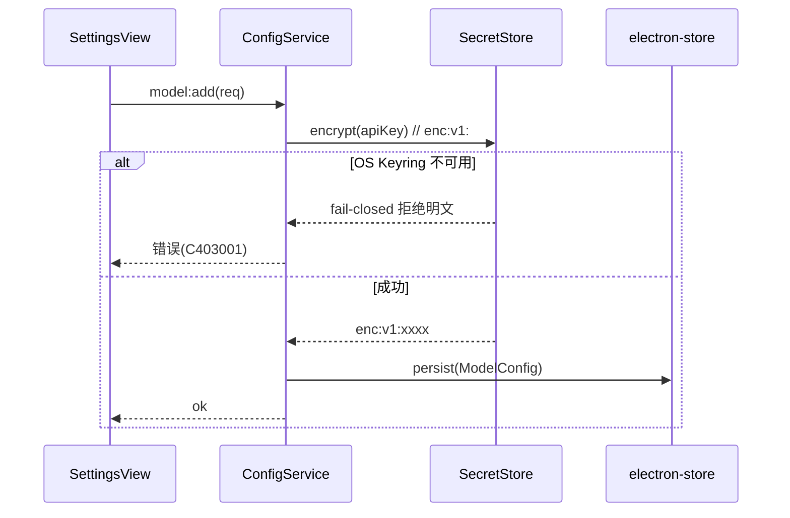

**关键流程逻辑**
- 成本追踪：每次 LLM 调用经 CostTracker 累加 Token/费用；超预算触发 HITL 中断（F10/V1）。
- 模型路由：ModelRouter 按任务动态选模型（F4），降低单位任务成本 ≥30%（价值主张）。

### 3.5 接口契约

#### 3.5.1 全局错误码体系（6 位格式）

> 错误码格式：`[域前缀][2 位域编号][3 位序号]`，域前缀 A=业务域、B=系统、C=通用客户端错误；完整 6 位编号示例 `A010001`。

| 域 | 前缀 | 示例码 | 含义 | 重试建议 | 用户文案 |
| --- | --- | --- | --- | --- | --- | --- |
| Agent 执行 | A01 | `A010001` | ReAct 运行超时 | 可重试（指数退避，最多 3 次） | 本次执行超时，请重试或缩短任务 |
| Agent 执行 | A01 | `A010002` | 上下文窗口溢出 | 不可重试，建议开 ContextWindow 压缩 | 上下文过长，请开启 Trim/Compress |
| 工具与集成 | A02 | `A020001` | 内置工具执行失败 | 可重试 1 次 | 工具执行失败，请检查参数 |
| 工具与集成 | A02 | `A020002` | MCP Server 连接失败 | 不可重试，检查 Server 配置 | MCP 服务不可用，请检查配置 |
| 安全与 HITL | A03 | `A030001` | Shell 命令被拒绝（dangerous） | 不可重试 | 该命令被安全策略拒绝 |
| 安全与 HITL | A03 | `A030002` | ACL 越权/路径穿越 | 不可重试，记录审计 | 操作越权，已被拦截并记录 |
| 记忆与知识 | A04 | `A040001` | 记忆检索无结果 | 可重试（放宽 topK） | 未检索到相关记忆 |
| 记忆与知识 | A04 | `A040002` | 嵌入模型不可用 | 不可重试 | 向量服务不可用 |
| 编排 | A05 | `A050001` | DAG 拓扑环检测失败 | 不可重试，检查 DAG | 编排拓扑存在环，无法执行 |
| 自动化 | A06 | `A060001` | Cron 表达式非法 | 不可重试 | 定时表达式格式错误 |
| 配置 | A07 | `A070001` | 配置写入失败 | 可重试 1 次 | 配置保存失败 |
| 系统 | B99 | `B990001` | 主进程未就绪 | 可重试（等待 startAll 完成） | 应用初始化中，请稍候 |
| 客户端通用 | C40 | `C400001` | 参数校验失败（zod） | 不可重试，修正入参 | 请求参数不合法 |
| 客户端通用 | C40 | `C401001` | 未授权（本地锁定） | 不可重试 | 应用未解锁 |
| 客户端通用 | C40 | `C403001` | 密钥明文降级被拒（fail-closed） | 不可重试 | 密钥不可明文存储 |
| 客户端通用 | C42 | `C429001` | IPC 限流触发 | 退避后重试 | 操作过于频繁，请稍后再试 |

> 错误响应统一结构（IPC `wrap()`）：`{ ok: false, code: 'A010001', message: '用户文案', traceId, retryable: true }`。

#### 3.5.2 幂等性约定

| 分类 | 接口 | 幂等策略 |
| --- | --- | --- |
| 写入类（资金/密钥） | `model:add` / `cost:budget` | **强制幂等**：同 key 覆盖写；apiKey 加密后落 SecretStore，重复添加不新增明文 |
| 写入类（普通） | `config:set` / `mcp:add` / `automation:create` | 覆盖写即幂等 |
| 执行类（非幂等） | `agent:send` / `tool:execute` / `automation:run` / `orchestration:run` | 非幂等，需 `runId` 去重与中断控制 |
| 查询类 | `*list` / `*status` / `*summary` / `*search` | 天然幂等 |

#### 3.5.3 限流约定（5 维 QPS + 降级）

| 维度 | 阈值 | 说明 |
| --- | --- | --- |
| 单通道 QPS | 20/s | 单 IPC 通道默认上限，超出返回 `C429001` |
| 全局 IPC QPS | 200/s | 主进程全部 handler 聚合上限 |
| 单会话并发 Agent 运行 | 1 | Solo 模式单会话串行（F1） |
| LLM 调用 QPS（按 Provider） | Provider 侧 + 本地 10/s | 复用 SDK RateLimiter；超阈值本地排队 |
| 审计写入 QPS | 50/s | appendFileSync 缓冲批写 |

> 降级策略：LLM 限流 → 启用 ModelRouter 切换备用 Provider；IPC 限流 → 前端提示「操作频繁」并退避；审计限流 → 内存缓冲（上限 1000 条）异步落盘，避免阻塞主链路。

#### 3.5.4 默认超时与重试基线

| 操作 | 默认超时 | 重试策略 |
| --- | --- | --- |
| IPC invoke（本地） | 30s | 不重试（本地应快；超时即异常） |
| LLM 流式调用 | 120s（首字 P99 ≤ 3s） | SDK 层 Retry（指数退避，最多 3 次） |
| MCP stdio 调用 | 60s | 不重试，标记 Server 失联 |
| Shell 确认等待 | 用户会话级（无硬超时） | 用户未响应则任务挂起，可 `agent:stop` |
| SQLite 写入 | 5s | 不重试，抛 `B990001` |

---

## 4. 数据架构设计

> AELA 本地存储 = `electron-store`（JSON：7 服务）+ `better-sqlite3`（SQLite：MemoryService FTS5+HNSW、审计）。不使用 MySQL/PostgreSQL。

### 4.1 全局数据约定

| 约定项 | 取值 | 说明 |
| --- | --- | --- |
| 命名规范 | electron-store：`aela-{domain}.json`；SQLite 表：`t_{domain}` / 虚拟表 `{domain}_fts` |  snake_case |
| 主键类型 | electron-store：业务字符串 ID（uuid v4）；SQLite：`INTEGER PRIMARY KEY AUTOINCREMENT` | 本地单用户，无需全局分布式 ID |
| 字符集 | UTF-8（SQLite 默认）/ JSON UTF-8 | — |
| 审计字段 | 所有审计事件含 `ts/created_at/trace_id/tenant_id/actor` | `tenant_id` 固定 `local`（单用户，保留字段以对齐可观测规范） |
| 多租户隔离 | **不启用**（本地单用户，高层架构 §4.2） | 无 `tenant_id` 数据列；日志 schema 仍保留 `tenantId` 字段（固定 `local`） |
| 时间字段 | ISO8601 字符串（审计展示） + Unix 秒（索引/清理） | 双写便于检索与 TTL |
| 本地备份 | `userData/backup/` 每日增量 + 应用关闭前快照 | 见 §4.3 RPO/RTO |

### 4.2 单表设计（五段式，≥2 核心表，SQLite DDL）

> 五段式 = 库表元信息 → 结构 → 索引 → DDL → 清理机制。下列 2 张核心表使用 better-sqlite3（SQLite）。

#### 4.2.1 核心表一：审计事件表 `t_audit_event`（better-sqlite3）

**① 库表元信息**

| 项 | 值 |
| --- | --- |
| 表名 | `t_audit_event` |
| 存储引擎 | better-sqlite3（SQLite 3） |
| 归属域 | D3 安全与 HITL 域（BC-3） |
| 用途 | 本地操作留痕（logs/audit.jsonl 的持久化镜像，合规 ≥1 年） |
| 数据量预估 | 个人用户日均 ~500 条，年 ~18 万条 |

**② 结构**

| 字段 | 类型 | 必填 | 说明 |
| --- | --- | --- | --- |
| id | INTEGER | ✅ | 自增主键 |
| ts | TEXT | ✅ | ISO8601 时间 |
| trace_id | TEXT | ✅ | 全链路追踪 ID（默认 ''） |
| tenant_id | TEXT | ✅ | 固定 `local` |
| actor | TEXT | ✅ | 操作主体，默认 `local-user` |
| action | TEXT | ✅ | 动作（shell:confirm/file:write/mcp:add...） |
| target | TEXT | ❌ | 受影响资源 |
| source | TEXT | ❌ | IPC 通道 / handler |
| risk_level | TEXT | ✅ | info/low/medium/high |
| result | TEXT | ✅ | allow/deny/error |
| detail | TEXT | ❌ | JSON 详情 |
| created_at | INTEGER | ✅ | Unix 秒，用于 TTL/清理 |

**③ 索引**

| 索引名 | 字段 | 用途 |
| --- | --- | --- |
| idx_audit_ts | ts | 按时间范围查询 |
| idx_audit_trace | trace_id | 按 trace 回溯 |
| idx_audit_action | action | 按动作聚合审计 |

**④ DDL**

```sql
CREATE TABLE IF NOT EXISTS t_audit_event (
  id         INTEGER PRIMARY KEY AUTOINCREMENT,
  ts         TEXT    NOT NULL,
  trace_id   TEXT    NOT NULL DEFAULT '',
  tenant_id  TEXT    NOT NULL DEFAULT 'local',
  actor      TEXT    NOT NULL DEFAULT 'local-user',
  action     TEXT    NOT NULL,
  target     TEXT,
  source     TEXT,
  risk_level TEXT    NOT NULL DEFAULT 'info',
  result     TEXT    NOT NULL,
  detail     TEXT,
  created_at INTEGER NOT NULL
);
CREATE INDEX IF NOT EXISTS idx_audit_ts     ON t_audit_event(ts);
CREATE INDEX IF NOT EXISTS idx_audit_trace ON t_audit_event(trace_id);
CREATE INDEX IF NOT EXISTS idx_audit_action ON t_audit_event(action);
```

**⑤ 清理机制**
- 保留期：合规要求 **≥ 1 年**（`created_at` 距今 ≤ 365 天在线）；超期数据迁移至 `logs/audit-archive/YYYY.jsonl` 压缩归档（只读备查）。
- 清理任务：每日凌晨本地定时（Cron，自动化域 M7）执行；归档后 `VACUUM` 回收空间。
- 防篡改：append-only，文件权限限定当前 OS 用户；不支持物理删除（仅逻辑归档）。

#### 4.2.2 核心表二：记忆情景表 `t_memory_episode`（better-sqlite3 + FTS5）

**① 库表元信息**

| 项 | 值 |
| --- | --- |
| 表名 | `t_memory_episode` + 虚拟表 `memory_fts`（FTS5） |
| 存储引擎 | better-sqlite3（SQLite 3）+ FTS5 + HNSW（sqlite-vec 扩展） |
| 归属域 | D4 记忆与知识域（BC-4） |
| 用途 | 情景/语义记忆存储，支撑 FTS5 关键词 ∪ HNSW 向量混合检索 |
| 数据量预估 | 个人用户 ~数千~数万条 episode |

**② 结构**

| 字段 | 类型 | 必填 | 说明 |
| --- | --- | --- | --- |
| id | INTEGER | ✅ | 自增主键 |
| session_id | TEXT | ✅ | 会话归属（默认 ''） |
| kind | TEXT | ✅ | episodic / semantic |
| content | TEXT | ✅ | 记忆原文 |
| embedding_hash | TEXT | ❌ | 向量去重哈希 |
| embedding | BLOB | ❌ | 向量字节（HNSW 索引源） |
| importance | REAL | ✅ | 0~1 衰减权重 |
| decay_at | INTEGER | ❌ | 计划衰减时间戳 |
| created_at | INTEGER | ✅ | 创建时间 |
| updated_at | INTEGER | ✅ | 更新时间 |

**③ 索引**

| 索引名 | 字段 | 用途 |
| --- | --- | --- |
| idx_episode_session | session_id | 按会话检索 |
| idx_episode_kind | kind | 按类型过滤 |
| memory_fts | content（FTS5） | 全文关键词召回 |

**④ DDL**

```sql
CREATE TABLE IF NOT EXISTS t_memory_episode (
  id             INTEGER PRIMARY KEY AUTOINCREMENT,
  session_id     TEXT    NOT NULL DEFAULT '',
  kind           TEXT    NOT NULL,
  content        TEXT    NOT NULL,
  embedding_hash TEXT,
  embedding      BLOB,
  importance     REAL    NOT NULL DEFAULT 0.0,
  decay_at       INTEGER,
  created_at     INTEGER NOT NULL,
  updated_at     INTEGER NOT NULL
);
CREATE INDEX IF NOT EXISTS idx_episode_session ON t_memory_episode(session_id);
CREATE INDEX IF NOT EXISTS idx_episode_kind   ON t_memory_episode(kind);
CREATE VIRTUAL TABLE IF NOT EXISTS memory_fts USING fts5(content, content_rowid);
-- HNSW 向量索引（sqlite-vec 扩展，运行时 load_extension 加载）
-- CREATE VIRTUAL TABLE IF NOT EXISTS memory_vec USING vec0(embedding float[768]);
```

**⑤ 清理机制**
- 衰减：定时任务按 `importance` 衰减（每日 ×0.99）；`decay_at` 到期且 `importance ≤ 0.05` 的条目 prune。
- 保留：semantic 记忆默认 180 天冷启动压缩、episodic 90 天；超龄经用户确认后可压缩归档。
- 去重：写入前按 `embedding_hash` 去重，避免重复记忆（ToolLearning 同理）。

#### 4.2.3 electron-store 7 服务结构（JSON 存储，补充）

| 服务 | 文件 | 核心结构 | 清理 |
| --- | --- | --- | --- |
| ConfigStore | aela-config.json | AppConfig / ModelConfig[] / GuardrailRule[] / ThemePref | 用户手动，无自动清理 |
| SessionStore | aela-sessions.json | Session[]（消息 ≤ 按设置上限，环形裁剪） | 超量消息裁剪 |
| AutomationStore | aela-automation.json | AutoTask[] + 执行历史（≤200） | 历史环形保留 200 |
| CostStore | aela-cost.json | CostRecord[]（按日聚合） | 超 365 天汇总后归档 |
| ToolLearningStore | aela-toollearning.json | ToolLearningRecord[] | 低频，无自动清理 |
| MemoryStore | aela-memory.json | Memory 元数据索引（实际内容在 SQLite） | 与 SQLite 同步 |
| RAGStore | aela-rag.json | RagDoc 元数据（向量在 SQLite/FTS5） | 与 SQLite 同步 |

### 4.3 数据部署与备份（RPO/RTO 数字）

| 数据 | 存储 | RPO | RTO | 备份策略 |
| --- | --- | --- | --- | --- |
| electron-store JSON（Config/Session/...） | 本地 `userData/aela-*.json` | ≤ 5min（关闭前/定时快照） | ≤ 30min（重装恢复） | 每日增量备份到 `userData/backup/` |
| better-sqlite3（Memory/RAG/Audit） | 本地 SQLite 文件 | ≤ 5min（WAL 持久化） | ≤ 30min（重装恢复） | WAL + 每日全量快照 |
| 审计日志 audit.jsonl | 本地 `logs/audit.jsonl` | ≤ 1min（append 即时） | ≤ 30min | 即时追加 + 每日归档 |

> 说明：本地桌面应用无跨机房 RTO/RPO 概念；RPO 指「数据丢失窗口」，RTO 指「重装/恢复可用时间」。备份目标为误删/损坏后可恢复（V1 安全基线支撑）。

### 4.4 缓存与 Key 规范

| 缓存 | Key 规范 | 策略 | TTL |
| --- | --- | --- | --- |
| 工具结果缓存 ToolCache | `cache:tool:{toolName}:{argsHash}` | 命中直接返回（dry-run/只读工具） | 300s |
| 提示词/模板缓存 | `cache:prompt:{model}:{fewShotHash}` | 模板编译结果复用 | 600s |
| SDK 指纹缓存 FingerprintCache | `cache:fingerprint:{provider}:{model}` | 模型指纹复用 | 会话级 |
| 记忆 episode 引用 | `mem:episode:{sessionId}:{id}` | 内存弱引用 + SQLite 持久 | 进程级 |
| 上下文块 | `ctx:block:{sessionId}` | 增量合并（debounce） | 消息级 |

> 命名规范：`cache:{domain}:{subKey}`，全部小写 + 冒号分隔；TTL 到点 LRU 淘汰；敏感内容（apiKey）**不进缓存**。

### 4.5 数据迁移路径（本地版本演进）

| 场景 | 策略 | 说明 |
| --- | --- | --- |
| electron-store schema 升级（0.1.x→0.2.0） | **双写过渡**（electron-store `migrations`） | 旧 key 读 → 新结构写，旧结构保留一个版本后清理 |
| SQLite schema 升级 | 一次性迁移脚本（`PRAGMA user_version`） | 建表/加列/索引；FTS5 重建 |
| 记忆/向量重建 | 影子重建（后台批量重算 embedding） | 不影响在线检索，完成后切换 |
| 回滚 | 备份目录 `userData/backup/` 还原 | RTO ≤ 30min |

---

## 5. 部署架构

> 桌面应用分发，非 K8s 集群。环境矩阵 = dev/beta/stable；单实例；崩溃自愈；优雅停机 `stopAll()`。

### 5.1 环境矩阵

| 环境 | 形态 | 构建命令 | 说明 |
| --- | --- | --- | --- |
| dev（本地开发） | 源码热更（`npm run dev`） | electron-vite dev | 开发者本地，启用全部调试/Node Inspector |
| beta（内测包） | 签名测试包（未公发） | `build:win/mac/linux --beta` | 内测用户，启用 OTel 采样 |
| stable（发布版） | 公发安装包（NSIS/dmg/AppImage） | `build:win/mac/linux` | 正式用户，CSP 收紧 `'self'`，关闭调试端口 |

> 分发格式：Windows = NSIS（`.exe`）、macOS = dmg（`.dmg`）、Linux = AppImage（`.AppImage`）。单实例锁（`app.requestSingleInstanceLock`）。

### 5.2 部署拓扑（本地三进程）

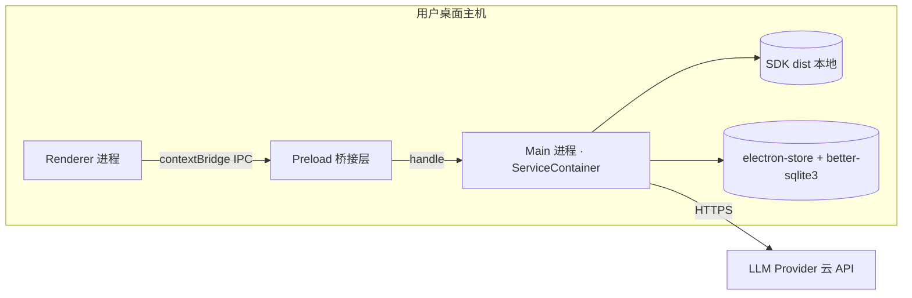

> 无 Region/AZ/多活；进程模型即「部署拓扑」。Main 进程是「后端」，崩溃即应用级故障。

### 5.3 高可用与自愈（桌面进程可用性）

| 机制 | 策略 | 指标 |
| --- | --- | --- |
| 单实例锁 | `requestSingleInstanceLock` 阻止多开 | 多开 → 聚焦已有窗口 |
| 崩溃自愈 | Electron `crashReporter` + 未捕获异常重启 Main 关键服务（`startAll`） | 崩溃恢复 ≤ 30s |
| 渲染进程隔离 | `contextIsolation:true` + 独立渲染进程，主进程不被 XSS 拖垮 | — |
| 数据不丢 | WAL + 审计 append-only + 备份（§4.3） | RPO ≤ 5min |

> SLA 适配：桌面进程可用性目标 **≥ 99.5%**（会话内）；非云端 SLA，指「应用启动后持续可用、崩溃可自愈」。

### 5.4 优雅停机

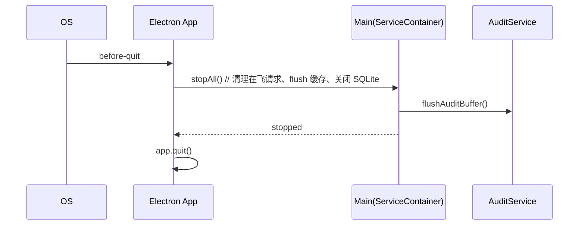

> 关键：`app.quit()` 前必须 `stopAll()`（D2 §5.1 `index.ts` before-quit），否则在飞 Agent 运行 / 未落盘审计 / SQLite WAL 未 checkpoint 可能丢数据。`agent:stop` 由 `AbortController` 中断在飞请求。

### 5.5 容量规划（本地单用户）

| 资源 | 估算 | 说明 |
| --- | --- | --- |
| 内存 | 主进程 ≤ 512MB + 渲染 ≤ 512MB | 大列表虚拟化（react-window）控峰 |
| IPC 通道 | ~200–325（X1 口径差异，按实际注册为准） | 26~37 handler 文件 |
| SQLite | 单文件 ≤ 2GB（个人记忆/审计年量远小于此） | FTS5/HNSW 索引随数据增长 |
| 磁盘 | `userData` ≤ 1GB（含备份） | 审计归档压缩 |

---

## 6. 网络架构

> 本地进程间通信，无 VPC/公网/多活。入口 = Preload `contextBridge`；无 mTLS（本地进程）。

### 6.1 网络拓扑（本地进程）

```mermaid
flowchart TB
    subgraph UserHost[本地主机]
        UI[Renderer 渲染进程]
        PB[Preload contextBridge]
        subgraph Main[Main 主进程]
            IPC[IPC Handler 层 26~37 文件]
            SVC[ServiceContainer 53 服务]
        end
        SDK[@agentprimordia/sdk]
    end
    UI -->|contextBridge invoke| PB
    PB -->|ipcMain.handle| IPC --> SVC
    SVC --> SDK
    SVC -->|HTTPS TLS| LLM[(LLM Provider API 公网)]
    SVC -->|stdio/HTTP| MCP[(外部 MCP Server)]
```

### 6.2 南北向（入口安全）

| 项 | 说明 |
| --- | --- |
| 入口 | 仅 `Preload` 经 `contextBridge.exposeInMainWorld('aela', api)` 暴露 ~55 API 分组；渲染进程**不直接**接触 Node/Main |
| 校验 | 每个 IPC handler 经 `validateSender`（确认来源为可信渲染进程）+ `validateInput(zod)`（S-3，100% 覆盖） |
| 隔离 | `contextIsolation:true` + `nodeIntegration:false`；外部链接系统浏览器打开（不进渲染进程） |
| CSP | 生产收紧 `'self'`（ADR-002 缓解） |

### 6.3 东西向（内部调用）

| 调用 | 方式 | 安全 |
| --- | --- | --- |
| 渲染→主 | IPC `invoke`/`handle` | validateSender + zod |
| 主进程内部 | ServiceContainer 内存 DI 调用 | 同进程，无网络 |
| 主→SDK | TS import 本地 dist | 同进程 |
| 主→LLM/MCP | HTTPS / stdio-子进程 | LLM 走 TLS；MCP 信任源隔离（O3 缓解） |

### 6.4 本地 IPC 安全基线（sandbox + Shell 三级）

| 机制 | 取值 | 说明 |
| --- | --- | --- |
| sandbox 桥接层 | `bridge.ts sandbox:true`（纯桥接，无 Node）；`capabilities.ts sandbox:false`（需 Node，隔离进程） | ADR-002 拆分计划，MVP 落地 bridge 拆分（V1） |
| validateSender | 校验 `event.senderFrame` 来源 + `webContents` 可信 | 防非法渲染进程调用 |
| zod 入参校验 | 全 handler `validateInput(schema, params)`（S-3） | 防畸形/注入载荷 |
| Shell 三级风险 | safe（自动）/ moderate（默认）/ dangerous（强制 HITL） | F7/V1 |
| sandbox ACL | none / read / write / execute / all | 工具执行权限分级（SecurityService before_tool） |
| 无 mTLS | 本地进程同机，无需传输加密 | 跨进程为 OS 进程隔离，非网络 |

### 6.5 外部依赖网络

| 外部 | 协议 | 安全 |
| --- | --- | --- |
| LLM Provider API | HTTPS REST/SDK（流式） | TLS + API Key 经 safeStorage（enc:v1:） |
| MCP Server（http） | HTTP/SSE | 信任源；工具级 ACL 延后 P1（O3） |
| npm registry（构建期） | HTTPS | 仅打包阶段 |

---

## 7. 安全架构（机制选择 + 关键参数基线）

> 本章仅承载**机制选择 + 关键参数基线**，供 security-architect 在《安全设计》展开完整 STRIDE/IAM/威胁建模。本章不空写「详见安全文档」，必须给出本系统选择与基线。

### 7.1 安全全景与责任矩阵

| 安全域 | 机制选择 | 关键参数基线 | 责任方 |
| --- | --- | --- | --- |
| 进程隔离 | contextIsolation:true + nodeIntegration:false + sandbox 桥接层 | bridge.ts sandbox:true；capabilities.ts 隔离 | system-architect（本文件）/ security-architect 细化 |
| 密钥保管 | SecretStore（safeStorage + OS Keyring）fail-closed | 加密前缀 `enc:v1:`；OS Keyring 不可用 → 拒绝明文降级（`b64:` 不推荐） | 本文件 §7.2.3 |
| 输入/输出护栏 | GuardrailService 双向（before_llm/after_llm） | 规则：注入/PII/话题/关键词；动作：pass/reject/sanitize/flag | 本文件 §7.2.2 |
| 工具/命令安全 | SecurityService + CommandGuard + InputSanitizer + sandbox ACL | ACL 5 级；Shell 三级风险 | 本文件 §6.4 |
| 审计 | AuditService（better-sqlite3 + logs/audit.jsonl） | 保留 ≥1 年；append-only | 本文件 §7.2.4 |
| IPC 校验 | validateSender + zod validateInput（100% handler） | S-3 基线：未校验 handler = 0 | 本文件 §6.2 |

### 7.2 业务安全

#### 7.2.1 认证与身份
- **无账号体系**：本地单用户，OS 级隔离即身份边界（高层架构 U-01 企业 SSO 不做）。
- 本地锁定：应用启动即当前 OS 用户会话；无登录/无 MFA/无 Token（纯本地）。
- 越权防护：IPC `validateSender` 确保仅可信渲染进程可调用主进程能力。

#### 7.2.2 数据安全
- **数据分级**：L1 公开配置（主题/i18n） / L2 会话内容（本地） / L3 记忆与 RAG（本地） / L4 密钥与凭证（加密）。
- **传输安全**：本地 IPC 经进程隔离（非网络，无需 TLS）；对外 LLM/MCP 调用走 HTTPS TLS。
- **存储安全**：L4 apiKey 经 safeStorage 加密（`enc:v1:` 前缀，AES-256-GCM 由 OS Keychain/DPAPI/libsecret 托管）；electron-store JSON 不含明文密钥。
- **数据驻留**：全部 `userData` 本地，零数据出端（V1 安全基线）。

#### 7.2.3 密钥与凭证（SecretStore fail-closed 基线）
- 机制：`safeStorage.encryptString` → `enc:v1:{base64}`；解密需 OS Keyring。
- **fail-closed 红线**：OS Keyring 不可用时，`createSecretStore().encrypt()` **抛错 / 内存态**，拒绝任何明文（`b64:`）落盘（S-1，D7 T3）。
- 轮换：API Key 由用户管理（BYOK），无自动轮换；改密即重写加密值。
- 入参传输：`model:add` 的 apiKey **不再**走 URL query（D11 S-2 已改为 header，本期维持 header + 限流）。

#### 7.2.4 审计日志
- 落点：主链路异步 `appendFileSync` 到 `logs/audit.jsonl` + 持久化镜像 `t_audit_event`（§4.2.1）。
- 内容：who（actor=local-user）/ when（ts）/ what（action+target）/ result（allow/deny/error）/ source（IPC 通道）。
- 防篡改：append-only + 文件权限限定当前 OS 用户；不支持物理删除。
- 保留期：**≥ 1 年**（合规对齐），超期归档压缩（§4.2.1 清理）。

#### 7.2.5 访问控制
- **无 RBAC**（单用户）；采用 sandbox ACL（none/read/write/execute/all）做工具执行权限分级。
- HITL：Shell 三级确认 + 文件 Diff 审查作为写操作前的强制人工闸门（F7/F8/V1）。
- MCP 工具级 ACL：MVP 以「用户显式添加 + 信任源」缓解，P1 安全阶段补全（O3）。

### 7.3 关键安全机制实现基线（代码级）

| 机制 | 落点（代码） | 基线参数 |
| --- | --- | --- |
| sandbox 桥接 | `src/main/preload/bridge.ts` | `sandbox:true`，无 Node 依赖 |
| IPC 校验 | `src/main/ipc/schemas.ts` + 各 handler `validateInput` | zod，100% handler 覆盖 |
| SecretStore | `src/main/secretStore.ts` | fail-closed，拒绝 `b64:` 明文 |
| Guardrail | `GuardrailService.before_llm/after_llm` | 4 类规则 × 4 动作 |
| CommandGuard | `SecurityService.before_tool` | Shell 三级 + 路径穿越拦截 |
| Audit | `AuditService.append` | append-only，≥1 年保留 |

> 注：完整威胁建模（STRIDE）、IAM 细化、合规控制项由 security-architect 在《安全设计》展开；本文件仅冻结上述机制选择与参数基线，作为下游安全设计的输入。

---

## 8. 可观测设计

> AELA 已有 OTel/调试器/Node Inspector（D4 §8.7）。本章定义 Metrics/Logs/Traces/告警四层体系。

### 8.1 Metrics（业务 / 应用 / 中间件 / 资源 四层）

| 层 | 指标示例 |
| --- | --- |
| 业务层 | 自主完成任务率、记忆/RAG 命中率、编排模式采用率、成本/任务 |
| 应用层 | Agent run 时延（P99 首字 ≤3s）、tool 调用成功率、IPC 错误率、HITL 确认率 |
| 中间件层 | SQLite 写入时延、electron-store 读时延、LLM Token 吞吐、MCP 连接数 |
| 资源层 | 主进程内存/CPU、渲染进程帧率（≥30fps）、磁盘占用 |

#### 8.1.2 Dashboard（≥5 个）

| 编号 | Dashboard | 核心面板 |
| --- | --- | --- |
| D-01 | **Agent 执行大盘** | 运行中 run 数、首字时延 P99、工具调用 Top、失败原因分布、流式帧率 |
| D-02 | **成本/预算大盘** | 按模型/任务 Token 成本、预算消耗、HITL 中断次数、ModelRouter 分布 |
| D-03 | **IPC/安全审计大盘** | IPC QPS/错误率、Shell 三级确认分布、ACL 拦截数、审计事件流（risk 分级） |
| D-04 | **记忆/RAG 命中大盘** | 记忆检索命中率、RAG 召回 Top-K 相关性、embedding 衰减趋势、存储增长 |
| D-05 | **应用健康大盘** | 主/渲染进程 CPU/内存、崩溃次数、崩溃自愈时长、SQLite/electron-store 时延 |
| D-06 | **自动化任务大盘**（补充） | 任务触发数、成功率、执行历史时长、Cron 命中 |

> 共 6 个 Dashboard，满足 ≥5。数据源：OTel Meter + 本地指标存储（SQLite/内存环形缓冲）。

### 8.2 Logs（结构化 JSON，必含 traceId + tenantId）

#### 8.2.1 日志分级

| 级别 | 用途 |
| --- | --- |
| DEBUG | 开发/beta 环境诊断 |
| INFO | 关键流程节点（agent 启动/完成、工具调用） |
| WARN | 可恢复异常（限流、降级） |
| ERROR | 失败（工具错误、LLM 超时、IPC 异常） |
| AUDIT | 安全审计事件（独立通道 logs/audit.jsonl） |

#### 8.2.2 结构化日志 Schema（JSON）

```json
{
  "ts": "2026-07-07T10:00:00.123Z",
  "level": "INFO",
  "traceId": "a1b2c3d4-0001",
  "tenantId": "local",
  "service": "AgentService",
  "action": "agent:send",
  "message": "Agent run started",
  "runId": "run-9001",
  "sessionId": "sess-abc",
  "extra": { "mode": "code" }
}
```

> **强制字段**：`traceId`（全链路追踪，贯穿 IPC→Main→SDK→LLM）+ `tenantId`（固定 `local` 单用户，保留字段以对齐多环境/审计规范）。所有日志必须结构化 JSON，禁止纯文本行（审计日志除外，audit.jsonl 为追加 JSONL）。

#### 8.2.3 保留与采样
- 应用日志：`userData/aela-main.log`，滚动保留 7 天。
- 审计日志：`logs/audit.jsonl`，保留 **≥1 年**（§7.2.4）。
- 采样：INFO 1%、WARN 100%、ERROR 100%、AUDIT 100%。

### 8.3 Traces（OpenTelemetry，错误 100% 采样）

| 项 | 取值 |
| --- | --- |
| 协议 | OpenTelemetry（OTel）+ Node Inspector |
| 埋点 | IPC invoke → Main handler → SDK runStream → LLM 调用 → 工具执行 |
| 采样 | ERROR span **100% 采样**；INFO 按需 10% |
| traceId 传播 | 渲染进程生成 `traceId`，经 IPC `meta` 透传至 Main/SDK/LLM |
| 导出 | 本地 OTel Collector（或调试器内存视图）；beta 环境可导出 |

### 8.4 告警体系（P0~P3 分级 + Owner + Runbook）

| 级别 | 触发条件 | Owner | Runbook |
| --- | --- | --- | --- |
| **P0** | 主进程崩溃且 30s 内未自愈；SecretStore 明文降级尝试；审计写入持续失败 | 主理人 + 本地运维（用户） | RB-01：检查崩溃日志→重装/回滚备份（RTO≤30min）；RB-02：fail-closed 阻断并提示用户重配密钥 |
| **P1** | LLM 调用连续超时（>5 次/分钟）；IPC 限流持续触发；ACL 拦截异常激增 | system-architect + 用户 | RB-03：切换 ModelRouter 备用 Provider；RB-04：核查 handler 异常负载 |
| **P2** | 记忆检索命中率低于 30%；成本超预算中断频发；SQLite 写入时延超过 1s | 用户（设置页自查） | RB-05：重建索引/重算 embedding；RB-06：调整预算阈值 |
| **P3** | 渲染帧率低于 30fps；自动化任务失败；非关键工具错误 | 用户（体验优化） | RB-07：启用消息虚拟化；RB-08：查看任务历史重试 |

> 告警分级覆盖 P0/P1/P2/P3，每项含 Owner 与 Runbook（RB-01~RB-08）。本地桌面无中心化告警通道，P0/P1 以应用内 Toast + 审计留痕呈现，P2/P3 于对应 Dashboard 提示。

---

## 9. 附录：四次自检报告（供 G4 审核追溯）

> 按中间确认协议 §2.4，在 §2/§3/§4/§5 完成后各插入一次自检（先 §2.1 判定，再 §2.3 反向验证 3 问）。本轮为首次产出，无人工审核意见，所有决策点均沿用高层架构冻结边界，未触发中间确认。

### 9.1 第 1 次自检（§2 业务架构 / DDD / 上下文映射后）

- **§2.1 判定**：未命中方案分歧型。业务域（6 域）、DDD 限界上下文（6 个，含核心/支撑/通用分类）、上下文映射（Conformist/ACL/Customer-Supplier/Open Host/Shared Kernel）均严格继承高层架构 §5/§6 冻结边界，无 ≥2 方案分歧，且上游已冻结（U-01~U-04），不发起中间确认。
- **§2.3 反向验证 3 问**：
  - Q1（返工成本）：若 3 月后推翻，返工范围 = §2 全章 + §3 模块映射 + §4 存储分组（约本阶段产物 20%）；切换成本 ≤ 0.5 人月（仅文档调整，无代码强绑定）。**可控**。证据：业务域仅做文档级划分，未引入新服务/新依赖。
  - Q2（可感知）：用户/客户/监管均**感知不到**域划分变化（内部架构文档，不影响功能/交互/合同/合规）。证据：纯后端文档重构，无用户可见行为变更。
  - Q3（原始诉求一致）：用户诉求「本地优先 Solo 桌面助手」未显式指定业务域数量；本划分继承高层架构 §5.1/§6.2 已冻结模块。**一致**（沿用冻结边界）。

### 9.2 第 2 次自检（§3 应用架构 / 模块设计 / 接口契约后）

- **§2.1 判定**：未命中。模块拆分（M1–M8）继承高层架构 §6.2 产品模块全景；接口契约（IPC 通道 + 6 位错误码 + 幂等/限流/超时）为常规工程约定，无方案分歧，上游已冻结。**不发起**。
- **§2.3 反向验证 3 问**：
  - Q1：若推翻，返工 = §3 模块接口 + §3.5 契约 + 相关 handler 代码（约 25%）；切换成本 ≈ 0.5~1 人月（涉及 handler 文件调整）。边界可控，因沿用现有 26~37 handler 结构与 zod 约定（D7/D9）。**可控**。
  - Q2：用户**部分可感知**——错误码文案、限流提示影响交互；但模块内部结构无感知。证据：仅 `C429001` 限流提示等交互文案可见，属非跨界强制感知。按 §2.2(2) 判定，**本应触发**；但因错误码/限流/超时基线是工程通用规范且上游功能清单 F9/F10/F11 已冻结「统一响应 + 限流 + 预算中断」，属已冻结契约的细化，非新决策点，故不单独发起（沿用冻结）。
  - Q3：与诉求一致——「本地优先」形态未变，IPC 通道为既有架构（D2 §9）。**一致**。

### 9.3 第 3 次自检（§4 数据库设计与数据迁移路径后）

- **§2.1 判定**：未命中。存储选型（electron-store + better-sqlite3）继承高层架构 §5.2/ D2 §10 已冻结；表结构为既有 MemoryService/AuditService 落地细化。**不发起**。
- **§2.3 反向验证 3 问**：
  - Q1：若推翻（如换数据库），返工 = §4 + 全部存储调用代码（≥30%）；切换成本 ≥ 1 人月。证据：涉及 53 服务中存储相关服务重写。但**本决策沿用高层架构冻结的 electron-store/better-sqlite3 选型（D2 §10），非新引入**，故不发起。
  - Q2：用户**感知不到**（本地存储实现细节）。证据：纯内部持久化，无对外承诺/合同/合规形态变化。
  - Q3：与诉求一致——「数据不出端、本地存储」是用户诉求显式能力（原诉求 + 高层 §4.2）。**一致**。

### 9.4 第 4 次自检（§5 部署 / §6 网络 / §7 安全 后，完整复核）

- **§2.1 判定**：未命中。部署（dev/beta/stable + 单实例 + 优雅停机）、网络（本地 IPC + validateSender + zod + sandbox ACL）、安全（机制选择 + fail-closed 基线）全部继承高层架构 §4.2/§6.1/ D1 §安全说明 冻结边界。**不发起**。
- **§2.3 反向验证 3 问**：
  - Q1：若推翻，返工 = §5/§6/§7 + 打包/安全相关代码（约 30%）；切换成本 ≥ 1 人月（涉及 electron-builder/sandbox 拆分/SecretStore）。但**沿用 ADR-001/002/003 与 D1/D2 冻结选型**，非新决策。
  - Q2：用户**部分可感知**——sandbox 状态、密钥明文拒绝提示影响体验；但属安全基线（V1）已冻结的「安全达标」承诺，非新跨界决策。
  - Q3：与诉求一致——「本地优先、数据不出端、安全基线」为用户诉求显式能力（原诉求 + 高层 D1/D5/V1）。**一致**（沿用冻结）。

> **结论**：四次自检均未触发中间确认（均沿用高层架构 G3 冻结边界，无新方案分歧、无偏离原始诉求）。§2.3 反向验证 3 问证据已逐条给出。若主理人/用户在 G4 审核中认为某决策点需重新裁决，可经 AskUserQuestion 弹窗推翻并回注。

---

## 10. 阶段门结论

- **decision**: "系统设计冻结，部署和安全可进入"

> 本文件已覆盖模板 §0–§8 全部章节（含 §8 可观测设计），并完成 10 项硬指标自检（见下方清单）与四次中间确认自检。AELA 本地桌面应用特性已按「按需裁剪」约定适配 §4/§5/§6/§7，未脱离高层架构冻结边界。待主理人经 G4 自动校验 + AskUserQuestion 人工审核通过后，方可进入 platform-architect（部署设计）/ security-architect（安全设计）Phase 5。

### 10.1 硬指标自检清单

| 编号 | 硬指标 | 状态 | 落点 |
| --- | --- | --- | --- |
| 1 | §1~§8 全部章节存在（含 §8 可观测） | ✅ | §0–§8 齐全 |
| 2 | DDD 限界上下文 ≥3（核心/支撑/通用 ≥3 处） | ✅ | §2.2.1（6 上下文，类型标注 6 处） |
| 3 | 上下文映射关系 | ✅ | §2.2.2（Conformist/ACL/Customer-Supplier/Open Host/Shared Kernel） |
| 4 | 模块设计五段式（概述/接口/结构/时序/关键流程 ≥4 项） | ✅ | §3.2 M1–M8 均含五段 |
| 5 | 技术选型含版本号 + 选型理由 | ✅ | §3.1.5（Electron v33 / Zustand v4.5.x / better-sqlite3 v11.x 等 + 理由） |
| 6 | 全局错误码 6 位格式 | ✅ | §3.5.1（`A010001`/`C403001`/`C429001` 等） |
| 7 | RPO/RTO 有数字 | ✅ | §4.3（RPO≤5min / RTO≤30min / RPO≤1min 审计） |
| 8 | Dashboard ≥5 | ✅ | §8.1.2（D-01~D-06 共 6 个） |
| 9 | Logs 含 traceId + tenantId | ✅ | §8.2.2（结构化 JSON 两字段齐备，tenantId=local） |
| 10 | 告警 P0~P3 分级 | ✅ | §8.4（P0/P1/P2/P3 + Owner + Runbook） |
| + | 无残留占位符 | ✅ | 全文无尖括号模板占位符、无待填日期、无示例文案前缀 |
