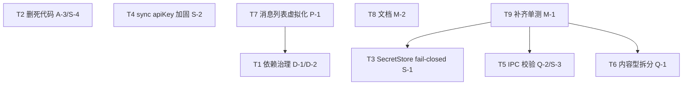

# AELA 增量修复 — 架构设计与任务分解（FixAll 2026-07-06）

> **作者**：架构师 高见远（software-architect）
> **依据**：`docs/project-evaluation-2026-07-06.md` + `docs/incremental-prd-fixall-2026-07-06.md`
> **目标**：对评估报告的 15 项问题中的 **10 类改动**做增量架构设计 + 有序任务分解；纯设计，不改源码。
> **技术栈结论**：**保持现状不变**（Electron ^33 + React 18 + TypeScript ^5.6 + electron-vite ^2.3 + Vite ^5.4 + Vitest ^4 + Playwright ^1.61）。唯一新增依赖：`react-window`（devDependency）。

---

## 0. 评估报告路径勘误（重要，供工程师定位）

| 评估报告所述 | 实际位置（已核实） | 影响 |
|------|------|------|
| `validateInput` 在 `main/utils/ipcHelpers.ts` | **`src/main/ipc/schemas.ts:253-260`**（`ipcHelpers.ts` 仅有 `wrap()`，见 `src/main/utils/ipcHelpers.ts:11`） | Q-2/S-3 的 schema 与函数调用**全部在 `schemas.ts`**，handler 以 `from '../schemas'` 导入（见 `src/main/ipc/handlers/terminal.ts:9-13`） |
| `secretStore.ts` 在 `src/main/services/secretStore.ts` | **`src/main/secretStore.ts`**（73 行，不在 `services/` 下） | S-1 修改目标为 `src/main/secretStore.ts`；明文降级在 `:47-49`，`isSecure()` 在 `:69-71`，前缀 `LEGACY_FALLBACK_PREFIX` 在 `:26` |
| `Q-1` 建议 promptContents 按 `agent/tool/system` 拆 | 实际文件按 **基础层 + 模式(coding/daily) × 变体** 组织（见 §3 T6） | 拆分口径需按真实结构，而非 PRD 文字 |

> 其余报告路径（sync-server 两份、`electron.vite.config.ts`、`src/shared/i18n.ts`、`package.json`）经核实与仓库一致。

---

## 1. 实现方案与框架选型

### 1.1 技术栈与依赖结论

- **技术栈不变**：Electron 主进程（Node/TS）承担「后端」，SDK `@agentprimordia/sdk` 经 `file:` + Vite alias 引入（本轮不改，见 Open Question A-1/D-3），Preload `contextBridge` 桥接，React 18 渲染进程，Zustand 状态，Vitest 单测 + Playwright e2e。
- **新增依赖（唯一）**：
  - `react-window@^1.8.10`（**devDependency**）：轻量虚拟列表，React 18 兼容且自带 `.d.ts` 类型，无需 `@types/react-window`。用于 P-1 消息列表虚拟化试点。
  - 选型理由：比 `@tanstack/react-virtual` 体积小、API 简单、稳定；消息高度不定，用其 `VariableSizeList`。如团队偏好 tanstack 见 Open Question P-1。
- **移除依赖（D-2）**：`yjs@^13.6.31`、`y-websocket@^3.0.0`、`lib0@^0.2.117`。已核实 `src/` 内**零 `import`/`require`**（仅 `node_modules` 与文档命中，见排查命令），属纯供应链面瘦身。保留 `ws@^8.21`（独立 sync-server 脚本仍用）。

### 1.2 D-1 / D-2 对打包（electron.vite.config.ts）的影响

- `electron.vite.config.ts:19`：`const BUNDLE_DEPS = ['@agentprimordia/sdk', 'electron-store']`，并经 `externalizeDepsPlugin({ exclude: BUNDLE_DEPS })`（main/preload 均用，第 23、44 行）显式**打包进 `out/`**。
- **D-1（react/react-dom/electron-store 移入 `dependencies`）**：electron-vite 打包行为由 `BUNDLE_DEPS`/`external` 决定，**与包在 `dependencies` 还是 `devDependencies` 无关**。故 D-1 仅修正 `package.json` 语义分类，**`electron.vite.config.ts` 无需改动**，`electron-store` 已正确列入 `BUNDLE_DEPS`。运行行为不变。
- **D-2（移除 yjs 等）**：三者均**不在** `BUNDLE_DEPS`，属 externalize 的 node 依赖；因全仓零引用，移除对产物无影响，仅缩小 `node_modules`/lockfile。`npm install` 后 lockfile 自动 prune 其 transitive（`y-protocols` 等）。
- **阻断构建风险**：D-1/D-2 本身不直接阻断构建（仅 `package.json` + lockfile）。风险点在「CI 重装依赖」一步——若某 CI 步骤假设这些包位置会失败，但当前无此假设。需重跑 `npm install` 刷新 lockfile 后跑全量门禁。

### 1.3 各改动实现思路（要点）

| 项 | 思路 | 关键文件 |
|----|------|---------|
| A-3/S-4 | 删除 `src/main/server/sync-server.ts`（纯 echo 死代码）；已核实 `src/` 内零引用（仅文档引用） | `src/main/server/sync-server.ts`（删） |
| D-1 | `react`/`react-dom`/`electron-store` 从 devDependencies 移入 dependencies | `package.json:60,71,72` |
| D-2 | 移除 `yjs`/`y-websocket`/`lib0` | `package.json:67,81,82` + lockfile |
| S-1 | `secretStore.ts` 在 `safeStorage.isEncryptionAvailable()===false` 时**拒绝明文落盘**（抛错/内存态），保留 `safeStorage` 可用时的现有行为；`SettingsView` 给提示 | `src/main/secretStore.ts`、`src/renderer/src/components/SettingsView.tsx` |
| S-2 | `src/server/sync-server.ts` 将 apiKey 从 URL query（`:116-117`）改为 `X-Api-Key` 请求头或 `Sec-WebSocket-Protocol` 子协议 + 内存令牌桶限流；客户端 `SyncService.ts:235` 同步改传参；TLS/拓扑推迟 | `src/server/sync-server.ts`、`src/main/services/SyncService.ts` |
| Q-2/S-3 | 为 **21 个**未校验 handler 补 zod schema（集中在 `src/main/ipc/schemas.ts`）+ `validateInput` 调用，沿用 `terminal.ts` 范式；对照 `preload/api/*` 避免过严 | `src/main/ipc/schemas.ts` + 21 handler |
| Q-1（内容型） | `i18n.ts`(1428) 拆 `src/shared/i18n/{index.ts + 子文件}`，导出面不变；`promptContents.ts`(860) 拆 `src/main/services/promptContents/{index.ts + base/coding/daily}`，导出 13 常量不变 | 见 T6 |
| P-1 | 引入 `react-window`，新增 `MessageList.tsx` 包 `VariableSizeList` 替换 `ChatView.tsx:431/489` 的 `messages.map`；兼容流式追加 | 见 T7 |
| M-2 | 新增 `CONTRIBUTING.md`；README 顶部加「本地开发前置条件」框 | `CONTRIBUTING.md`、`README.md` |
| M-1 | 补 `ChatView`/`Sidebar`/拆出 i18n 模块单测；**不改覆盖率门禁** | `test/**` |

---

## 2. 文件列表（相对路径，标注 增/改/删）

> 相对仓库根 `E:\codecast\AELA`。`[增]` 新增 / `[改]` 修改 / `[删]` 删除。

### T1 依赖治理（D-1 + D-2）
- `[改]` `package.json` — react/react-dom 移入 dependencies（L71-72），electron-store 移入 dependencies（L60）；删除 yjs（L82）、y-websocket（L81）、lib0（L67）
- `[改]` `package-lock.json` — 重生成（npm install 产出）
- `[确认无改]` `electron.vite.config.ts` — BUNDLE_DEPS 已含 electron-store，无需改

### T2 删除死代码（A-3 / S-4）
- `[删]` `src/main/server/sync-server.ts` — 纯 echo，零引用

### T3 SecretStore fail-closed（S-1）
- `[改]` `src/main/secretStore.ts` — insecure 时拒绝明文落盘（L32-72）
- `[改]` `src/renderer/src/components/SettingsView.tsx` —  insecure 环境提示（L619 约 619 行文件）
- `[确认]` `src/main/services/ConfigStore.ts`（或调用 `encrypt` 处）— 捕获新抛错（按需）

### T4 sync apiKey 加固（S-2）
- `[改]` `src/server/sync-server.ts` — apiKey 改 header/子协议 + 限流（L114-152）
- `[改]` `src/main/services/SyncService.ts` — 客户端握手改传参（L233-272，关键 L235）
- `[确认无改]` `src/preload/api/sync.ts` — 仅透传 SyncConfig，结构不变则不动

### T5 IPC 输入校验补齐（Q-2 / S-3）
- `[改]` `src/main/ipc/schemas.ts` — 新增 ~21 个 schema（沿用 L253 `validateInput`）
- `[改]` 以下 **21 个** handler（缺 `validateInput`）：
  `src/main/ipc/handlers/{memory,security,skill,sdkPhase4,automation,debugger,telemetry,resilience,toolLearning,screenshot,subagent,configHandlers,costHandlers,checkpoint,planningHandlers,advanced,misc,sdkEnhancements,bg-agent,multiAgent,sync}.ts`
- `[对照，不改]` `src/preload/api/*`（24 个，见 §0 核实清单）— 用于校验 schema 严格度

### T6 内容型上帝文件拆分（Q-1 内容型）
- **i18n**：
  - `[删]` `src/shared/i18n.ts`
  - `[增]` `src/shared/i18n/index.ts` — 桶文件，re-export 全部 8 个导出（见 §4）
  - `[增]` `src/shared/i18n/{zh,en,common}.ts`（或按模块 sidebar/automation/...）— 字典与函数拆分
- **promptContents**：
  - `[删]` `src/main/services/promptContents.ts`
  - `[增]` `src/main/services/promptContents/index.ts` — 桶文件，re-export 13 常量
  - `[增]` `src/main/services/promptContents/{base,coding,daily}.ts` — 按模式分组（见 §3 T6 说明）
  - `[确认无改或微调]` `src/main/services/PromptBuilder.ts` — 若保留 `./promptContents` 路径指向新目录 index，则无需改（L7-21）

### T7 消息列表虚拟化试点（P-1）
- `[增]` `package.json` — devDependency: `react-window@^1.8.10`
- `[增]` `src/renderer/src/components/chat/MessageList.tsx` — react-window 包装
- `[改]` `src/renderer/src/components/ChatView.tsx` — 用 `MessageList` 替换 `messages.map`（L431、L489）
- `[确认无改]` `src/renderer/src/components/chat/MessageBubble.tsx` — 保持 memo

### T8 贡献/构建文档（M-2）
- `[增]` `CONTRIBUTING.md`
- `[改]` `README.md` — 顶部加本地开发前置条件框

### T9 补齐单测（M-1 安全起步）
- `[增]` `test/renderer/components/ChatView.test.tsx`、`test/renderer/components/Sidebar.test.tsx`
- `[增]` `test/shared/i18n/*.test.ts`（拆出模块单测）
- `[增]` `test/main/secretStore.test.ts`（S-1 路径）
- `[增]` `test/main/ipc/schemas.test.ts`（Q-2 部分 schema）
- 门禁 `vitest.config.ts` **不改**（覆盖率 45/30/45/45 保持）

---

## 3. 任务列表（有序、含依赖、按实现顺序）

> 实现顺序建议（非强制依赖）：**T1 依赖 → T2 死代码 → T3/T4 安全 → T5 校验 → T6 拆分 → T7 虚拟化 → T8 文档 → T9 测试**。
> 多数任务彼此独立（可并行）；仅 T7 依赖 T1（共用 lockfile 重装），T9 依赖 T3/T5/T6（为这些改动补测）。

### T1 — 依赖治理（D-1 + D-2）｜P1/P2
- **依赖**：无
- **涉及文件**：`package.json`、`package-lock.json`（重生成）、确认 `electron.vite.config.ts` 不变
- **动作**：
  1. `react`(^18.3.1)、`react-dom`(^18.3.1)、`electron-store`(^10) 由 devDependencies 移入 dependencies；
  2. 删除 `yjs`/`y-websocket`/`lib0` 三项 devDependencies；
  3. `npm install` 刷新 lockfile。
- **验收点**：
  - `npm install` 成功，CI 重装通过；
  - `grep -rn "from 'yjs'\|from 'y-websocket'\|from 'lib0'" src` 无命中（已确认）；
  - `electron.vite.config.ts:19` 的 `BUNDLE_DEPS` 仍含 `electron-store`；
  - 全量 `typecheck` + `lint` + `test` + `test:e2e` 通过。

### T2 — 删除死代码 sync-server（A-3 / S-4）｜P1
- **依赖**：无
- **涉及文件**：`src/main/server/sync-server.ts`（删）
- **动作**：删除文件；确认 `src/main/server/` 目录已无它用（当前仅此一文件）；检查构建脚本/CI 未显式引用该路径。
- **验收点**：
  - 文件删除；`grep -rn "main/server/sync-server" src` 零命中（已确认）；
  - 保留的 `src/server/sync-server.ts` 不受影响；`build` 通过。

### T3 — SecretStore fail-closed（S-1）｜P1
- **依赖**：无
- **涉及文件**：`src/main/secretStore.ts`、`src/renderer/src/components/SettingsView.tsx`、（按需）`ConfigStore.ts`
- **动作**：
  1. `createSecretStore`（L32）在 `!available` 时：`encrypt()` 不再返回 `b64:` 明文（L47-49），改为**抛错或返回内存态并标记不可持久化**；`isSecure()` 仍返回 false；
  2. `SettingsView` 在检测到 insecure 时显示提示「当前环境无法安全保存密钥，请手动配置或设置主密码」；
  3. 调用 `encrypt` 处（ConfigStore）捕获错误并降级为内存态而非静默落盘。
- **验收点**：
  - 单测覆盖 insecure 路径（拒绝明文落盘、抛错/内存态）；
  - `isSecure()` 语义保持；secure 路径行为不变；
  - `SettingsView` 在 insecure 时渲染提示；e2e 设置页验证。

### T4 — sync-server apiKey 传输加固（S-2）｜P2
- **依赖**：无（TLS/部署拓扑推迟）
- **涉及文件**：`src/server/sync-server.ts`、`src/main/services/SyncService.ts`、`src/preload/api/sync.ts`（确认透传不变）
- **动作**：
  1. 服务端（L114-124）：apiKey 从 `url.searchParams.get('apiKey')`（L117）改为读 `req.headers['x-api-key']` 或 `Sec-WebSocket-Protocol` 子协议；保留 roomId（可仍走 query 或 header）；
  2. 加基础内存令牌桶限流（按 apiKey/IP 限流，简单 Map + 时间窗）；
  3. 客户端 `SyncService.openWebSocket`（L233-272，关键 L235）：`new WebSocket(url, { headers: { 'X-Api-Key': config.apiKey } })`，去掉 query 中的 apiKey；
  4. 确认 `preload/api/sync.ts` 透传 `SyncConfig`（含 serverUrl/apiKey/roomId）结构不变。
- **验收点**：
  - 两端握手契约一致（header 传递）；集成测试验证通过/拒绝；
  - 限流生效（超阈值拒绝）；
  - 现有 sync 功能 e2e（如有）通过。

### T5 — IPC 输入校验补齐（Q-2 / S-3）｜P1
- **依赖**：无（建议对照 `preload/api/*` 实参，避免过严）
- **涉及文件**：`src/main/ipc/schemas.ts` + 21 个 handler（见 §2 T5）+ 对照 `src/preload/api/*`
- **动作**：
  1. 在 `schemas.ts` 为 21 个缺校验 handler 新增 zod schema（命名 `\w+Schema`，沿用 L7-251 风格；对象类用 `z.object({}).passthrough()` 放宽未知字段）；
  2. 在每个 handler 入口、先于 `wrap()` 调用 `validateInput(schema, params)`，范式同 `terminal.ts:24-27`；
  3. **严格度约束**：schema 须对照该 handler 对应的 `preload/api/*.ts` 渲染进程实参推导，不得过严拒掉历史合法入参（尤其 `id`/路径/外部命令类）。
- **验收点**：
  - 全 38 个 handler 入口均有 `validateInput` 调用（或显式豁免注释）；
  - 对照 `preload/api/*` 实参实测，历史合法调用不被拒；
  - 新增 schema 单测 + 核心流 e2e 通过。

### T6 — 内容型上帝文件拆分（Q-1 内容型）｜P2
- **依赖**：无（但须保证导出面不变）
- **涉及文件**：`src/shared/i18n.ts`→`src/shared/i18n/*`；`src/main/services/promptContents.ts`→`src/main/services/promptContents/*`；`PromptBuilder.ts`（按需）
- **动作**：
  - **i18n**：拆为 `src/shared/i18n/index.ts`（桶）+ `zh.ts`/`en.ts`/`common.ts`（或按业务模块 sidebar/automation/chat...）。`index.ts` **必须 re-export 全部 8 个现有导出**：`Lang`(L4)、`dict`(L7)、`setLang`(L1391)、`getLang`(L1399)、`subscribeLang`(L1403)、`getLangSnapshot`(L1408)、`translate`(L1413)、`translateF`(L1418)。渲染层 `src/renderer/src/i18n/index.ts` 经 `@shared/i18n` 自动命中新桶，无需改。
  - **promptContents**（修正 PRD 口径）：实际按 **基础层 + 模式(coding/daily) × 变体** 组织，13 个导出为 `promptBase`(L7) + `promptCoding{Daily}{Default,Concise,SafetyFirst,CodeReviewer,PairProgrammer,MentorCoach}`(L82-836)。建议拆为 `base.ts`(promptBase) + `coding.ts`(6 个 coding 变体) + `daily.ts`(6 个 daily 变体) + `index.ts`（re-export 全部 13 常量）。`PromptBuilder.ts` 从 `./promptContents`（指向新目录 index）导入，**路径不变则无需改**（L7-21）。
  - **红线**：仅搬移/重组，不改任何导出名与逻辑；`global.d.ts`/`SessionStore`/`ToolManager`/`MemoryService` 等逻辑型/类型型拆分**不在本轮**。
- **验收点**：
  - 全仓 `tsc` 通过（`@shared/i18n` 与 `./promptContents` 导出面 100% 不变）；
  - i18n 模块单测通过；`PromptBuilder` 行为不变（构造的 prompt 字符串一致）；
  - 无逻辑分支改动（pure move）。

### T7 — 消息列表虚拟化试点（P-1）｜P2
- **依赖**：T1（共用 lockfile 重装，新增 react-window）
- **涉及文件**：`package.json`（react-window）、`src/renderer/src/components/chat/MessageList.tsx`（增）、`src/renderer/src/components/ChatView.tsx`（改 L431/L489）、`MessageBubble.tsx`（确认）
- **动作**：
  1. 新增 `react-window@^1.8.10`（devDependency）；
  2. 新建 `MessageList.tsx`：用 `VariableSizeList`（消息高度不定），`itemKey=msg.id`，props 含 `messages`、`onReachTop?`、`className?`，内部渲染 `MessageBubble`；
  3. `ChatView.tsx` 以 `<MessageList messages={messages} />` 替换 `messages.map`（L431）与 L489 处的映射；
  4. 保持与 `stores/streaming.ts` 的 Zustand 订阅兼容（流式追加不卸载 memo 的 MessageBubble）。
- **验收点**：
  - 长消息列表滚动流畅（无明显卡顿）；
  - 滚动位置保持、选中态、流式追加兼容；
  - e2e 消息列表/流式渲染通过。

### T8 — 贡献与构建文档（M-2）｜P2
- **依赖**：无
- **涉及文件**：`CONTRIBUTING.md`（增）、`README.md`（改）
- **动作**：
  1. 新增 `CONTRIBUTING.md`：开发环境、依赖安装、`predev`/`prebuild` 触发 `scripts/build-sdk.mjs`、测试/lint 命令、PR 规范、表面积收敛规范（A-2 安全起步）；
  2. README 顶部加「本地开发前置条件」框：须存在 `../codecast/AgentPrimordia` 或设 `AELA_SDK_PATH`（`electron.vite.config.ts:15` 回退），否则 `npm run predev/prebuild` 失败。
- **验收点**：README 顶部显著标注；CONTRIBUTING 内容完整；链接有效。

### T9 — 补齐组件/模块单测（M-1 安全起步）｜P2
- **依赖**：T3、T5、T6（为这些改动补测）
- **涉及文件**：`test/**` 下新增若干 `.test.ts(x)`
- **动作**：补 `ChatView`/`Sidebar` 组件测试、`i18n` 拆出模块单测、`secretStore` insecure 路径单测、部分 schema 单测；**覆盖率门禁不变**（不提高阈值，避免 CI 红）。
- **验收点**：新测试通过；整体覆盖率不降（门禁 45/30/45/45 保持）；CI 绿。

---

## 4. 共享知识（跨文件约定）

1. **zod schema 放置约定**：集中在 `src/main/ipc/schemas.ts`（与现有 17 个 handler 一致，勿散落）。新增命名 `xxxSchema`；复合/宽松对象用 `z.object({}).passthrough()`（如 `setConfigSchema` L26）；通用原子复用 `sessionIdSchema`(L7)/`filePathSchema`(L9)/`nonEmptyStringSchema`(L10)。
2. **`validateInput` 调用范式**（来自 `terminal.ts:24-27`，须先校验后 `wrap`）：
   ```ts
   const v = validateInput(someSchema, params)
   if (!v.success) return { success: false, error: v.error }
   return wrap(() => service.doSomething(params))
   ```
   失败返回统一 `{ success:false, error }`，由 `wrap()` 之外的边界拦截。
3. **i18n 拆分后导入方式**：对外仍用 `@shared/i18n`（目录解析到 `index.ts`）；新增子文件放 `src/shared/i18n/{zh,en,common}.ts`，`index.ts` 聚合 re-export 全部 8 导出（`Lang, dict, setLang, getLang, subscribeLang, getLangSnapshot, translate, translateF`）。渲染层 `src/renderer/src/i18n/index.ts` 不动。
4. **promptContents 拆分后导入方式**：`PromptBuilder.ts` 仍 `from './promptContents'`（指向新目录 `index.ts`），导出 13 常量不变；新子文件 `base.ts`/`coding.ts`/`daily.ts` 仅被 `index.ts` 聚合。
5. **虚拟列表组件 props 约定**（`MessageList`）：`messages: MessageItem[]`、`onReachTop?: () => void`、`className?: string`；内部 `VariableSizeList`，`itemKey` 取 `message.id`，`itemSize` 估算 + `measure` 自适应；保持 `MessageBubble` 的 `React.memo` 不被破坏，以兼容 `streaming.ts` 的批量 flush。
6. **react-window 版本**：`^1.8.10`（自带类型，无需 `@types`）；与 React 18 兼容。

---

## 5. 风险与回归范围

| 改动 | 阻断构建风险 | 回归影响模块 | 须跑测试 | 备注 |
|------|------|------|------|------|
| T1 D-1/D-2 | 低（仅 package.json+lockfile）；CI 重装若假设包位置会失败（当前无） | 全仓依赖图 | `npm install` + `typecheck`+`lint`+`test`+`test:e2e` | `electron-store` 已在 `BUNDLE_DEPS`，配置不变 |
| T2 A-3/S-4 | 无（零引用） | 无 | `build` + e2e 冒烟 | 确认无构建脚本引用该路径 |
| T3 S-1 | 无（单文件） | `ConfigStore`、设置页、密钥持久化 | secretStore 单测 + 设置页 e2e | **行为变更**：Linux 无 GUI 会话无法自动持久化密钥，需用户干预 |
| T4 S-2 | 无（独立 node 脚本 + main 服务） | `SyncService`、sync 握手、preload/api/sync | sync 集成测试 + e2e（如有） | **两端须同步**，仅改一端会握手失败；TLS 推迟 |
| T5 Q-2/S-3 | 无（单文件） | 38 个 handler + 渲染进程调用方 | schema 单测 + 核心流 e2e | **主要风险：schema 过严拒历史合法入参** → 对照 `preload/api/*` 实参 |
| T6 Q-1 | 无（纯搬移） | 所有 `@shared/i18n` 与 `PromptBuilder` 消费者 | `tsc` 全量 + i18n 单测 + PromptBuilder 行为 | 导出面 100% 不变为硬约束 |
| T7 P-1 | 低（新增 dep + 组件） | `ChatView`、消息列表滚动/选中/流式 | 消息列表 e2e + 组件测试 | 与 `streaming.ts` 兼容验证 |
| T8 M-2 | 无（纯文档） | 无 | 文档链接检查 | — |
| T9 M-1 | 无（仅测试） | 被覆盖模块 | `test` + `test:coverage` | **不改门禁**，避免 CI 红 |

**优先级最高的回归红线**：D-1/D-2 重装后必须全量门禁通过；S-1 行为变更需单测+e2e 锁死 insecure 路径；T5 schema 严格度须对照调用方实测；T4 两端契约必须同步。

---

## 6. 待明确事项（Open Questions）

1. **A-1 / D-3（SDK 解耦方案）**：需用户/主理人拍板发布形态——(a) 私有 npm 包 / (b) monorepo workspace / (c) git submodule。本轮仅做文档安全起步（已并入 T8）。**未定前不得改 `package.json` 的 `file:` 依赖与 `electron.vite.config.ts` 的 alias**。
2. **S-2 客户端改造范围**：已确认客户端在仓内 `src/main/services/SyncService.ts:235`。但需确认：① sync 功能默认是否启用？② 是否还有其他 sync 客户端（renderer sync 视图/测试脚本）需同步改传参？③ 限流粒度（按 apiKey 还是 IP）？建议明确后再合。
3. **Q-1 拆分口径**：PRD 文字建议 `agent/tool/system`，但 `promptContents.ts` 实际按 **基础层 + 模式(coding/daily) × 变体** 组织（见 §3 T6）。请 PM/主理人确认按 `base/coding/daily` 拆分是否可接受，或坚持按 PRD 文字另拟分组。
4. **S-1 主密码派生加密**：PRD 将 PBKDF2+AES 主密码方案列为可选增强/Open Question。建议本轮只做最小 fail-closed（拒绝明文落盘），主密码方案单独立项。
5. **P-1 虚拟化选型**：默认 `react-window@^1.8.10`；若团队偏好 `@tanstack/react-virtual`（对变高列表更灵活、体积略大）请明示。
6. **Q-2 schema 严格度边界**：`id` 类字段是否统一 `sessionIdSchema`(max 128)？部分历史 id 可能超长？需对照 `preload/api/*` 实参确认，避免误拒（尤其 terminal/file/agent 域）。
7. **A-2 表面积收敛规范落点**：本轮只立规范（无代码），规范写入 `docs/architecture/` 还是单独 ADR？建议随 T8 一并落到 `CONTRIBUTING.md` 或 `docs/architecture/`。
8. **D-2 transitive 残留**：移除 yjs/y-websocket 后，`y-protocols` 等 transitive 由 `npm install` 自动 prune；需确认无其他包依赖之（已 grep 无 `src` 引用，但 lockfile 需复核）。

---

## 7. 任务依赖图



> 注：T1–T6、T8 彼此独立，可并行；上图仅表达**代码级依赖**（T7 复用 T1 的 lockfile 重装结果；T9 为 T3/T5/T6 补测）。推荐执行顺序见 §3 开头。

---

*文档结束。本设计为纯架构交付，未修改任何源码。所有文件路径/行号已逐项核实。*
