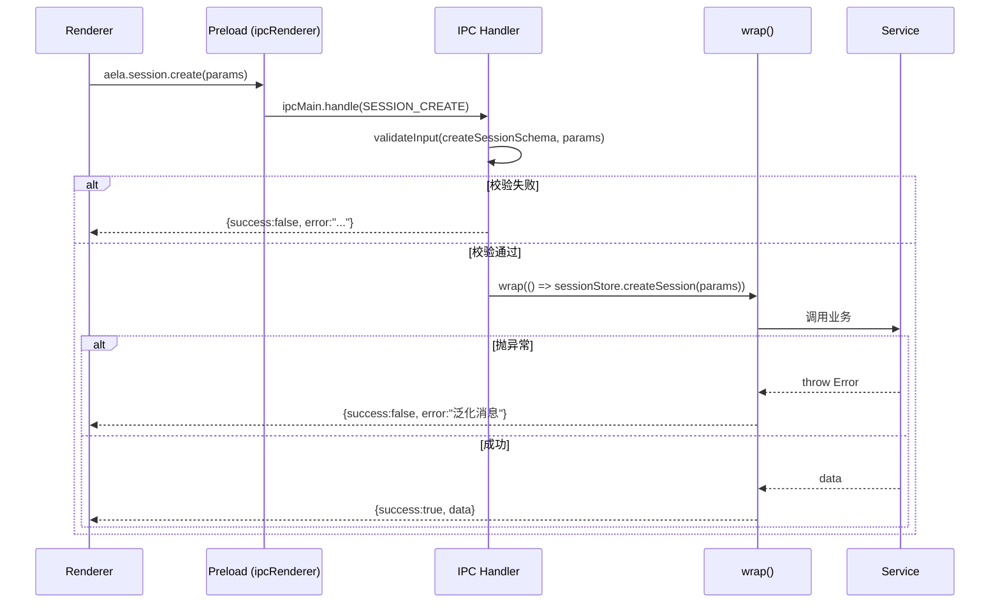
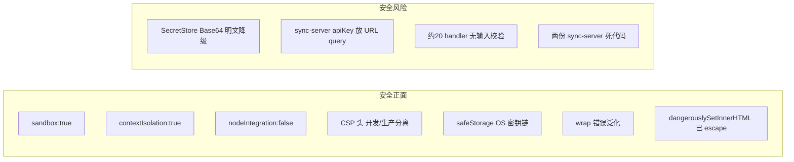
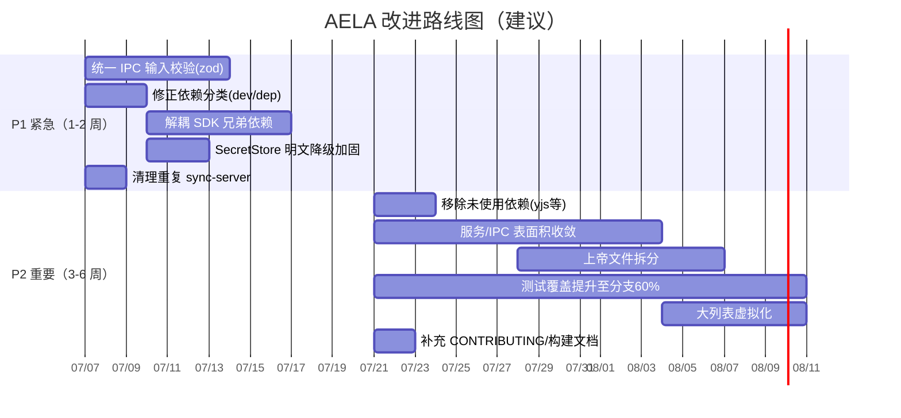

# AELA 项目深度评估报告

> 评估对象：`E:\codecast\AELA`（AELA 桌面应用，版本 `0.2.0`）
> 评估人：架构师 高见远（software-architect）
> 评估日期：2026-07-06
> 评估方式：静态源码审查 + 配置审查 + 依赖审查（未修改任何文件，未安装依赖）

---

## ⚠️ 关键更正（请主理人注意）

任务简报中描述为「**Go 后端 API + Agent 引擎**」，但经深度探查 `E:\codecast\AELA` 源码树：

- **仓库内不存在任何 Go 代码**（全仓 `find -name "*.go"` 结果为空）。
- 实际技术栈为 **Electron + TypeScript 单体应用**：主进程（`src/main`，TS）承担「后端」职责，Agent 引擎来自同仓依赖的 **TypeScript SDK `@agentprimordia/sdk`**（来自兄弟仓库 `../codecast/AgentPrimordia/sdk/typescript`，通过 `file:` 相对依赖 + Vite alias 引入）。
- 因此本报告基于「**Electron 主进程 + AgentPrimordia SDK + Preload 桥接层 + React 渲染进程**」的真实架构撰写，而非 Go 后端。

如团队所指「Go 后端」位于**独立仓库**，则本评估仅覆盖 `AELA` 这一前端/桌面壳层，需在结论中区分。

---

## 0. 项目概览与评估方法论

### 0.1 代码规模统计

| 指标 | 数值 | 说明 |
|------|------|------|
| 源代码总行数（src） | ~58,440 行 | `.ts` + `.tsx` 合计 |
| `src/main` (TS) | 138 个文件 | 主进程 / 后端逻辑 |
| `src/preload` (TS) | 31 个文件 | 桥接层（24 个 api 命名空间） |
| `src/renderer` | 89 `.tsx` + 24 `.ts` | React 渲染进程 |
| `src/shared` (TS) | 39 个文件 | 共享类型 / IPC 通道 / i18n |
| 测试文件 | ~70 个 | `test/` 下 unit + e2e |
| DI 容器服务数 | ~53 个 | `SERVICE_TOKENS` 枚举 |
| IPC 通道数 | 325 个 | `src/shared/ipcChannels.ts` |
| 文档 | README + CODE_WIKI(66KB) + SDK集成架构文档(24KB) + USER_GUIDE(25KB) + docs/{architecture,design,plans,testing} | 文档体系较完善 |

### 0.2 评估方法

1. 全量扫描 `src/`、`test/`、`docs/`、`scripts/` 及各 `*.config.*` 配置文件。
2. 抽样精读关键文件：入口（`main/index.ts`）、窗口管理（`WindowManager.ts`）、DI（`ServiceContainer.ts`）、IPC 注册（`ipc/index.ts` + 多 handler）、凭据（`secretStore.ts`）、流式状态（`stores/streaming.ts`）、关键大文件。
3. 静态模式扫描：硬编码密钥、XSS（`dangerouslySetInnerHTML`/`innerHTML`）、`eval`/`new Function`、监听器/定时器清理、依赖使用率（grep import）。
4. 配置与 CI 审查：`electron.vite.config.ts`、`tsconfig*.json`、`vitest.config.ts`、`playwright.config.ts`、`.eslintrc.cjs`、`.github/workflows/*`。

---

## 1. 项目架构评估

### 1.1 分层架构（总体合理）

```mermaid
flowchart TB
    subgraph Renderer["渲染进程 (React 18 + TS)"]
        RV[View 组件 / 懒加载]
        RS[Zustand Stores ×15]
        RA[window.aela API 调用]
    end
    subgraph Preload["Preload (contextBridge 桥接)"]
        PB[api/* 命名空间 ×24]
    end
    subgraph Main["主进程 (Node/Electron — 实际后端)"]
        IP[IPC Handlers ×37]
        SC[ServiceContainer DI ~53 服务]
        SDK[@agentprimordia/sdk Agent 引擎]
        SS[(better-sqlite3 / safeStorage / electron-store)]
    end
    RV --> RA
    RA -. contextBridge .-> PB
    PB -->|ipcRenderer| IP
    IP --> SC
    SC --> SDK
    SC --> SS
```

架构优点：
- **职责清晰的三层分离**：渲染进程 / Preload / 主进程边界明确，主进程不直接暴露 Node API 给渲染进程。
- **依赖注入容器**（`ServiceContainer.ts`）：提供 `register`/`registerFactory`/`get`/`resolve`、`topoSort`（Kahn 算法）自动拓扑启动、统一 `start()/stop()` 生命周期、`declareDependency` 声明依赖。**循环依赖会被 `topoSort()` 在启动时显式抛出**（第 164-169 行），从机制上防止循环依赖。
- **IPC Handler 拆分**：37 个 domain handler 文件，由 `ipc/index.ts` 薄桶文件统一注册，单文件职责聚焦。
- **视图懒加载**：`App.tsx` 通过 `Suspense` + `lazy()` 对非 chat 视图懒加载，`WorkbenchPanel` 也懒加载，降低首屏体积。

### 1.2 模块划分与问题

| 维度 | 评价 | 证据 |
|------|------|------|
| 目录结构 | 良好，按 `main/ipc/handlers`、`main/services`、`main/bootstrap`、`shared/types` 分层 | `find src -type d` |
| 上帝文件（God File） | **存在**，集中在「内容型」与「类型型」文件 | `src/shared/i18n.ts` 1428 行、`promptContents.ts` 860 行、`SessionStore.ts` 720 行、`global.d.ts` 673 行、`ToolManager.ts` 664 行、`MemoryService.ts` 652 行 |
| 服务数量膨胀 | ~53 个服务，单进程承载过多职责，启动拓扑复杂 | `SERVICE_TOKENS` 枚举（第 253-307 行） |
| 重复实现 | **存在两份 sync-server** | `src/server/sync-server.ts`（3941B，含 room/apiKey/持久化）与 `src/main/server/sync-server.ts`（776B，纯 echo 无鉴权） |
| 外部耦合 | SDK 通过相对路径兄弟依赖耦合，不可独立构建 | `package.json` `"@agentprimordia/sdk": "file:../codecast/AgentPrimordia/sdk/typescript"`；`electron.vite.config.ts:15` 强依赖 `../AgentPrimordia/sdk/typescript/dist` |
| 前后端通信 | 基于 `contextBridge.exposeInMainWorld('aela', api)` + 325 个 IPC 通道；通信契约由 `src/shared/ipcChannels.ts` 集中管理 | `preload/index.ts:128`、`ipcChannels.ts` |

**架构级风险点（详见第 6 章）**：
- **A-1（中）**：`@agentprimordia/sdk` 以 `file:` 兄弟路径 + Vite alias 方式耦合，CI/新成员环境必须存在 `../codecast/AgentPrimordia`，否则 `predev`/`prebuild` 的 `scripts/build-sdk.mjs` 失败，构建不可移植。
- **A-2（中）**：~53 个服务 + 325 个 IPC 通道，系统表面积过大，认知负荷高，新功能易继续堆砌而非抽象收敛。
- **A-3（低/中）**：两份 `sync-server.ts` 并存，其中 `src/main/server/sync-server.ts`（776B 纯回声、无鉴权）在 `src` 内**无任何引用**（死代码），易误导维护者。

---

## 2. 代码质量评估

### 2.1 规范性与工程基建（良好）

| 实践 | 状态 | 证据 |
|------|------|------|
| ESLint（strict 推荐集 + 自定义规则） | ✅ | `.eslintrc.cjs`：`@typescript-eslint/recommended`、`plugin:react/recommended`、`eqeqeq:always`、`no-throw-literal:error` |
| Prettier + Husky + lint-staged | ✅ | `package.json` scripts、`lint-staged` 配置、`prettier --check` |
| TypeScript `strict: true` | ✅ | `tsconfig.node.json:10`、`tsconfig.web.json` |
| 统一错误响应包装 `wrap()` | ✅ | `main/utils/ipcHelpers.ts`：统一 `{success, data, error}` |
| 输入校验（zod schema） | ⚠️ 部分 | 17/37 handler 文件导入 `validateInput` |
| 类型安全（`any` 使用） | ✅ 低 | 全仓 `any` 命中极少（ESLint 关闭 `no-explicit-any` 但团队自觉少用） |

### 2.2 错误处理



优点：`wrap()` 在 `ipcHelpers.ts` 统一捕获异常，并对 `ENOENT/EACCES/EPERM` 等做**消息泛化**（防止泄露内部路径），错误边界统一。
不足：约 **20/37 个 handler 未在 IPC 边界做 zod 输入校验**，渲染进程传入的 `id`/对象直接进服务层，存在非法输入透传风险（见 S-3）。

### 2.3 代码坏味道（Code Smell）

| 类型 | 位置 | 严重度 | 说明 |
|------|------|--------|------|
| 上帝文件 | `src/shared/i18n.ts` (1428 行) | 低 | 内联翻译字典，内容型，可按语言/模块拆分 |
| 上帝文件 | `src/main/services/promptContents.ts` (860 行) | 低 | 提示词常量，内容型 |
| 过长模块 | `SessionStore.ts` (720)、`MemoryService.ts`(652)、`ToolManager.ts`(664) | 中 | 单文件聚合过多方法，建议按子域拆分 |
| 类型上帝文件 | `src/renderer/src/types/global.d.ts` (673 行) | 低 | `window.aela` 全量类型，维护易与 preload 漂移 |
| 死代码 | `src/main/server/sync-server.ts` (776B) | 中 | 在 `src` 内无引用 |
| 重复代码 | 两份 `sync-server.ts` | 中 | 实现不一致（一个有鉴权有持久化，一个纯 echo） |
| 魔法数字 | 少量存在但多数已命名 | 低 | 如 `streaming.ts` 的 `FLUSH_INTERVAL_MS=16` 已合理命名；CSP 字符串散落 `WindowManager.ts` 两处（重复定义） |

---

## 3. 依赖与配置分析

### 3.1 依赖清单审视（`package.json`）

| 问题 | 严重度 | 证据与说明 |
|------|--------|-----------|
| **运行时依赖误置 devDependencies** | 中 | `react`/`react-dom`(^18.3.1)、`electron-store`(^10) 声明于 `devDependencies`。Electron-vite 将其打包进 `out/` 故运行时不报错，但语义错误：打包后 `node_modules` 缺失这些包会破坏任何「真·外部依赖」假设；且 `electron-store` 被 `BUNDLE_DEPS` 强制打包（config 第 19 行），与主进程运行期强相关，应列为 `dependencies`。 |
| **声明但未使用的依赖** | 中 | `yjs`(^13.6.31)、`y-websocket`(^3.0.0)、`lib0`(^0.2.117) 在全仓（除 lock 外）**零引用**——既未 `import` 也未 `require`。疑似为「协作编辑」预留却未接线，徒增安装体积与供应链面。 |
| **兄弟仓库 file: 依赖** | 中 | `@agentprimordia/sdk: "file:../codecast/AgentPrimordia/sdk/typescript"` 导致不可独立 `npm install`/构建。 |
| 版本整体较新 | — | electron ^33、react 18.3、zod ^4、typescript ^5.6、vite ^5.4、vitest ^4、better-sqlite3 ^12、@playwright/test ^1.61——版本合理、无显著过时。 |
| `ws` 仅用于独立 sync-server | 低 | `ws`(^8.21) 仅被 `src/**/sync-server.ts` 引用（独立 `node` 脚本，非打包主程序），作为 devDependency 合理。 |

### 3.2 配置文件审查

| 文件 | 评价 | 备注 |
|------|------|------|
| `electron.vite.config.ts` | ✅ 合理 | 三角色（main/preload/renderer）分离；SDK 路径支持 `AELA_SDK_PATH` 环境变量回退；`externalizeDepsPlugin` 排除需打包项。 |
| `tsconfig*.json` | ✅ 合理 | `strict:true`、`composite` 引用结构清晰；`tsconfig.web.json` 含 DOM lib，`tsconfig.node.json` 仅 node——分层类型正确。 |
| `tailwind.config.js` | ✅ 良好 | 通过 CSS 变量支持暗/亮主题（`darkMode:'class'`），自定义动画/圆角/阴影完整。 |
| `postcss.config.js` | ✅ | tailwind + autoprefixer 标准。 |
| `vitest.config.ts` | ✅ 良好 | 环境 `node` + 组件测试 `jsdom` 覆盖；覆盖率门禁（语句 45%/分支 30%/函数 45%/行 45%）——**当前实测 51/36/51/52，已越线但分支覆盖偏低**。 |
| `playwright.config.ts` | ✅ 合理 | `fullyParallel:false`、`workers:1`（Electron 单实例），CI 用 github reporter。 |
| `.eslintrc.cjs` | ✅ 严格 | `env` 按 main/preload/renderer/shared/test 分区覆写，规则严谨。 |

---

## 4. 性能与安全评估

### 4.1 性能

| 项目 | 评价 | 证据 |
|------|------|------|
| 流式渲染性能 | ✅ 优 | `stores/streaming.ts`：token 进 buffer 数组，`setTimeout(16ms)` 批量 flush，将逐 token 字符串拼接的 **O(n²) 降为 O(n)**，并降低 Zustand 更新/React 重渲染频率；`MessageBubble` 用 `React.memo` 跳过历史消息重渲染。 |
| 视图懒加载 | ✅ | `App.tsx` 非 chat 视图 `Suspense`+`lazy`；`WorkbenchPanel` 懒加载。 |
| 定时器清理 | ⚠️ 依赖调用方 | `streaming.ts` 的 `flushTimer`/`eventFlushTimer` 在 `resetStreamingContent`/`flush`/`clearStreamEvents` 中 `clearTimeout`——若流式中断但调用方未触发 reset，定时器可能短暂悬挂（影响小）。 |
| 大列表虚拟化 | ❓ 未核实 | 未发现 `react-window` 等虚拟列表依赖；会话/消息/技能等列表若数据量大存在渲染压力（建议排查 `SessionManagerView`/`SkillsView`）。 |
| 包体积 | ⚠️ | 未使用的 `yjs/y-websocket/lib0` 增加安装与潜在打包体积；325 个 IPC 通道反映功能庞大。 |

### 4.2 安全



**安全正面（值得肯定）**：
- `WindowManager.ts:76-83`：`webPreferences` 设 `sandbox:true` + `contextIsolation:true` + `nodeIntegration:false`，符合 Electron 安全最佳实践，XSS→RCE 攻击面被有效隔离。
- CSP 在开发（`unsafe-inline/eval` 放宽以支持 HMR）与生产（`script-src 'self'`、收紧 `connect-src`）分别配置（`WindowManager.ts:33-52, 100-125`）。
- `secretStore.ts` 使用 `safeStorage`（macOS Keychain / Windows DPAPI / Linux libsecret）加密 API Key，设计正确。
- **全仓未发现硬编码密钥/Token**（grep `sk-`/`AIza`/`xox[baprs]-` 零命中于源码）。
- `SessionManagerView.tsx:173-177` 的 `dangerouslySetInnerHTML` 由 `highlightSnippet` 内部 `escapeHtml` 转义，`<mark>` 硬编码——属安全可控用法（仍建议统一替换为 `dangerouslySetInnerHTML` 白名单封装）。

**安全风险**：
- **S-1（中）**：`secretStore.ts:47-49` 当 OS Keyring 不可用时降级为 `Base64`（明文等价）存储，`isSecure()` 返回 false 但**仍持久化明文**。Linux 无 GUI 会话场景会静默降级，存在凭据泄露风险。建议：降级时拒绝持久化或强制用户设置主密码。
- **S-2（中）**：`src/server/sync-server.ts:116-117` 将 `apiKey` 置于 WebSocket URL query（`?apiKey=...`），易被代理/日志记录；且服务端无速率限制、无 TLS、无 `apiKey` 强度校验。作为同步通道安全性薄弱（建议改 header/子协议 + TLS）。
- **S-3（中）**：约 20/37 个 IPC handler 未做 zod 输入校验（仅 17 个导入 `validateInput`），渲染进程传入的 `id`/对象直接进服务层，存在非法输入/越权访问风险。
- **S-4（低）**：`src/main/server/sync-server.ts` 纯 echo 服务器无鉴权，若被误启用将开放任意消息中继。

---

## 5. 可维护性与扩展性评估

### 5.1 模块化与抽象（良好）

- **服务拆分彻底**：~53 个服务各自聚焦（Memory/Security/Orchestration/RAG/Terminal…），并统一 `IService` 生命周期接口。
- **IPC 按域拆分**：37 个 handler 文件 + 薄注册桶，符合单一职责。
- **状态管理清晰**：15 个 Zustand store 按领域切分（`app`/`messages`/`streaming`/`config`/`voice`…），并将高频流式状态独立到 `streaming.ts` 避免级联重渲染（`app.ts:13` 注释明确）。
- **配置外置**：`electron-store`/`ConfigStore` 管理用户配置；SDK 路径、端口等均环境变量化。

### 5.2 测试覆盖（中等偏上）

| 指标 | 实测 | 门禁 |
|------|------|------|
| Statements | 51.02% | 45% ✅ |
| Branches | 35.91% | 30% ✅ |
| Functions | 50.84% | 45% ✅ |
| Lines | 52.19% | 45% ✅ |

- 单元测试覆盖大量核心服务（`AgentService`/`MemoryService`/`ToolManager`/`ModelRouter`/`SecurityService`/`ServiceContainer` 等 ~70 文件）。
- E2E：`test/e2e-playwright/*.spec.ts` + `test/e2e/*.test.ts`，Playwright 配置合理。
- **不足**：分支覆盖率仅 36%，错误处理/边界路径覆盖偏弱；渲染层组件测试仅 `ChatView`/`Dialog`/`DiffCard`/`ErrorBoundary`/`Sidebar`/`Voice*` 等少数，大量 View 组件无测试。

### 5.3 文档（完善）

- 根目录：`README.md`、`CODE_WIKI.md`(66KB)、`SDK集成架构文档.md`(24KB)、`USER_GUIDE.md`(25KB)、`verification_report.md`。
- `docs/` 含 `architecture/`、`design/`、`plans/`、`testing/` 子目录——架构/设计/计划/测试文档齐备。
- **缺失**：未发现 `CONTRIBUTING.md`；SDK 兄弟依赖的本地构建前置条件未在 README 显著标注（新手易踩坑）。

---

## 6. 问题总结与改进建议

### 6.1 问题汇总表（按严重度）

| 编号 | 维度 | 问题 | 严重度 | 优先级 | 关键证据 |
|------|------|------|--------|--------|----------|
| A-1 | 架构 | SDK 以 `file:` 兄弟路径 + Vite alias 强耦合，构建不可移植 | 中 | P1 | `package.json` L40、`electron.vite.config.ts` L15 |
| A-2 | 架构 | ~53 服务 + 325 IPC 通道，系统表面积过大 | 中 | P2 | `ServiceContainer.ts` L253-307、`ipcChannels.ts` |
| A-3 | 架构 | 两份 `sync-server.ts` 重复，其中一份为死代码 | 中 | P1 | `src/main/server/sync-server.ts`（无引用）、`src/server/sync-server.ts` |
| Q-1 | 代码质量 | 上帝文件集中（i18n 1428 / promptContents 860 / SessionStore 720 / global.d.ts 673） | 低 | P2 | 见 2.3 |
| Q-2 | 代码质量 | 约 20/37 handler 无 zod 输入校验 | 中 | P1 | grep `validateInput` 仅 17 文件 |
| D-1 | 依赖 | `react`/`react-dom`/`electron-store` 误置 devDependencies | 中 | P1 | `package.json` L59-83 |
| D-2 | 依赖 | `yjs`/`y-websocket`/`lib0` 声明但零使用 | 中 | P2 | grep 全仓零 import |
| D-3 | 依赖 | 兄弟仓库 `file:` 依赖导致无法独立安装 | 中 | P1 | `package.json` L40 |
| S-1 | 安全 | SecretStore 在缺 Keyring 时降级为 Base64 明文 | 中 | P1 | `secretStore.ts` L47-49 |
| S-2 | 安全 | sync-server 将 apiKey 置于 URL query，无 TLS/限流 | 中 | P2 | `src/server/sync-server.ts` L116-117 |
| S-3 | 安全 | 大量 IPC handler 缺输入校验（越权/注入面） | 中 | P1 | 同 Q-2 |
| S-4 | 安全 | 死代码 echo sync-server 若误启用则开放中继 | 低 | P2 | `src/main/server/sync-server.ts` |
| M-1 | 可维护性 | 分支测试覆盖率仅 36%，组件测试覆盖少 | 中 | P2 | `coverage.log` |
| M-2 | 可维护性 | 无 `CONTRIBUTING.md`；SDK 构建前置条件文档缺失 | 低 | P2 | 根目录无该文件 |
| P-1 | 性能 | 大列表未虚拟化（未发现虚拟列表方案） | 低 | P2 | 依赖清单无 `react-window` 等 |

### 6.2 最严重的 5–10 个问题（Top Issues）

1. **S-3 / Q-2（IPC 输入校验不一致）**：约半数 handler 未在边界做 zod 校验，是潜在越权与非法输入面，且修复成本低、收益高 → **P1**。
2. **D-1（依赖分类错误）**：`react`/`react-dom`/`electron-store` 在 devDependencies，语义错误，未来任何外部依赖场景会破裂 → **P1**。
3. **A-1 / D-3（SDK 兄弟依赖耦合）**：`file:` + alias 硬耦合导致不可独立构建/CI 脆弱 → **P1**，建议发布为 npm 包或 git submodule。
4. **S-1（凭据明文降级）**：Keyring 不可用时 API Key 以 Base64 明文落盘 → **P1**，建议降级即拒绝持久化或强制主密码。
5. **A-3（重复/死代码 sync-server）**：删除 `src/main/server/sync-server.ts`，保留并加固 `src/server/sync-server.ts` → **P1**。
6. **D-2（未使用依赖 yjs/y-websocket/lib0）**：移除，减小安装/供应链面 → **P2**。
7. **A-2（服务/IPC 表面积过大）**：新功能应优先抽象收敛而非继续堆砌 → **P2**。
8. **Q-1（上帝文件）**：对 `i18n.ts`/`promptContents.ts` 等按模块/语言拆分（内容型可接受，但 `global.d.ts` 建议代码生成或拆分） → **P2**。
9. **M-1（测试覆盖）**：将分支覆盖率门禁从 30% 逐步提升至 60%，补齐组件测试 → **P2**。
10. **P-1（列表虚拟化）**：对会话/消息/技能等大数据列表引入虚拟滚动 → **P2**。

### 6.3 可执行改进路线图



**P0（立即，若有）**：本次未发现会导致数据丢失/安全事件的 P0 级阻断问题；现有 Electron 安全基线与错误包装已具备基本防线。

---

## 7. 总体健康度评分

| 维度 | 分值（/100） | 说明 |
|------|------|------|
| 项目架构 | 76 | 分层清晰、DI 完善、循环依赖有机制防护；但表面积过大、SDK 强耦合、存在重复/死代码 |
| 代码质量 | 73 | ESLint/Prettier/strict 到位、`any` 少；但上帝文件与未校验 handler 拉低 |
| 依赖与配置 | 66 | 配置合理、版本较新；但依赖分类错误、未使用依赖、兄弟依赖耦合 |
| 性能与安全 | 77 | sandbox/CSP/safeStorage 优秀；但明文降级、apiKey 入 URL、未校验 handler 为短板 |
| 可维护与扩展 | 80 | 模块化/文档/测试均良好；分支覆盖与组件测试待补 |
| **综合健康度** | **74** | 一个工程基建扎实、安全基线良好的中大型 Electron 应用，主要短板在依赖治理、输入校验一致性与系统表面积控制 |

> 结论：AELA 处于「**健康且可继续演进**」状态，工程纪律（lint/typecheck/CI/audit/DI/错误包装）明显优于多数同类桌面项目。建议优先落地 **P1** 五项（输入校验统一、依赖分类修正、SDK 解耦、凭据降级加固、清理重复 sync-server），可在 1–2 周内显著降险；**P2** 项作为持续重构路线。

---

## 附录 A：最大源文件 Top 20

```
1428  src/shared/i18n.ts
 860  src/main/services/promptContents.ts
 812  src/main/services/PromptService.ts
 720  src/main/services/SessionStore.ts
 673  src/renderer/src/types/global.d.ts
 664  src/main/services/ToolManager.ts
 652  src/main/services/MemoryService.ts
 614  src/main/services/SupervisorService.ts
 609  src/main/services/RAGService.ts
 581  src/main/services/SubAgentIsolationService.ts
 547  src/main/services/SqliteMemoryStore.ts
 536  src/main/services/AdaptiveLearningService.ts
 519  src/main/services/ToolLearningService.ts
 513  src/main/services/AgentService.ts
 508  src/main/services/tools/builtin/agentTools.ts
 502  src/main/services/SyncService.ts
 500  src/shared/ipcChannels.ts
 471  src/main/services/OrchestrationService.ts
 699  src/renderer/src/components/InputBox.tsx
 619  src/renderer/src/components/SettingsView.tsx
```

## 附录 B：评估所用关键命令

```bash
# 结构
find src -type d | sort
find src -name '*.ts' -exec wc -l {} + | sort -rn | head
# 安全扫描
grep -rn "sk-\|AIza\|xox[baprs]-" src
grep -rn "dangerouslySetInnerHTML\|innerHTML\|eval(\|new Function(" src
# 依赖使用率
grep -rln "from 'yjs'\|from 'y-websocket'\|from 'lib0'" src
# 校验覆盖率
grep -rl "validateInput" src/main/ipc/handlers | wc -l
grep -rl "from '../../utils/ipcHelpers'" src/main/ipc/handlers | wc -l
# 死代码
grep -rln "main/server/sync-server" src --include=*.ts | grep -v "src/main/server/sync-server.ts"
```

---
*报告结束。如需对任意问题项深入定位（行级 diff 建议或具体重构方案），可指派后续任务。*
